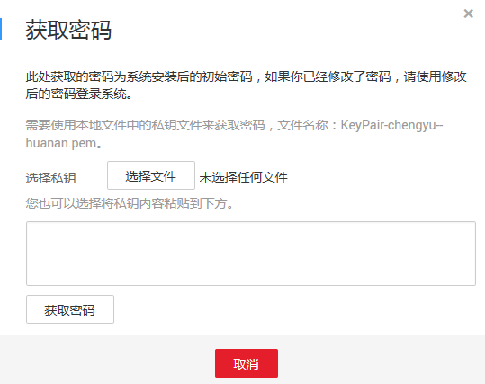

# MSTSC密码方式登录

## 前提条件

-   裸金属服务器已经绑定弹性公网IP地址。
-   已在本地获取登录裸金属服务器的私钥文件。
-   已配置安全组入方向的访问规则，配置方式请参见[配置安全组](https://support.huaweicloud.com/usermanual-bms/zh-cn_topic_0028313245.html)。
-   使用的登录工具与待登录的裸金属服务器之间网络连通。例如，默认的3389端口没有被防火墙屏蔽。

## 本地使用Windows操作系统

我们以mstsc.exe远程登录工具为例介绍如何登录裸金属服务器。

1.  在Windows裸金属服务器下发并配置完成之后，在管理控制台页面对应的Windows裸金属服务器所在行，单击“更多 \> 获取密码”，选择本地下发裸金属服务器的私钥文件。然后单击“获取密码”，即可获取Windows裸金属服务器的用户名和密码。

    **图 1**  获取密码  
    

2.  在本地Windows操作系统“开始”菜单中输入“mstsc.exe”，在远程桌面连接的界面输入Windows裸金属服务器的弹性公网IP以及用户名，并按照提示输入步骤[1](#li1239991105912)中获取的密码即可完成登录。

