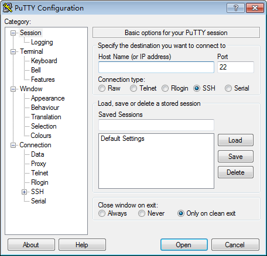

# SSH密钥方式登录

## 前提条件

-   裸金属服务器状态必须为“运行中”。
-   已获取创建该裸金属服务器时使用的密钥对私钥文件。
-   裸金属服务器已绑定弹性公网IP，绑定方式请参见[绑定弹性公网IP至服务器](绑定弹性公网IP至服务器.md)。
-   已配置安全组入方向的访问规则，配置方式请参见[添加安全组规则](添加安全组规则.md)。
-   使用的登录工具（如PuTTY）与待登录的裸金属服务器之间网络连通。例如，默认的22端口没有被防火墙屏蔽。

## 本地使用Windows操作系统

如果本地使用Windows操作系统的计算机，您可以按照下面方式登录Linux裸金属服务器。

**方式一：使用PuTTY登录**

使用PuTTY登录裸金属服务器前，需要先将私钥文件转换为.ppk格式。

1.  判断私钥文件是否为.ppk格式。
    -   是，执行步骤[7](#li693703913264)。
    -   否，执行步骤[2](#li11816141811202)。

2.  在以下路径中下载PuTTY和PuTTYgen。

    [https://www.chiark.greenend.org.uk/\~sgtatham/putty/latest.html](https://www.chiark.greenend.org.uk/~sgtatham/putty/latest.html)

    > **说明：**   
    >PuTTYgen是密钥生成器，用于创建密钥对，生成一对公钥和私钥供PuTTY使用。  

3.  运行PuTTYgen。
4.  在“Actions”区域，单击“Load”，并导入创建裸金属服务器时保存的私钥文件。

    导入时需要确保导入的格式为“All files \(\*.\*\)”。

5.  单击“Save private key”。
6.  保存转换后的私钥到本地。例如：kp-123.ppk
7.  双击“PUTTY.EXE”，打开“PuTTY Configuration”。

    **图 1**  PuTTY Configuration  
    

8.  选择“Connection \> Data”，在Auto-login username处输入镜像的用户名root。
9.  选择“Connection \> SSH \> Auth”，在最下面一个配置项“Private key file for authentication”中，单击“Browse”，选择步骤[6](#li194442401260)中转换的.ppk格式密钥。
10. 选择“Session”，在“Host Name \(or IP address\)”下的输入框中输入裸金属服务器的弹性公网IP地址。
11. 单击“Open”。

    登录裸金属服务器。

**方式二：使用Xshell登录**

1.  打开Xshell工具。
2.  执行以下命令，SSH远程连接裸金属服务器。

    **ssh** _用户名_**@**_弹性公网IP_

    示例：

    **ssh** **root@192.168.0.1**

3.  （可选）如果系统弹窗提示“SSH安全警告”，此时需单击“接受并保存”。

    **图 2**  SSH安全警告  
    

4.  选择“Public Key”，并单击“用户密钥\(K\)”栏的“浏览”。
5.  在“用户密钥”窗口中，单击“导入”。
6.  选择本地保存的密钥文件，并单击“打开”。
7.  单击“确定”，登录裸金属服务器。

## 本地使用Linux操作系统

如果本地使用Linux操作系统的计算机，您可以按照以下方式登录Linux裸金属服务器。下面步骤以私钥文件是“KeyPair-ee55.pem”为例进行介绍。

1.  在您的Linux计算机的命令行中执行如下命令，变更权限。

    **chmod** **400** **/**_path_/_KeyPair-ee55_

    > **说明：**   
    >上述命令的path为密钥文件的存放路径。  

2.  执行如下命令登录裸金属服务器。

    **ssh** **-i** **/**_path_/_KeyPair-ee55_ **root@**_裸金属服务器的弹性公网IP地址_

    > **说明：**   
    >-   path为密钥文件的存放路径。  
    >-   root为裸金属服务器镜像的用户名。  

