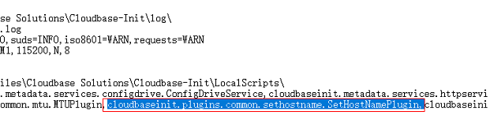
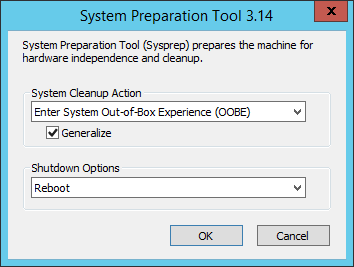
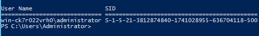

# Windows Server 2012裸金属服务器如何修改SID值？<a name="bms_faq_0049"></a>

## 操作背景<a name="section1040713710414"></a>

SID也就是安全标识符（Security Identifiers），是标识用户、组和计算机帐户（管理员帐户）的唯一号码。在第一次创建该帐户时，将给网络上的每一个帐户发布一个唯一的SID。SID由计算机名、当前时间、当前用户态线程的CPU耗费时间的总和三个参数决定以保证它的唯一性。

一个完整的SID包括：

-   用户和组的安全描述
-   48-bit的ID authority
-   修订版本
-   可变的验证值（Variable sub-authority values）

例如：S-1-5-21-287469276-4015456986-3235239863-500

<a name="table6579131713422"></a>
<table><tbody><tr id="row7580111774215"><td class="cellrowborder" valign="top" width="12.15%"><p id="p858041716423"><a name="p858041716423"></a><a name="p858041716423"></a>S</p>
</td>
<td class="cellrowborder" valign="top" width="12.1%"><p id="p195801175424"><a name="p195801175424"></a><a name="p195801175424"></a>1</p>
</td>
<td class="cellrowborder" valign="top" width="22.78%"><p id="p958071720421"><a name="p958071720421"></a><a name="p958071720421"></a>5</p>
</td>
<td class="cellrowborder" valign="top" width="35.15%"><p id="p858061754220"><a name="p858061754220"></a><a name="p858061754220"></a>21-287469276-4015456986-3235239863</p>
</td>
<td class="cellrowborder" valign="top" width="17.82%"><p id="p10580191714214"><a name="p10580191714214"></a><a name="p10580191714214"></a>500</p>
</td>
</tr>
<tr id="row1758012178427"><td class="cellrowborder" valign="top" width="12.15%"><p id="p12580117154211"><a name="p12580117154211"></a><a name="p12580117154211"></a>表示该字符串是SID</p>
</td>
<td class="cellrowborder" valign="top" width="12.1%"><p id="p1058061711425"><a name="p1058061711425"></a><a name="p1058061711425"></a>SID的版本号</p>
</td>
<td class="cellrowborder" valign="top" width="22.78%"><p id="p135808173424"><a name="p135808173424"></a><a name="p135808173424"></a>指颁发机构，这里是NT，值是5</p>
</td>
<td class="cellrowborder" valign="top" width="35.15%"><p id="p13580181714421"><a name="p13580181714421"></a><a name="p13580181714421"></a>表示一系列的子颁发机构</p>
</td>
<td class="cellrowborder" valign="top" width="17.82%"><p id="p55808170424"><a name="p55808170424"></a><a name="p55808170424"></a>标志域内的帐户和组。</p>
</td>
</tr>
</tbody>
</table>

目前，所有Windows Server 2012裸金属服务器拥有相同的SID，对于集群部署场景，需要按照本指导修改SID，以保证唯一性。

## 操作步骤<a name="section01514191545"></a>

1.  登录裸金属服务器操作系统。
2.  <a name="li7621152616481"></a>单击左下角的图标，选择“Windows PowerShell”，输入**whoami /user**命令查看机器的SID值。

    **图 1**  查看SID初始值<a name="fig951703185413"></a>  
    

3.  修改Cloudbase-init的配置文件。
    1.  分别打开“cloudbase-init.conf”和“cloudbase-init-unattend.con”文件。

        文件所在目录：C:\\Program Files\\Cloudbase Solutions\\Cloudbase-Init\\conf

    2.  为两个配置文件都增加一行“first\_logon\_behaviour=no”。

        ```
        [DEFAULT]
        username=Administrator
        groups=Administrators
        first_logon_behaviour=no
        netbios_host_name_compatibility=false
        metadata_services=cloudbaseinit.metadata.services.httpser
        inject_user_password=true
        ...
        ```

    3.  删除“cloudbase-init-unattend.conf”配置文件中的“cloudbaseinit.plugins.common.sethostname.SetHostNamePlugin”。

        **图 2**  配置文件修改示例<a name="zh-cn_topic_0103210577_fig109881027113611"></a>  
        

4.  打开命令提示符，输入如下命令打开Sysprep窗口。

    ```
    进入目录：C:\Program Files\Cloudbase Solutions\Cloudbase-Init\conf> 
    输入命令：C:\Windows\System32\Sysprep\sysprep.exe /unattend:Unattend.xml
    ```

5.  Windows Server 2012的Sysprep版本是3.14，按照下图进行设置，单击“OK”开始清理系统。

    **图 3**  System Preparation Tool设置<a name="fig1916144511312"></a>  
    

6.  清理完成会自动重启，然后系统需要重新封装，重新解包。重启完成后，Windows系统需要重新设置密码，详细操作请参见“[重置裸金属服务器密码](https://support.huaweicloud.com/usermanual-bms/bms_01_0028.html)”。
7.  登录裸金属服务器操作系统，按照[2](#li7621152616481)的方法再次查看SID值。

    **图 4**  查看SID值（修改后）<a name="fig11868182131019"></a>  
    

    可以看到，SID已被修改为新的值。


