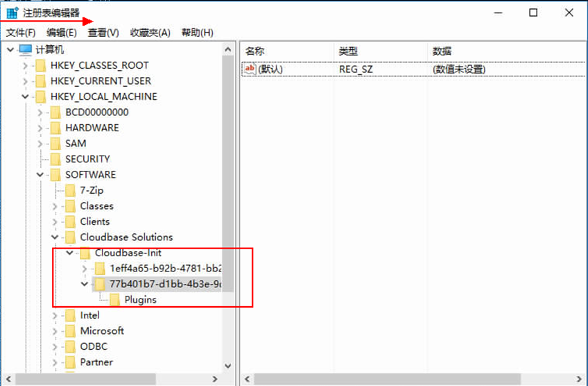
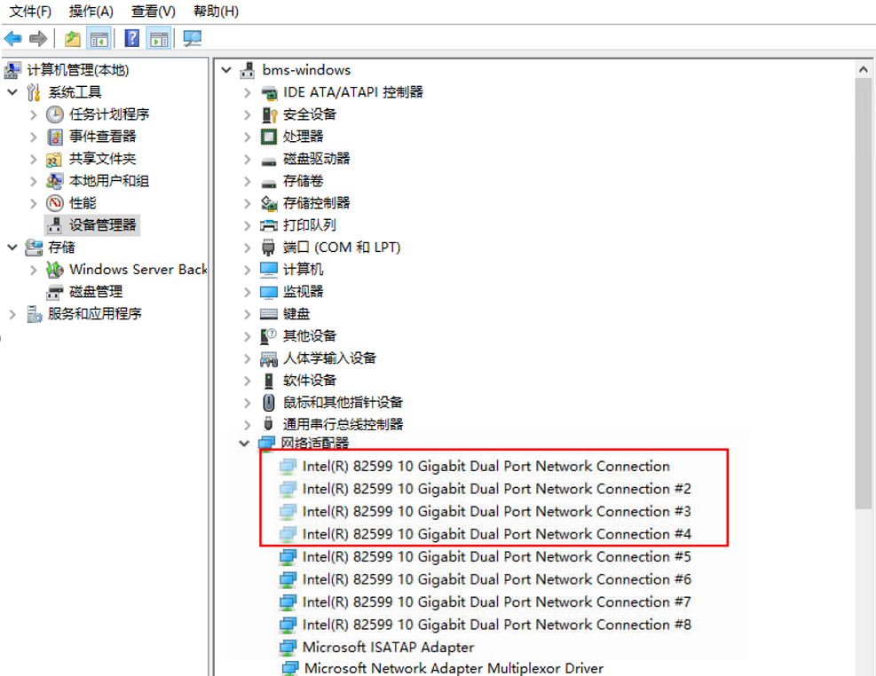

# Windows云盘裸机HA之后网络不通如何恢复？

## 操作场景

使用windows云盘启动裸机，HA之后，网络不通。

## 操作步骤

1.  登录windows操作系统，创建备用管理员账号（预留逃生通道）。

    单击“控制面板-\>用户账号-\>更换账户类型-\>添加”，添加账号，更改新账户为管理员类型。

2.  单击左下角的图标，选择“Windows PowerShell”，输入**regedit.exe**，打开注册表。

    在“注册表编辑器”页面，选择“HKEY\_LOCAL\_MACHINE-\>SOFTWARE-\>Cloudbase Solutions-\>Cloudbase-Init”，删除Cloudbase-Init下所有文件夹，相关目录如[图1](#fig1173182354518)。

    **图 1**  删除文件夹目录  
    

3.  手动清理bond信息。

    a、使用命令删除。

    使用查询命令Get-NetAdapter，查询是否存在Team1。

    当存在Team1时，以管理员身份打开“Windows PowerShell”，输入以下命令删除Team1。

    Remove-NetLbfoTeam -Name Team1。

    b、删除隐藏网络适配器显示信息。

    单击“计算机管理 -\> 设备管理器 -\>查看 -\> 显示隐藏设备 -\> 网络适配器”，右击显示为灰色的适配器，如[图2](#fig64463197494)，单击卸载。

    **图 2**  适配器  
    

4.  重启windows服务器。
5.  使用预留管理员账号（重启后administrator账号密码失效）进入系统。

    检查网络正常后，重新给administrator账号修改成需要的密码，检查密码OK后，可删除预留账号。

