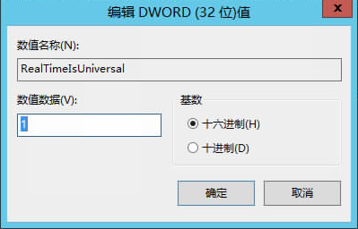

# Windows裸金属服务器的系统时间与本地时间相差8小时，如何处理？

## 问题原因

Linux操作系统以主机板CMOS芯片的时间作为格林尼治标准时间，再根据设置的时区来确定系统的当前时间。但是一般Windows操作系统并不如此，Windows系统直接将CMOS时间认定为系统当前时间，不再根据时区进行转换。

## 解决方案

1.  登录Windows裸金属服务器操作系统。
2.  单击“开始”菜单，在“搜索程序和文件”中输入“regedit”，并按“Enter”，打开注册表。
3.  在“注册表编辑器”页面，选择“HKEY\_LOCAL\_MACHINE \> SYSTEM \> CurrentControlSet \> Control \> TimeZoneInformation”。
4.  在“TimeZoneInformation”右侧区域右键单击，选择“新建 \> DWORD \(32-位\)值\(D\)”，添加一项类型为REG\_DWORD的机码，名称为RealTimeIsUniversal，值设为1。

    **图 1**  添加机码  
    

5.  修改完成后，重启裸金属服务器。

    重启完成后，裸金属服务器时间和本地时间保持一致。

