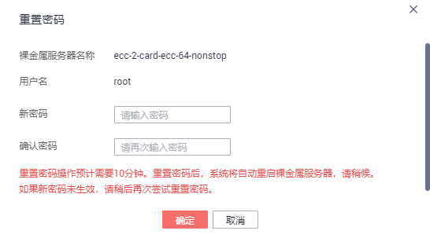

# 一键式重置密码

云平台提供了一键式重置密码功能，当裸金属服务器的密码丢失或过期时，如果您的裸金属服务器提前安装了密码重置插件，可以参见本节内容设置新密码。

## 前提条件

-   密码丢失或过期前，已安装密码重置插件“CloudResetPwdAgent”。安装操作请参见[安装一键式重置密码插件（可选）](安装一键式重置密码插件（可选）.md)。
-   裸金属服务器使用的虚拟私有云网络DHCP不能禁用。
-   裸金属服务器网络正常通行。
-   裸金属服务器已绑定弹性公网IP。

## 操作步骤

1.  登录管理控制台。
2.  选择“计算 \> 裸金属服务器”。

    进入裸金属服务器页面。

3.  选择待重置密码的裸金属服务器，单击“操作”列的“更多 \> 重置密码”。
4.  根据界面提示，设置裸金属服务器的新密码，并确认新密码。

    **图 1**  重置密码  
    

    新密码的复杂度应满足[表1](#table163171093713)。

    **表 1**  密码规则

    
    <table><thead align="left"><tr id="row1664810153712"><th class="cellrowborder" valign="top" width="20%" id="mcps1.2.4.1.1">
参数

    </th>
    <th class="cellrowborder" valign="top" width="60%" id="mcps1.2.4.1.2">
规则

    </th>
    <th class="cellrowborder" valign="top" width="20%" id="mcps1.2.4.1.3">
样例

    </th>
    </tr>
    </thead>
    <tbody><tr id="row136951083710"><td class="cellrowborder" valign="top" width="20%" headers="mcps1.2.4.1.1 ">
密码

    </td>
    <td class="cellrowborder" valign="top" width="60%" headers="mcps1.2.4.1.2 "><ul id="ul1674101033711"><li>密码长度范围为8到26位。</li><li>密码至少包含以下4种字符中的3种：<ul id="ul1480810153719"><li>大写字母</li><li>小写字母</li><li>数字</li><li>特殊字符
Windows：~!@#$%*-_=+[]:./?

    
Linux：~!@#%^*-_=+[]{}:,./?

    </li></ul>
    </li><li>密码不能包含用户名或用户名的逆序。</li><li>Windows系统的裸金属服务器，不能包含用户名中超过两个连续字符的部分。</li></ul>
    </td>
    <td class="cellrowborder" valign="top" width="20%" headers="mcps1.2.4.1.3 ">
Test12@#

    </td>
    </tr>
    </tbody>
    </table>

5.  单击“确定”。

    重置密码操作预计需要10分钟，请勿频繁执行。重置过程中，系统会自动重启裸金属服务器。启动后，使用新密码登录裸金属服务器，验证密码是否重置成功。

## 相关链接

[如何处理业务端口被一键式重置密码插件占用？](https://support.huaweicloud.com/bms_faq/bms_faq_0055.html)

