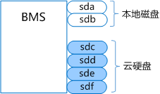
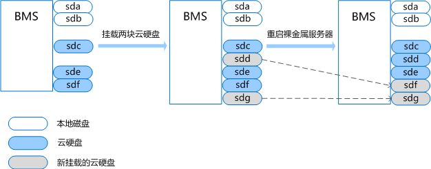
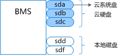
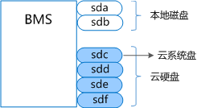
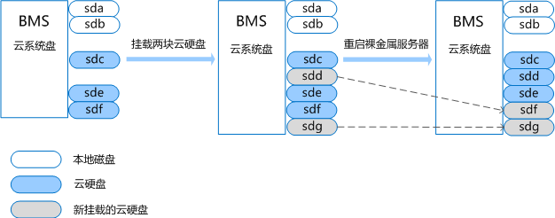
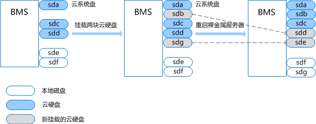
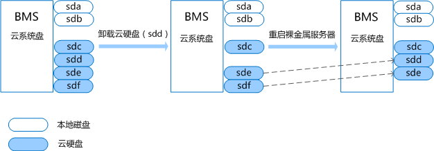
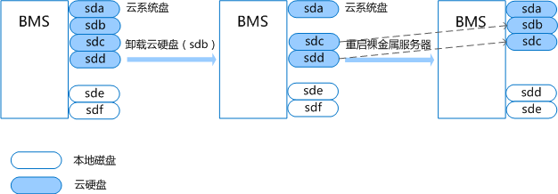

# 云硬盘设备名称与操作系统内块设备名称是否一致？

## 本地系统盘场景

裸金属服务器在详情页面显示的云硬盘设备名称与操作系统内部的设备名称不一致。为防止设备名称变化对业务造成影响，建议通过UUID的方式使用云硬盘。

当携带云硬盘创建裸金属服务器完成后，裸金属服务器详情界面的云硬盘名称从/dev/sdb开始进行显示，操作系统内部的云硬盘名称在本地硬盘名称之后，按照字母顺序依次增加，操作系统内部设备名称如[图1](#fig1769278111120)所示。

**图 1**  操作系统内部设备名称  

裸金属服务器创建完成后进行挂载云硬盘，裸金属服务器详情界面的云硬盘名称为挂载云硬盘时指定的名称；卸载云硬盘后，详情界面将不再显示该云硬盘，同时释放该云硬盘对应的设备名称。

而裸金属服务器创建完成后进行卸载云硬盘，操作系统中云硬盘名称跟操作系统是否重启有关。

若操作系统为未重启，挂载云硬盘时操作系统会选择一个可用的、字母序中最小的盘符名称，比如/dev/sda和/dev/sdc已被使用，将会分配dev/sdb；卸载云硬盘时操作系统会将云硬盘对应的设备名称释放。

若操作系统重启，操作系统内部的云硬盘名称会根据设备挂载时间以及本地磁盘个数重新生成，挂载云硬盘重启前后的现象，如[图2](#fig125556971412)所示；卸载云硬盘重启前后的现象如[图3](#fig571093113146)所示。

**图 2**  挂载云硬盘  

**图 3**  卸载云硬盘  

## 云系统盘场景

裸金属服务器在详情页面显示的云硬盘设备名称与操作系统内部的设备名称可能不一致。

当携带云硬盘创建裸金属服务器完成后，裸金属服务器详情界面的云硬盘名称从/dev/sda开始进行显示，操作系统内部的云硬盘名称和本地硬盘名称取决于系统的扫描顺序，整体按照字母顺序依次增加，可能存在以下两种情况，其中云系统盘始终为云硬盘盘符最小的一个，操作系统内部设备名称如[图4](#fig73716231158)和[图5](#fig17464143631512)所示。

**图 4**  操作系统内部设备名称（一）  

**图 5**  操作系统内部设备名称（二）  

裸金属服务器创建完成后进行挂载云硬盘，裸金属服务器详情界面的云硬盘名称为挂载云硬盘时指定的名称；卸载云硬盘后，详情界面将不再显示该云硬盘，同时释放该云硬盘对应的设备名称。

而裸金属服务器创建完成后进行卸载云硬盘，操作系统中云硬盘名称跟操作系统是否重启有关。

若操作系统未重启，挂载云硬盘时操作系统会选择一个可用的、字母序中最小的盘符名称，比如/dev/sda和/dev/sdc已被使用，将会分配dev/sdb；卸载云硬盘时操作系统会将云硬盘对应的设备名称释放。

若操作系统重启，操作系统内部的云硬盘名称会根据设备挂载时间以及本地磁盘个数重新生成，挂载云硬盘重启前后的现象，如[图6](#fig2951141791613)和[图7](#fig167631251101615)所示；卸载云硬盘重启前后的现象如[图8](#fig1773821141716)和[图9](#fig107095363171)所示。

**图 6**  挂载云硬盘（重启前）  

**图 7**  挂载云硬盘（重启后）  

**图 8**  卸载云硬盘（重启前）  

**图 9**  卸载云硬盘（重启后）  

> **说明：** 
>登入裸金属服务器操作系统后，通过**lsscsi**命令，查看卷类型为“Huawei”的盘即为云硬盘。

