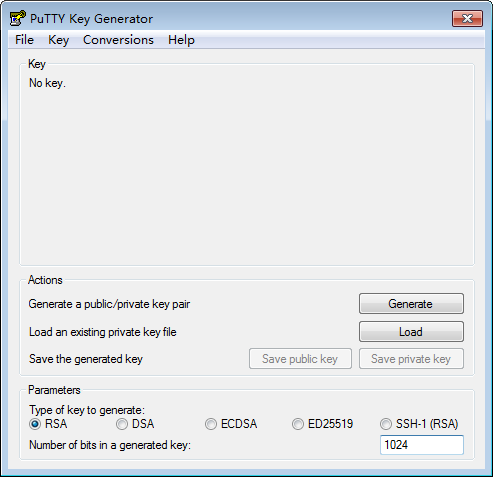
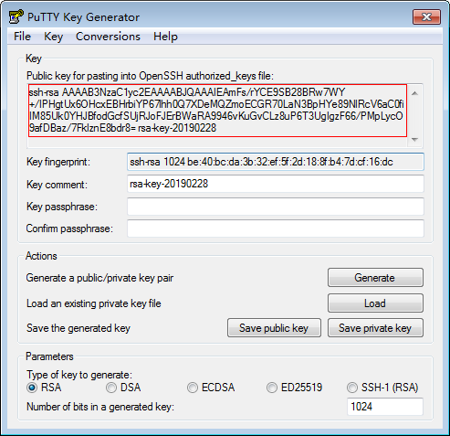
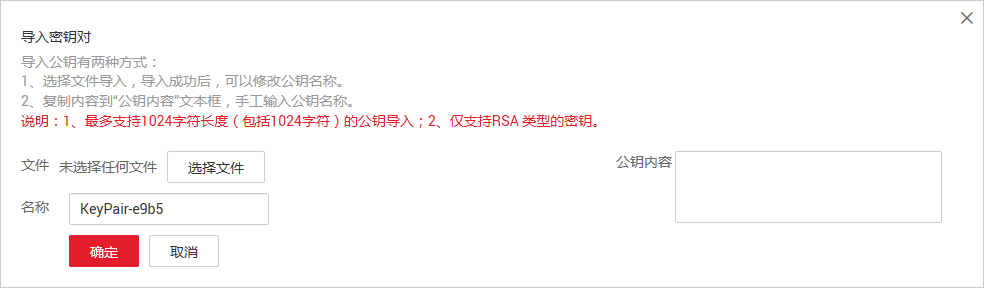

# 使用SSH密钥对

## SSH密钥对使用方式

为安全起见，裸金属服务器登录时建议使用密钥对方式进行身份验证。因此，您需要使用已有密钥对或创建一个密钥对，用于远程登录身份验证。

-   创建密钥对

    如果没有可用的密钥对，需要创建一个密钥对，生成公钥和私钥，并在登录裸金属服务器时提供私钥进行鉴权。创建密钥对的方法如下：

    -   （推荐）通过管理控制台创建密钥对，公钥自动保存在系统中，私钥由用户保存在本地，具体操作请参见[通过管理控制台创建密钥对](#section177941342144514)。
    -   通过PuTTYgen工具创建密钥对，公钥和私钥均保存在用户本地，具体操作请参见[通过PuTTYgen工具创建密钥对](#section1553115399576)。创建成功的密钥对，还需要执行[导入密钥对](#section139515511165)，导入系统才能正常使用密钥对。

        > **说明：**   
        >PuTTYgen是一款公钥私钥生成工具，获取路径：[https://www.chiark.greenend.org.uk/\~sgtatham/putty/latest.html](https://www.chiark.greenend.org.uk/~sgtatham/putty/latest.html)  

-   使用已有密钥对

    如果本地已有密钥对（例如，使用PuTTYgen工具生成的密钥对），可以在管理控制台导入密钥对公钥，由系统维护您的公钥文件。具体操作请参见[导入密钥对](#section139515511165)。

## 通过管理控制台创建密钥对

1.  登录管理控制台。
2.  选择“计算 \> 裸金属服务器”。
3.  在左侧导航树中，选择“密钥对”。
4.  在“密钥对”页面，单击“创建密钥对”。
5.  输入密钥名称，单击“确定”。

    密钥名称由两部分组成：KeyPair-4位随机数字，使用一个容易记住的名称，如KeyPair-xxxx\_bms。

6.  您的浏览器会提示您下载或自动下载私钥文件。文件名是您为密钥对指定的名称，文件扩展名为“.pem”。请将私钥文件保存在安全位置。然后在系统弹出的提示框中单击“确定”。

    > **须知：**   
    >这是您保存私钥文件的唯一机会，请妥善保管。当您创建裸金属服务器时，您将需要提供密钥对的名称；每次SSH登录到裸金属服务器时，您将需要提供相应的私钥。  

## 通过PuTTYgen工具创建密钥对

1.  生成公钥和私钥文件。
    1.  双击“puttygen.exe”，打开“PuTTY Key Generator”。

        **图 1**  PuTTY Key Generator  
        

    2.  单击“Generate”。

        密钥生成器将自动生成一对公钥和私钥，其中，[图2](#fig1743640142214)的红框内容为生成的公钥文件。

        **图 2**  生成公钥和私钥文件  
        

2.  复制红框中的公钥内容，并将其粘贴在文本文档中，以“.txt”格式保存在本地，保存公钥文件。

    > **说明：**   
    >请勿直接单击“Save public key”保存公钥文件。因为通过PuTTYgen工具的“Save public key”按钮保存在本地的公钥文件，公钥内容的格式会发生变化，不能直接导入管理控制台使用。  

3.  保存私钥文件。

    根据不同用途，需将私钥文件保存为不同格式。为保证安全，私钥只能下载一次，请妥善保管。

    -   保存私钥文件为“.ppk”格式。

        当用户使用PuTTY工具登录Linux裸金属服务器时，需使用“.ppk”格式的私钥文件。保存方法如下：

        1.  在“PuTTY Key Generator”界面，选择“File \> Save private key”。
        2.  保存私钥到本地。例如：kp-123.ppk。

    -   保存私钥文件为“.pem”格式。

        当用户使用Xshell工具登录Linux裸金属服务器时，或者获取Windows裸金属服务器的密码时，需使用“.pem”格式的私钥文件。保存方法如下：

        1.  在“PuTTY Key Generator”界面，选择“Conversions \> Export OpenSSH key”。

            > **须知：**   
            >如果该私钥文件用于Windows裸金属服务器的获取密码操作，在选择“Export OpenSSH key”时，请勿填写“Key passphrase”信息，否则会导致获取密码失败。  

        2.  保存私钥到本地。例如：kp-123.pem。

4.  公钥和私钥文件正确保存后，请参见[导入密钥对](#section139515511165)，将公钥导入系统中。

## 导入密钥对

通过PuTTYgen工具的“Save public key”按钮保存在本地的公钥文件，公钥内容的格式会发生变化，不能直接导入管理控制台。请先参考[通过PuTTYgen工具创建的密钥对，导入管理控制台失败怎么办？](通过PuTTYgen工具创建的密钥对-导入管理控制台失败怎么办.md)，获取正确格式的公钥文件内容，然后再导入管理控制台。

1.  登录管理控制台。
2.  选择“计算 \> 裸金属服务器”。
3.  在左侧导航树中，选择“密钥对”。
4.  在“密钥对”页面，单击“导入密钥对”。

    **图 3**  导入密钥对  
    

5.  导入密钥对的方式有如下两种：
    -   选择文件方式：将本地已有的可用密钥，导入到系统中。
        1.  在管理控制台“导入密钥对”页面，单击“选择文件”，选择本地保存的公钥文件（例如，[2](#li1156822695811)中保存的“.txt”格式文件）。

            > **说明：**   
            >执行“导入密钥对”操作时，请确认导入的是公钥文件，否则会导入失败。  

        2.  单击“确定”，导入公钥。

            公钥导入成功后，您可以修改公钥名称。

    -   复制公钥文件内容方式：将“.txt”格式文本文档中的公钥内容粘贴至对话框，导入到系统中。
        1.  复制文本文档中保存的公钥文件内容，并将其粘贴在“公钥内容”的空白区域。
        2.  单击“确定”，导入公钥。

## 私钥文件丢失或泄露怎么办？

建议您开启[数据加密服务](https://www.huaweicloud.com/product/dew.html)（Data Encryption Workshop，DEW）。开启后，您可以管理密钥对，包括绑定、查看、重置、替换、解绑、删除密钥对等。具体操作，请参见[管理密钥对](https://support.huaweicloud.com/usermanual-dew/dew_01_0071.html)。

示例：

-   如果私钥文件丢失，您可以通过“重置密钥对”功能重新配置裸金属服务器的密钥对。
-   如果私钥文件泄露，您可以通过“替换密钥对”功能使用新的密钥对替换裸金属服务器内的公钥。

## 删除密钥对

如果不再需要一个密钥对，您可以将其删除。删除操作会将密钥对彻底删除，不可恢复。但是使用了该密钥对的裸金属服务器不受任何影响，还可以使用本地保存的私钥进行登录，而且被删除的密钥对名称仍会显示在裸金属服务器详情信息中。

> **说明：**   
>-   如果您的密钥对已经绑定服务器，而且在删除前未解绑服务器，删除后，您将不能再用相同的名称创建密钥对。否则，创建或导入密钥对时，输入这个名称，控制台会报错“密钥对已存在”。  
>-   如果您的密钥对在删除前未绑定服务器或者已经解绑服务器，删除后，您仍可以使用相同的名称创建密钥对。  

1.  登录管理控制台。
2.  选择“计算 \> 裸金属服务器”。
3.  在左侧导航树中，选择“密钥对”。
4.  选中一个需要删除的密钥对，单击操作列的“删除”。

