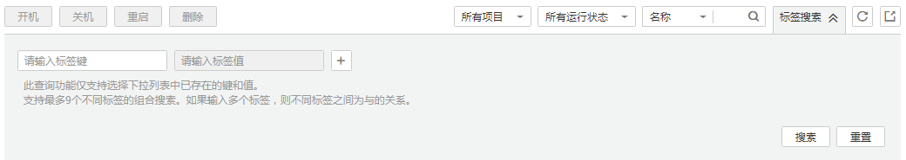

# 使用标签检索资源

为云资源添加标签后，您可以通过本文所述的两种方法使用标签检索资源。

## 在资源列表中筛选资源

在裸金属服务器列表页，您可以按“标签键+标签值”搜索目标裸金属服务器。

1.  登录管理控制台。
2.  选择“计算 \> 裸金属服务器”。

    进入裸金属服务器页面。

3.  单击裸金属服务器列表右上角的“标签搜索”，展开查询页。

    **图 1**  按标签搜索  
    

4.  输入待查询裸金属服务器的标签。

    标签键和标签值均不能为空，当标签键和标签值全匹配时，系统可以自动查询到目标裸金属服务器。

5.  单击添加多个标签。

    系统支持不同标签的组合搜索，并取各个标签的交集。

6.  单击“搜索”。

    系统根据标签键或标签值搜索目标裸金属服务器。

## 通过标签管理筛选资源

1.  登录管理控制台。
2.  在右上角的用户名下选择“标签管理”，进入标签管理服务页面。
3.  在“资源标签”页面，设置搜索条件（包括区域、资源类型、资源标签）。
4.  单击“搜索”。

    搜索结果区域将列出所有符合搜索条件的资源。

