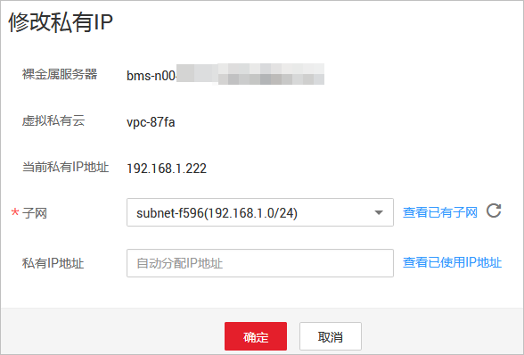

# 修改私有IP地址

## 操作场景

您可以直接修改虚拟私有云中裸金属服务器的私有IP地址，也可以通过更改裸金属服务器所属的子网来修改私有IP地址。

## 约束与限制

-   裸金属服务器已关机。
-   不支持修改扩展网卡的私有IP地址。
-   手动指定私有IP时，需要保证该私有IP在所选子网内。
-   修改的私有IP不能和该裸金属服务器其他网卡的IP在同一子网内。

## 操作步骤

1.  登录管理控制台。
2.  选择“计算 \> 裸金属服务器”。
3.  在裸金属服务器列表中的右上角，输入裸金属服务器名称、私有IP地址、ID或规格，并单击进行搜索。
4.  单击待修改私有IP的裸金属服务器名称。

    系统跳转至该裸金属服务器详情页面。

5.  选择“网卡”页签，并单击主网卡所在行的“修改私有IP”。

    系统打开“修改私有IP”窗口。

    **图 1**  修改私有IP  
    

6.  根据需要修改主网卡的“子网”、“私有IP地址”，然后单击“确定”。

    > **说明：**   
    >只能在同一虚拟私有云下更换子网。  
    >如果您不需要切换子网，则直接修改“私有IP地址”即可。  
    >如果未填写“私有IP地址”，系统会自动分配一个新的私有IP地址给主网卡使用。  

7.  在裸金属服务器详情页面，单击右上角的“开机”，裸金属服务器重新启动后，修改的私有IP就生效了。

