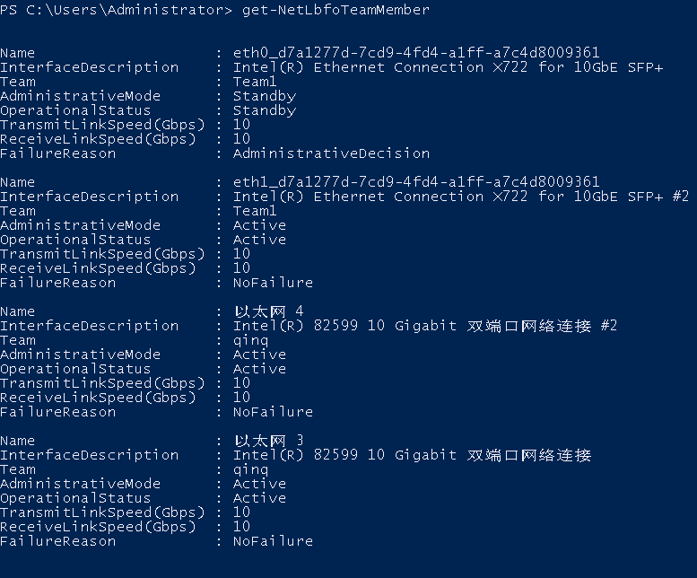

# 修改裸金属服务器名称<a name="bms_01_0010"></a>

## 操作场景<a name="section31883092112"></a>

为了方便用户在管理控制台上进行裸金属服务器实例管理，可快速辨别出每台服务器的名字，华为云支持给每台服务器命名，并且可以随时更改，重启生效。

## 约束限制<a name="section49641651142610"></a>

Windows裸金属服务器不支持修改主机名。

## 操作步骤<a name="section11351898212"></a>

1.  登录管理控制台。
2.  选择“计算 \> 裸金属服务器”。

    进入裸金属服务器页面。

3.  单击待修改主机名的裸金属服务器名称，进入详情页面。
4.  单击名称后的，输入满足以下规范的主机名称，确认修改后单击右侧的，保存主机名设置。

    主机名称规范：只能由英文字母、数字及“-”、“\_”和“.”组成。

5.  登录该裸金属服务器操作系统，通过以下命令，打开自动同步主机名功能开关。

    **vi /opt/huawei/network\_config/bms-network-config.conf**

    将参数“auto\_synchronize\_hostname”设置为“True”：

    ```
    auto_synchronize_hostname = True
    ```

    修改完成后按“Esc”，输入**:wq**保存并退出文件。

    > **说明：**   
    >如果参数项“auto\_synchronize\_hostname”取值为“False”，裸金属服务器重启后，主机名会恢复为创建时定义的主机名。  

6.  再次进入管理控制台，在该裸金属服务器所在行，单击操作列的“更多 \> 重启”。

    等待10分钟左右，保证裸金属服务器重启完成并自动更新主机名。


