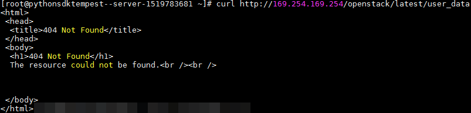

# 元数据<a name="bms_01_0040"></a>

## 元数据介绍<a name="section39791057141010"></a>

裸金属服务器元数据包含了裸金属服务器在云平台的基本信息，例如服务器ID、主机名、网络信息等。裸金属服务器元数据支持两种风格，可以分别通过兼容OpenStack和兼容EC2的API获取，如[表1](#zh-cn_topic_0042400609_table273552371680)所示。

**表 1**  裸金属服务器元数据类别支持列表

|元数据类型|实例元数据项|说明|
|--|--|--|
|OpenStack类型|/meta_data.json|查询裸金属服务器的元数据信息。元数据的关键字段请参见表2。|
|/password|查询裸金属服务器的密码。对于Windows系统，使用密钥对创建服务器初始化时，Cloudbase-init用于保存密文密码。|
|/user_data|查询裸金属服务器的用户数据。用户根据需要自行指定脚本和配置文件用于服务器初始化，详细操作请参考实例自定义数据注入。若Linux服务器使用密码方式，则保存注入密码的脚本。|
|/network_data.json|查询裸金属服务器的网络信息。|
|/securitykey|获取临时的AK、SK。对裸金属服务器获取临时的AK、SK，需要在IAM上对裸金属服务授权，并对相应的服务器资源进行授权委托管理。|
|兼容EC2类型|/meta-data/hostname|查询裸金属服务器的主机名称。请参考以下链接为裸金属服务器去掉后缀.novalocal:裸金属服务器的主机名带后缀“novalocal”|
|/meta-data/instance-type|查询裸金属服务器的规格名称。|
|/meta-data/local-ipv4|查询裸金属服务器的固定IP地址。多网卡情况下，只显示主网卡的地址。|
|/meta-data/placement/availability-zone|查询裸金属服务器的AZ信息。|
|/meta-data/public-ipv4|查询裸金属服务器的弹性公网IP地址。多网卡情况下，只显示主网卡的弹性公网IP地址。|
|/meta-data/public-keys/0/openssh-key|查询裸金属服务器的公钥。|
|/user-data|查询裸金属服务器的用户数据。|
|/meta-data/security-groups|查询裸金属服务器所使用的安全组名称。|


**表 2**  metadata关键字段

|参数|参数类型|描述|
|--|--|--|
|uuid|String|裸金属服务器的ID。|
|availability_zone|String|裸金属服务器所在可用区。|
|meta|Dict|元数据信息，包括镜像名称、镜像ID、VPC ID等信息。|
|hostname|String|裸金属服务器主机名。请参考以下链接为裸金属服务器去掉后缀.novalocal：裸金属服务器的主机名带后缀“novalocal”|
|vpc_id|String|裸金属服务器所属的虚拟私有云ID。|


对于支持的元数据类型，本节详细介绍了其URI和使用方法。

## 前提条件<a name="zh-cn_topic_0042400609_section36703712181817"></a>

-   已登录裸金属服务器。
-   请确保安全组出方向规则满足如下要求，否则访问元数据请求失败：

    -   协议：TCP
    -   端口范围：80
    -   远端地址：169.254.0.0/16

    > **说明：** 
    >如果您使用的是默认安全组出方向规则，则已经包括了如上要求，可以正常访问元数据。默认安全组出方向规则为：
    >-   协议：Any
    >-   端口范围：Any
    >-   远端地址：0.0.0.0/16


## Metadata（OpenStack元数据API）<a name="zh-cn_topic_0042400609_section29573104171554"></a>

用于查询裸金属服务器的元数据。

-   URI

    /169.254.169.254/openstack/latest/meta\_data.json

-   方法

    支持GET请求。

-   示例：

    以使用cURL工具为例，介绍查询裸金属服务器元数据的方法。

    **curl** **http://169.254.169.254/openstack/latest/meta\_data.json**

    ```
    {
        "random_seed": "rEocCViRS+dNwlYdGIxJHUp+00poeUsAdBFkbPbYQTmpNwpoEb43k9z+96TyrekNKS+iLYDdRNy4kKGoNPEVBCc05Hg1TcDblAPfJwgJS1okqEtlcofUhKmL3K0fto+5KXEDU3GNuGwyZXjdVb9HQWU+E1jztAJjjqsahnU+g/tawABTVySLBKlAT8fMGax1mTGgArucn/WzDcy19DGioKPE7F8ILtSQ4Ww3VClK5VYB/h0x+4r7IVHrPmYX/bi1Yhm3Dc4rRYNaTjdOV5gUOsbO3oAeQkmKwQ/NO0N8qw5Ya4l8ZUW4tMav4mOsRySOOB35v0bvaJc6p+50DTbWNeX5A2MLiEhTP3vsPrmvk4LRF7CLz2J2TGIM14OoVBw7LARwmv9cz532zHki/c8tlhRzLmOTXh/wL36zFW10DeuReUGmxth7IGNmRMQKV6+miI78jm/KMPpgAdK3vwYF/GcelOFJD2HghMUUCeMbwYnvijLTejuBpwhJMNiHA/NvlEsxJDxqBCoss/Jfe+yCmUFyxovJ+L8oNkTzkmtCNzw3Ra0hiKchGhqK3BIeToV/kVx5DdF081xrEA+qyoM6CVyfJtEoz1zlRRyoo9bJ65Eg6JJd8dj1UCVsDqRY1pIjgzE/Mzsw6AaaCVhaMJL7u7YMVdyKzA6z65Xtvujz0Vo=",
        "uuid": "ca9e8b7c-f2be-4b6d-a639-f10b4d994d04",
        "availability_zone": "lt-test-1c",
        "hostname": "bms-ddd4-l00349281.novalocal",
        "launch_index": 0,
        "meta": {
            "metering.image_id": "3a64bd37-955e-40cd-ab9e-129db56bc05d",
            "metering.imagetype": "gold",
            "metering.resourcespeccode": "physical.s3.small",
            "metering.cloudServiceType": "service.type.ec2",
            "image_name": "CentOS 7.6 64bit",
            "os_bit": "64",
            "vpc_id": "3b6c201f-aeb3-4bce-b841-64756e66cb49",
            "metering.resourcetype": "1",
            "cascaded.instance_extrainfo": "pcibridge:2",
            "os_type": "Linux",
            "charging_mode": "0"
        },
        "project_id": "6e8b0c94265645f39c5abbe63c4113c6",
        "name": "ecs-ddd4-l00349281"
    }
    ```


## User data（OpenStack元数据API）<a name="zh-cn_topic_0042400609_section51339028173755"></a>

用于查询裸金属服务器的用户数据。该值仅在创建裸金属服务器时指定，不支持修改。

-   URI

    /169.254.169.254/openstack/latest/user\_data

-   方法

    支持GET请求。

-   示例

    **curl** **http://169.254.169.254/openstack/latest/user\_data**

    ```
    ICAgICAgDQoiQSBjbG91ZCBkb2VzIG5vdCBrbm93IHdoeSBpdCBtb3ZlcyBpbiBqdXN0IHN1Y2ggYSBkaXJlY3Rpb24gYW5kIGF0IHN1Y2ggYSBzcGVlZC4uLkl0IGZlZWxzIGFuIGltcHVsc2lvbi4uLnRoaXMgaXMgdGhlIHBsYWNlIHRvIGdvIG5vdy4gQnV0IHRoZSBza3kga25vd3MgdGhlIHJlYXNvbnMgYW5kIHRoZSBwYXR0ZXJucyBiZWhpbmQgYWxsIGNsb3VkcywgYW5kIHlvdSB3aWxsIGtub3csIHRvbywgd2hlbiB5b3UgbGlmdCB5b3Vyc2VsZiBoaWdoIGVub3VnaCB0byBzZWUgYmV5b25kIGhvcml6b25zLiINCg0KLVJpY2hhcmQgQmFjaA==
    ```

    > **说明：** 
    >如果创建裸金属服务器时未注入用户数据，此时，该接口的查询结果是404，如[图1](#fig748134111137)所示。
    >**图 1**  404 Not Found<a name="fig748134111137"></a>  
    >


## Network data（OpenStack元数据API）<a name="section374011381441"></a>

查询裸金属服务器的网络信息。

-   URI

    /openstack/latest/network\_data.json

-   方法

    支持GET请求

-   示例

    **curl** **http://169.254.169.254/openstack/**latest**/network\_data.json**

    ```
    {
        "services": [{
            "type": "dns",
            "address": "100.125.1.250"
        },
        {
            "type": "dns",
            "address": "100.125.21.250"
        }],
        "networks": [{
            "network_id": "67dc10ce-441f-4592-9a80-cc709f6436e7",
            "type": "ipv4_dhcp",
            "link": "tap68a9272d-71",
            "id": "network0"
        }],
        "links": [{
            "type": "cascading",
            "vif_id": "68a9272d-7152-4ae7-a138-3ef53af669e7",
            "ethernet_mac_address": "fa:16:3e:f7:c1:47",
            "id": "tap68a9272d-71",
            "mtu": null
        }]
    }
    ```


## Security Key（OpenStack元数据API）<a name="zh-cn_topic_0042400609_section921029416614"></a>

获取临时的AK、SK。

> **说明：** 
>-   您如果需要在裸金属服务器获取临时的AK、SK，需要在IAM上对裸金属服务器进行云服务委托授权，并对相应的裸金属服务器资源进行授权委托管理。操作流程请参考[IAM用户指南](https://support.huaweicloud.com/usermanual-iam/iam_06_0004.html)。
>-   临时的AK、SK一小时后会失效。临时AK、SK更新时间早于失效时间10分钟，10分钟内新旧临时AK、SK均可用。
>-   使用临时AK、SK时，需要在消息的header中增加'X-Security-Token':securitytoken。其中，securitytoken就是调用接口返回的值。

-   URI

    /openstack/latest/securitykey

-   方法

    支持GET请求

-   示例

    **curl** **http://169.254.169.254/openstack/latest/securitykey**


## User data（EC2-兼容的API）<a name="zh-cn_topic_0042400609_section1526795182322"></a>

用于查询裸金属服务器的用户数据。该值仅在创建裸金属服务器时指定，不支持修改。

-   URI

    /169.254.169.254/latest/user-data

-   方法

    支持GET请求。

-   示例

    **curl** **http://169.254.169.254/latest/user-data**

    ```
    ICAgICAgDQoiQSBjbG91ZCBkb2VzIG5vdCBrbm93IHdoeSBpdCBtb3ZlcyBpbiBqdXN0IHN1Y2ggYSBkaXJlY3Rpb24gYW5kIGF0IHN1Y2ggYSBzcGVlZC4uLkl0IGZlZWxzIGFuIGltcHVsc2lvbi4uLnRoaXMgaXMgdGhlIHBsYWNlIHRvIGdvIG5vdy4gQnV0IHRoZSBza3kga25vd3MgdGhlIHJlYXNvbnMgYW5kIHRoZSBwYXR0ZXJucyBiZWhpbmQgYWxsIGNsb3VkcywgYW5kIHlvdSB3aWxsIGtub3csIHRvbywgd2hlbiB5b3UgbGlmdCB5b3Vyc2VsZiBoaWdoIGVub3VnaCB0byBzZWUgYmV5b25kIGhvcml6b25zLiINCg0KLVJpY2hhcmQgQmFjaA==
    ```


## Hostname（EC2-兼容的API）<a name="zh-cn_topic_0042400609_section370431618033"></a>

用于查询裸金属服务器的主机名称，后面会追加.novalocal后缀。

-   URI

    /169.254.169.254/latest/meta-data/hostname

-   方法

    支持GET请求。

-   示例

    **curl** **http://169.254.169.254/latest/meta-data/hostname**

    ```
    bms-test.novalocal
    ```


## Instance Type（EC2-兼容的API）<a name="zh-cn_topic_0042400609_section5678065318623"></a>

用于查询裸金属服务器的规格名称。

-   URI

    /169.254.169.254/latest/meta-data/instance-type

-   方法

    支持GET请求。

-   示例

    **curl** **http://169.254.169.254/latest/meta-data/instance-type**

    ```
    physical.o2.medium
    ```


## Local IPv4（EC2-兼容的API）<a name="zh-cn_topic_0042400609_section3229992918750"></a>

用于查询裸金属服务器的固定IP地址。多网卡情况下，只显示主网卡的地址。

-   URI

    /169.254.169.254/latest/meta-data/local-ipv4

-   方法

    支持GET请求。

-   示例

    **curl** **http://169.254.169.254/latest/meta-data/local-ipv4**

    ```
    192.1.1.2
    ```


## Availability Zone（EC2-兼容的API）<a name="zh-cn_topic_0042400609_section4087782618925"></a>

用于查询裸金属服务器的AZ信息。

-   URI

    /169.254.169.254/latest/meta-data/placement/availability-zone

-   方法

    支持GET请求。

-   示例

    **curl** **http://169.254.169.254/latest/meta-data/placement/availability-zone**

    ```
    az1.dc1
    ```


## Public IPv4（EC2-兼容的API）<a name="zh-cn_topic_0042400609_section5999198518129"></a>

用于查询裸金属服务器的弹性公网IP地址。多网卡情况下，只显示主网卡的弹性公网IP地址。

-   URI

    /169.254.169.254/latest/meta-data/public-ipv4

-   方法

    支持GET请求。

-   示例

    **curl** **http://169.254.169.254/latest/meta-data/public-ipv4**

    ```
    46.1.1.2
    ```


## Public Keys（EC2-兼容的API）<a name="zh-cn_topic_0042400609_section51581190181532"></a>

用于查询裸金属服务器的公钥。

-   URI

    /169.254.169.254/latest/meta-data/public-keys/0/openssh-key

-   方法

    支持GET请求。

-   示例

    **curl** **http://169.254.169.254/latest/meta-data/public-keys/0/openssh-key**

    ```
    ssh-rsa AAAAB3NzaC1yc2EAAAADAQABAAABAQDI5Fw5k8Fgzajn1zJwLoV3+wMP+6CyvsSiIc/hioggSnYu/AD0Yqm8vVO0kWlun1rFbdO+QUZKyVr/OPUjQSw4SRh4qsTKf/+eFoWTjplFvd1WCBZzS/WRenxIwR00KkczHSJro763+wYcwKieb4eKRxaQoQvoFgVjLBULXAjH4eKoKTVNtMXAvPP9aMy2SLgsJNtMb9ArfziAiblQynq7UIfLnN3VclzPeiWrqtzjyOp6CPUXnL0lVPTvbLe8sUteBsJZwlL6K4i+Y0lf3ryqnmQgC21yW4Dzu+kwk8FVT2MgWkCwiZd8gQ/+uJzrJFyMfUOBIklOBfuUENIJUhAB Generated-by-Nova
    ```


