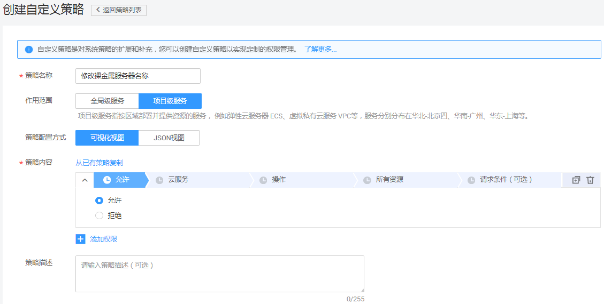
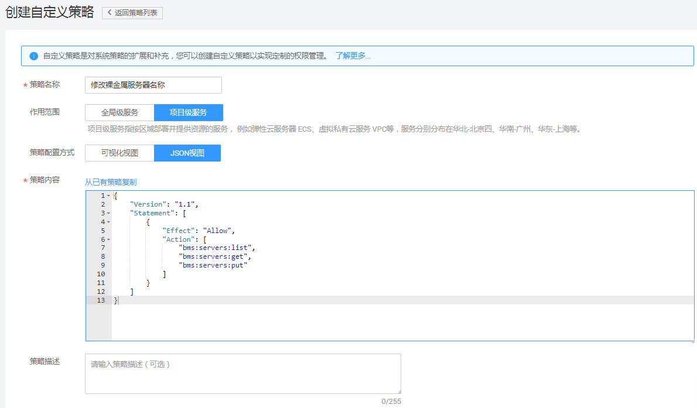

# 创建BMS自定义策略<a name="ZH-CN_TOPIC_0170005209"></a>

## 操作场景<a name="section1340315520599"></a>

如果系统预置的BMS权限，不满足您的授权要求，可以创建自定义策略。自定义策略中可以添加的授权项（Action）请参考：[策略及授权项说明](https://support.huaweicloud.com/api-bms/zh-cn_topic_0169929480.html)。

目前华为云支持以下两种方式创建自定义策略：

-   可视化视图创建自定义策略：无需了解策略语法，按可视化视图导航栏选择云服务、操作、资源、条件等策略内容，可自动生成策略。
-   JSON视图创建自定义策略：可以在选择策略模板后，根据具体需求编辑策略内容；也可以直接在编辑框内编写JSON格式的策略内容。

如下以定制一个用户仅能修改裸金属服务器名称的策略为例，分别采用可视化视图和JSON视图的配置方式创建自定义策略。

## 前提条件<a name="section14166125082620"></a>

-   请先在IAM控制台中开通细粒度策略，开通方法请参见：[申请细粒度访问控制公测](https://support.huaweicloud.com/usermanual-iam/iam_01_019.html)。
-   如需使用JSON视图创建自定义策略，请您先熟悉策略结构，具体请参见[策略语法：细粒度策略](策略语法-细粒度策略.md)。
-   请确定自定义策略需要允许哪些操作，拒绝哪些操作，并获取操作对应的授权项。授权项请参见：[策略及授权项说明](https://support.huaweicloud.com/api-bms/zh-cn_topic_0169929480.html)。

## 可视化视图配置自定义策略<a name="section2095751713323"></a>

1.  在IAM控制台，选择左侧导航栏的“策略”，在右上角单击“创建自定义策略”。

    

2.  在“创建自定义策略”中，配置如下信息：

    

    -   “策略名称”：填写“修改裸金属服务器名称”。
    -   “作用范围”：根据服务的属性填写，BMS为项目级服务，选择“项目级服务”。
    -   “策略配置方式”：选择“可视化视图”。
    -   “策略内容”：
        1.  选择“允许”。
        2.  在“云服务”中搜索“BMS”，选择“裸金属服务器 \(BMS\)”。
        3.  在“操作”中勾选“ReadWrite”中的“bms:servers:put”，即“修改裸金属服务器名称”。“bms:servers:put”依赖“bms:servers:list”（查询裸金属服务器列表）和“bms:servers:get”（查询裸金属服务器详情）两个操作，因此，还需要勾选“ReadOnly”中的“bms:servers:get”和“ListOnly”中的“bms:servers:list”。
        4.  单击“确定”，自定义策略创建完成。

            系统返回策略列表，可以看到创建成功的自定义策略“修改裸金属服务器名称”。


## JSON视图配置自定义策略<a name="section11440122014280"></a>

1.  在IAM控制台，选择左侧导航栏的“策略”，在右上角单击“创建自定义策略”。

    

2.  在“创建自定义策略”中，填写如下参数：

    

    -   “策略名称”：填写“修改裸金属服务器名称”。
    -   “作用范围”：根据服务的属性填写，BMS为项目级服务，选择“项目级服务”。
    -   “策略配置方式”：选择“JSON视图”。
    -   “策略内容”：将如下内容拷贝至策略内容中。如下策略表示允许修改裸金属服务器名称。

        ```
        {
                "Version": "1.1",
                "Statement": [
                        {
                                "Action": [
                                        "bms:servers:list",
        				"bms:servers:get",
                                        "bms:servers:put"
                                ],
                                "Effect": "Allow"
                        }
                ]
        }
        ```

3.  单击“确定”后，系统会自动校验语法，如跳转到策略列表，则自定义策略创建成功；如提示“策略内容错误”，请按照语法规范进行修改。

## 验证自定义策略权限<a name="section149807321323"></a>

1.  将新创建的自定义策略授予用户组，使得用户组中的用户仅具备修改裸金属服务器名称的权限。
2.  用户登录并验证自定义策略定义的权限：修改裸金属服务器名称。

    权限授予成功后，用户可以通过控制台以及REST API等多种方式验证。此处以登录控制台为例，介绍用户如何验证修改裸金属服务器名称的权限。

    1.  使用新创建的用户登录华为云，登录方法选择为“IAM用户登录”。
        -   账号名为该IAM用户所属华为云账号的名称。
        -   用户名和密码为账号在IAM创建用户时输入的用户名和密码。

    2.  在裸金属服务器页面，进行修改裸金属服务器名称操作。操作成功，表示权限配置正确并已生效。
    3.  尝试进行其他操作，例如：创建裸金属服务器。

        系统提示“权限不足”，权限配置正确并已生效。


## 策略样例<a name="section1737354083912"></a>

-   示例1：授权用户批量启动服务器。

    ```
    {
            "Version": "1.1",
            "Statement": [
                    {
                            "Action": [
                                    "bms:servers:get",
    				"bms:servers:list",
                                    "bms:servers:start"
                            ],
                            "Effect": "Allow"
                    }
            ]
    }
    ```

-   示例2：拒绝用户下电服务器。

    拒绝策略需要同时配合其他策略使用，否则没有实际作用。用户被授予的策略中，一个授权项的作用如果同时存在Allow和Deny，则遵循Deny优先。

    如果您给用户授予BMS Admin的系统策略，但不希望用户拥有BMS Admin中定义的下电裸金属服务器权限（bms:servers:stop），您可以创建一条拒绝下电服务器的自定义策略，然后同时将BMS Admin和拒绝策略授予用户，根据Deny优先原则，则用户可以对BMS执行除了下电以外的所有操作。以下策略样例表示：拒绝用户下电裸金属服务器。

    ```
    {
            "Version": "1.1",
            "Statement": [
                    {
                            "Effect": "Deny",
                            "Action": [
                                    "bms:servers:stop"
                            ]
                    }
            ]
    }
    ```


