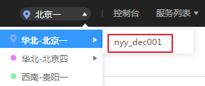
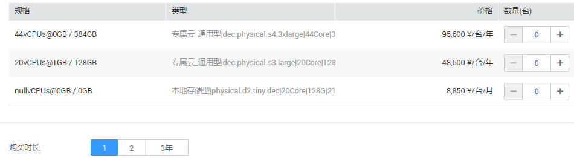

# 创建专属裸金属服务器

## 操作场景

专属云中的专属资源池与公共资源池物理隔离，如果您的业务对安全合规性有较高要求，可以选择将裸金属服务器创建在专属云中。

创建专属裸金属服务器有两种方式：

-   [在专属云控制台创建](#section189549226910)
-   [在云服务器控制台创建](#section533335919)

这两种方法都需要先申请专属裸金属资源池。

## 前提条件

已开通专属云服务，详细操作请参见[开通专属云](https://support.huaweicloud.com/usermanual-dcc/dcc_03_0002.html)。

## 申请专属裸金属资源池

1.  登录管理控制台。
2.  单击左侧上方区域下拉列表，切换到专属云所在服务区。

    **图 1**  选择专属云所在服务区  
    

3.  选择“服务列表 \> 专属云 \> 专属裸金属”。

    进入专属裸金属界面。

4.  单击右上方的“申请资源”，创建专属资源池。
5.  根据自己的业务需求选择合适的规格类型，并设置数量及购买时长。

    **图 2**  设置专属资源池参数  
    

6.  单击“立即申请”，确认无误后单击“提交”。

    提示任务提交成功，资源池的申请需要运维人员审核，审核通过后可在“费用中心 \> 我的订单”中进行支付。

7.  支付成功后，您可以在专属裸金属管理页面查看资源池的信息，比如资源池类型、CPU分配率、内存分配率等。

## 方法一：在专属云控制台创建专属裸金属服务器

1.  登录管理控制台。
2.  单击左侧上方区域下拉列表，切换到专属云所在服务区。
3.  选择“服务列表 \> 专属云 \> 专属裸金属”。

    进入专属裸金属界面。

4.  单击右上方的“在专属云中发放裸金属服务器”。

    跳转至创建裸金属服务器向导页面。

5.  根据界面提示完成参数配置，这些参数与创建普通裸金属服务器无异，详情请参阅[创建裸金属服务器](创建裸金属服务器.md)。

    创建成功后，返回“专属裸金属”页面，可以看到裸金属服务器数量变为1，CPU分配率、内存分配率也同步增加。

## 方法二：在云服务器控制台创建专属裸金属服务器

1.  登录管理控制台。
2.  单击左侧上方区域下拉列表，切换到专属云所在服务区。
3.  选择“服务列表 \> 计算 \> 裸金属服务器”。

    进入云服务器控制台。

4.  在裸金属服务器页面，单击右上方的“在专属云中发放裸金属服务器”。

    跳转至创建裸金属服务器向导页面。

5.  根据界面提示完成参数配置，这些参数与创建普通裸金属服务器无异，详情请参阅[创建裸金属服务器](创建裸金属服务器.md)。

    创建成功后，进入“总览”页面，在“资源使用详情”区域单击“裸金属资源池”页签，可以看到裸金属服务器数量变为1，CPU分配率、内存分配率也同步增加。

