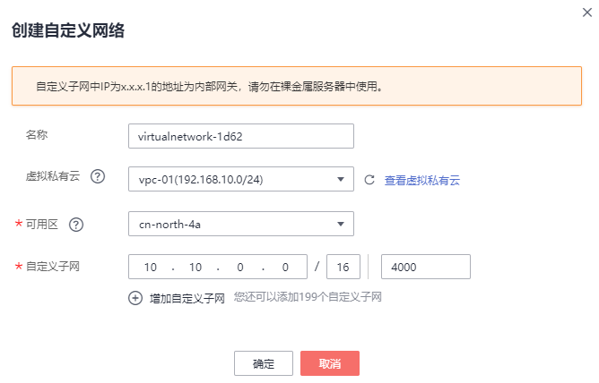
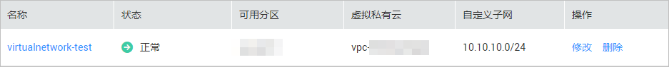
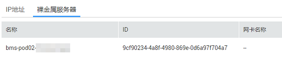

# 创建并管理自定义网络

## 创建自定义网络

> **说明：**   
>本章节以在“华南-广州”区域创建自定义网络为例，“华北-北京一”、“亚太-曼谷”区域的差异点参见[使用须知](自定义网络简介.md#section973732622210)。  

1.  登录管理控制台。
2.  选择“计算 \> 裸金属服务器”。

    进入裸金属服务器页面。

3.  在“自定义网络”页签中，选择“自定义网络”并单击“创建自定义网络”。
4.  根据实际需求填写名称，选择虚拟私有云、可用区，设置自定义子网，以及VLAN。

    **图 1**  创建自定义网络  
    

    > **说明：**   
    >-   自定义子网掩码限制在16\~29位，自定义子网的网关IP不能被租户使用，且自定义子网和VPC子网的CIDR不能冲突。  
    >-   VLAN取值范围为1\~4094，同一个自定义网络下的自定义子网都必须拥有不同的VLAN。  

5.  单击“确定”完成自定义网络的创建。

    创建成功后，可以在列表查看自定义网络的状态、虚拟私有云、自定义子网等相关信息。

    **图 2**  自定义网络列表  
    

    > **说明：**   
    >如果您还没有创建多网卡裸金属服务器，会弹出“多网卡裸金属服务器实例不足”提示，创建失败。  

## 修改自定义网络的名称

1.  在裸金属服务器页面，单击“自定义网络”页签，在自定义网络列表中找到待修改名称的自定义网络，单击“操作”列的“修改”。
2.  输入新名称，单击“确定”。

## 查看自定义网络详情

1.  在裸金属服务器页面，单击“自定义网络”页签。
2.  在自定义网络列表中，单击待查看详情的自定义网络名称。

    可以在详情页面查看自定义网络的名称、可用区、自定义子网个数、虚拟私有云信息。

    您也可以在该页面修改自定义网络名称，单击，输入新名称，单击。

## 管理自定义子网

-   添加自定义子网

    在自定义网络详情页面，单击“添加自定义子网”，输入IP地址和VLAN，单击“确定”。

-   查看自定义子网详情

    在自定义子网列表，单击待查看详情的自定义子网名称，系统跳转至自定义子网详情页面。

    在“IP地址”页签查看自定义子网的IP地址，以及绑定的弹性公网IP。

    在“裸金属服务器”页签查看所有多网卡裸金属服务器的信息。

    **图 3**  裸金属服务器  
    

-   修改自定义子网

    用户无法直接修改自定义子网，需通过删除自定义网络后重新创建自定义网络来创建新的自定义子网。

-   删除自定义子网

    在自定义子网列表，找到待删除的自定义子网，单击“操作”列的“删除”。

    如果自定义网络下只有一个子网，则不允许用户删除自定义子网。

## 删除自定义网络

1.  在裸金属服务器页面，单击“自定义网络”页签。
2.  找到待删除的自定义网络，单击“操作”列的“删除”，在弹出框中单击“确定”。

    最后一个多网卡裸金属服务器实例被删除后，自定义网络将不可用，需要用户手动删除。下次使用时，请重新创建自定义网络。

