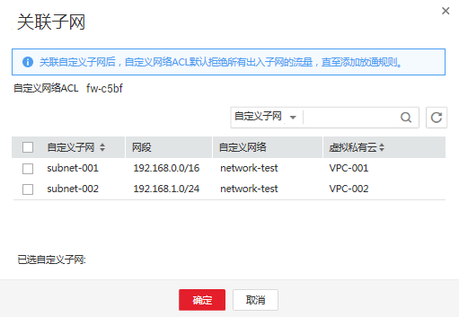

# 创建并管理自定义网络ACL

## 创建自定义网络ACL

每个用户默认可以创建200个自定义网络ACL。

1.  登录管理控制台。
2.  选择“计算 \> 裸金属服务器”。

    进入裸金属服务器页面。

3.  在“自定义网络”页签中，选择“自定义网络ACL”并单击“创建自定义网络ACL”。
4.  输入名称、描述，单击“确定”。
5.  创建成功后，自定义网络ACL列表中增加一条记录。

## 添加入/出方向规则

您可根据自身网络需求，在出方向和入方向添加相应规则。

1.  在裸金属服务器页面，单击“自定义网络”页签，选择“自定义网络ACL”。
2.  单击待添加规则的自定义网络ACL名称，进入自定义网络ACL详情页面。
3.  在入方向规则或出方向规则页签，单击“添加规则”，添加入方向或出方向规则。

    单击“+”可以依次增加多条规则。

    **表 1**  参数说明

    
    <table><thead align="left"><tr id="row237820178581"><th class="cellrowborder" valign="top" width="18.61186118611861%" id="mcps1.2.4.1.1">
参数

    </th>
    <th class="cellrowborder" valign="top" width="54.88548854885489%" id="mcps1.2.4.1.2">
参数说明

    </th>
    <th class="cellrowborder" valign="top" width="26.502650265026507%" id="mcps1.2.4.1.3">
取值样例

    </th>
    </tr>
    </thead>
    <tbody><tr id="row5378141755817"><td class="cellrowborder" valign="top" width="18.61186118611861%" headers="mcps1.2.4.1.1 ">
策略

    </td>
    <td class="cellrowborder" valign="top" width="54.88548854885489%" headers="mcps1.2.4.1.2 ">
自定义网络ACL策略。必选项，单击下拉按钮可选择。

    </td>
    <td class="cellrowborder" valign="top" width="26.502650265026507%" headers="mcps1.2.4.1.3 ">
允许

    </td>
    </tr>
    <tr id="row113781117155817"><td class="cellrowborder" valign="top" width="18.61186118611861%" headers="mcps1.2.4.1.1 ">
协议

    </td>
    <td class="cellrowborder" valign="top" width="54.88548854885489%" headers="mcps1.2.4.1.2 ">
自定义网络ACL支持的协议。必选项，单击下拉按钮可选择。目前只支持选择TCP、UDP、ICMP、全部协议。当选择ICMP或者全部时，端口信息不可填写。

    </td>
    <td class="cellrowborder" valign="top" width="26.502650265026507%" headers="mcps1.2.4.1.3 ">
TCP

    </td>
    </tr>
    <tr id="row2037913177582"><td class="cellrowborder" valign="top" width="18.61186118611861%" headers="mcps1.2.4.1.1 ">
源地址

    </td>
    <td class="cellrowborder" valign="top" width="54.88548854885489%" headers="mcps1.2.4.1.2 ">
此方向允许的源地址。

    
默认值为0.0.0.0/0，代表支持所有的IP地址。

    
例如：

    
xxx.xxx.xxx.xxx/32（IP地址）

    
xxx.xxx.xxx.0/24（子网）

    
0.0.0.0/0（任意地址）

    </td>
    <td class="cellrowborder" valign="top" width="26.502650265026507%" headers="mcps1.2.4.1.3 ">
0.0.0.0/0

    </td>
    </tr>
    <tr id="row937971705818"><td class="cellrowborder" valign="top" width="18.61186118611861%" headers="mcps1.2.4.1.1 ">
源端口范围

    </td>
    <td class="cellrowborder" valign="top" width="54.88548854885489%" headers="mcps1.2.4.1.2 ">
源端口范围，取值范围是1~65535的数字。表示某一范围时，两个数字必须以短中划线分隔，例如：1-100。

    
选择TCP或UDP协议时必须填写。

    </td>
    <td class="cellrowborder" valign="top" width="26.502650265026507%" headers="mcps1.2.4.1.3 ">
22或22-30

    </td>
    </tr>
    <tr id="row737931711588"><td class="cellrowborder" valign="top" width="18.61186118611861%" headers="mcps1.2.4.1.1 ">
目的地址

    </td>
    <td class="cellrowborder" valign="top" width="54.88548854885489%" headers="mcps1.2.4.1.2 ">
此方向允许的目的地址。

    
默认值为0.0.0.0/0，代表支持所有的IP地址。

    
例如：

    
xxx.xxx.xxx.xxx/32（IP地址）

    
xxx.xxx.xxx.0/24（子网）

    
0.0.0.0/0（任意地址）

    </td>
    <td class="cellrowborder" valign="top" width="26.502650265026507%" headers="mcps1.2.4.1.3 ">
0.0.0.0/0

    </td>
    </tr>
    <tr id="row20379171714584"><td class="cellrowborder" valign="top" width="18.61186118611861%" headers="mcps1.2.4.1.1 ">
目的端口范围

    </td>
    <td class="cellrowborder" valign="top" width="54.88548854885489%" headers="mcps1.2.4.1.2 ">
目的端口范围，取值范围是1~65535的数字。表示某一范围时，两个数字必须以短中划线分隔，例如：1-100。

    
选择TCP或UDP协议时必须填写。

    </td>
    <td class="cellrowborder" valign="top" width="26.502650265026507%" headers="mcps1.2.4.1.3 ">
22或22-30

    </td>
    </tr>
    <tr id="row173434529593"><td class="cellrowborder" valign="top" width="18.61186118611861%" headers="mcps1.2.4.1.1 ">
描述

    </td>
    <td class="cellrowborder" valign="top" width="54.88548854885489%" headers="mcps1.2.4.1.2 ">
自定义网络ACL规则的描述信息，非必填项。

    
描述信息内容不能超过255个字符，且不能包含&lt;、&gt;符号。

    </td>
    <td class="cellrowborder" valign="top" width="26.502650265026507%" headers="mcps1.2.4.1.3 ">
-

    </td>
    </tr>
    </tbody>
    </table>

4.  单击“确定”完成自定义网络ACL规则的添加。

## 关联自定义子网

当用户需进行子网关联时，可进入该自定义网络ACL详情页面的“关联自定义子网”页签。关联子网后，自定义网络ACL默认拒绝裸金属服务器所有出入子网的流量，直至添加放通规则。

1.  在裸金属服务器页面，单击“自定义网络”页签，选择“自定义网络ACL”。
2.  单击待关联自定义子网的自定义网络ACL名称，进入自定义网络ACL详情页面。
3.  在“关联子网”页签，单击“关联”，弹出“关联子网”窗口。

    **图 1**  关联子网  
    

4.  勾选需要进行关联的自定义子网，单击“确定”，完成自定义子网关联。

    > **说明：** 
    >已关联自定义网络ACL的自定义子网将不会展示在关联自定义子网页面的列表中，即暂不支持一键式解绑自定义子网与关联自定义子网操作，若用户需要关联已绑定自定义网络ACL的自定义子网，需要先解除绑定再进行关联。

