# 初始化Windows数据盘（Windows 2016）

## 操作场景

本文以服务器的操作系统为“Windows Server 2016 Standard 64bit”为例，提供云硬盘的初始化操作指导。

MBR格式分区支持的磁盘最大容量为2 TB，GPT分区表最大支持的磁盘容量为18 EB，因此当为容量大于2 TB的磁盘分区时，请采用GPT分区方式。关于磁盘分区形式的更多介绍，请参见[初始化数据盘场景及磁盘分区形式介绍](初始化数据盘场景及磁盘分区形式介绍.md)。

不同服务器的操作系统的格式化操作可能不同，本文仅供参考，具体操作步骤和差异请参考对应的服务器操作系统的产品文档。

> **须知：**   
>首次使用云磁盘时，如果您未参考本章节对磁盘执行初始化操作，主要包括创建分区和文件系统等操作，那么当后续扩容磁盘时，新增容量部分的磁盘可能无法正常使用。  

## 前提条件

-   已登录裸金属服务器。
-   已挂载数据盘至裸金属服务器，且该数据盘未初始化。

## 操作指导

1.  在裸金属服务器桌面，单击左下方开始图标。

    弹出Windows Server窗口。

2.  单击“服务器管理器”。

    弹出“服务器管理器”窗口，如[图1](#zh-cn_topic_0115255433_fig128445136715)所示。

    **图 1**  服务器管理器  
    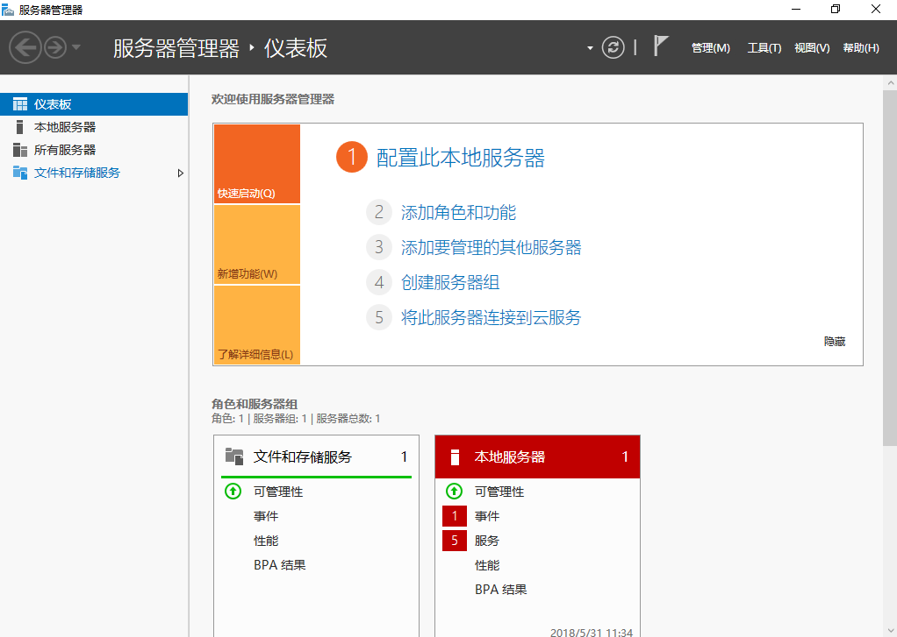

3.  在左侧导航树中，选择“文件和存储服务”。

    进入“服务器”页面，如[图2](#zh-cn_topic_0115255433_fig142571021135913)所示。

    **图 2**  服务器  
    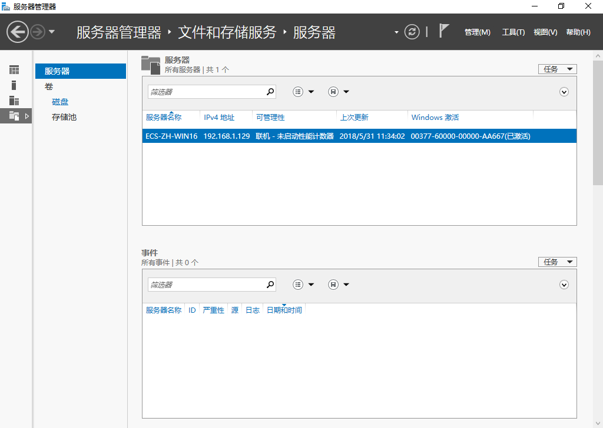

4.  在左侧导航栏单击“磁盘”。

    进入磁盘页面，如[图3](#zh-cn_topic_0115255433_fig629116141111)所示。

    **图 3**  磁盘  
    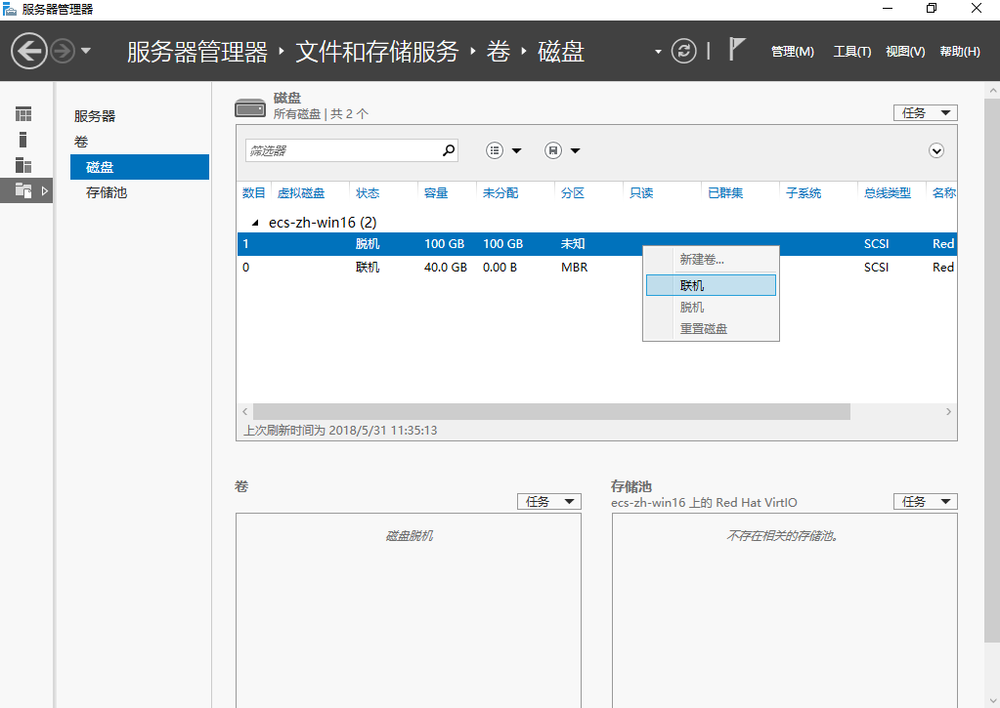

5.  在页面右侧可以查看磁盘列表，若新增磁盘处于脱机状态，需要先进行联机，再进行初始化。
    1.  选中新增磁盘，右键单击菜单列表中的“联机”。

        弹出“使磁盘联机”对话框，如[图4](#zh-cn_topic_0115255433_fig1718445812150)所示。

        **图 4**  使磁盘联机  
        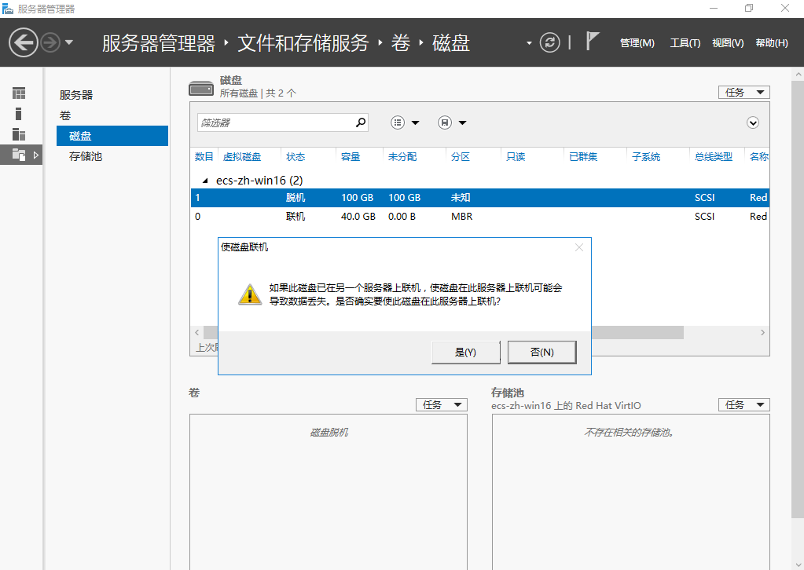

    2.  在弹出的对话框中，单击“是”，确认联机操作。
    3.  单击界面右上方，刷新磁盘信息。

        当磁盘状态由“脱机”变为“联机”，表示联机成功，如[图5](#zh-cn_topic_0115255433_fig982219318220)所示。

        **图 5**  联机成功  
        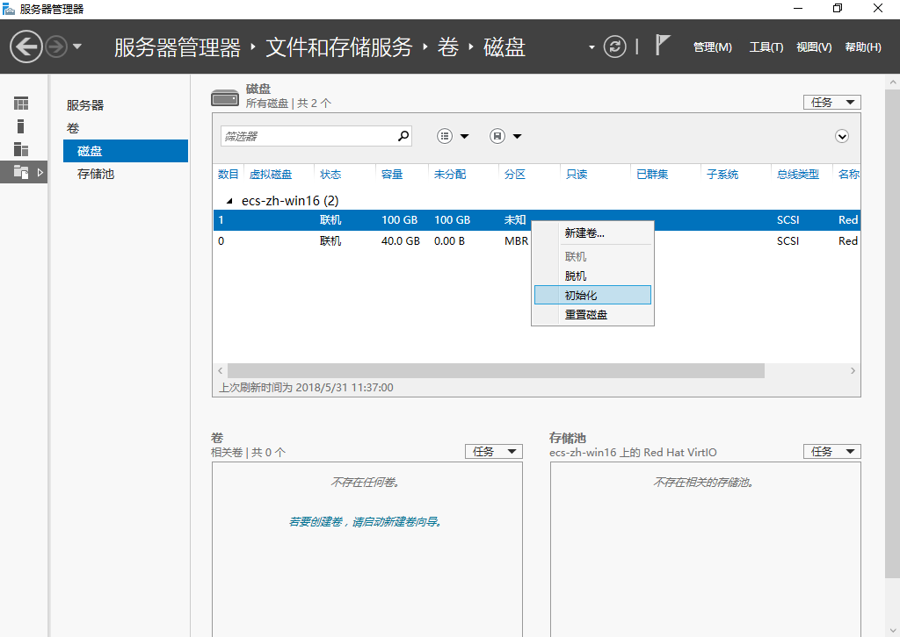

6.  联机成功后，初始化新增磁盘。
    1.  选中新增磁盘，右键单击菜单列表中的“初始化”。

        弹出“初始化磁盘”对话框，如[图6](#zh-cn_topic_0115255433_fig14110153018242)所示。

        **图 6**  初始化磁盘（Windows 2016）  
        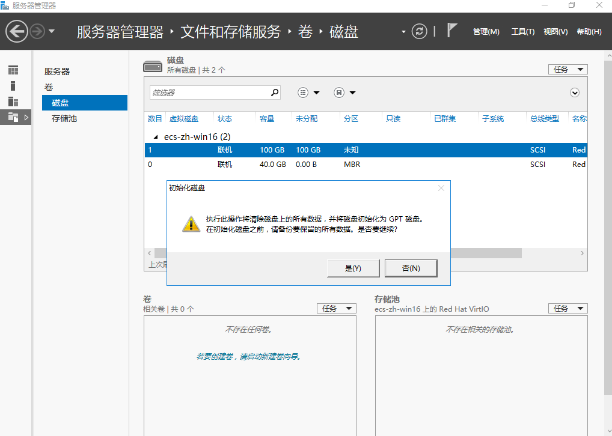

    2.  在弹出的对话框中，单击“是”，确认初始化操作。
    3.  单击界面右上方，刷新磁盘信息。

        当磁盘分区由“未知”变为“GPT”，表示初始化完成，如[图7](#zh-cn_topic_0115255433_fig1785185542612)所示。

        **图 7**  初始化完成  
        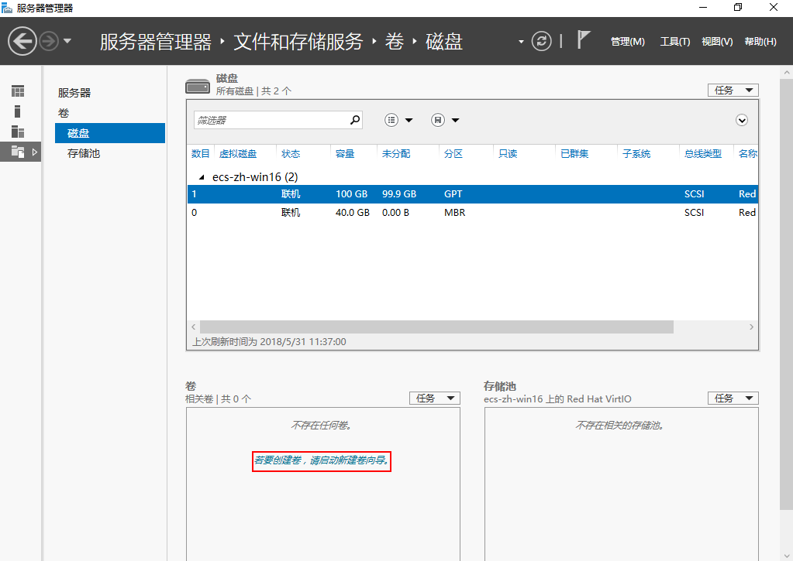

7.  单击界面左下方的“若要创建卷，请启动新建卷向导”超链接，新创建卷。

    弹出“新建卷向导”窗口，如[图8](#zh-cn_topic_0115255433_fig1827310212598)所示。

    **图 8**  新建卷向导  
    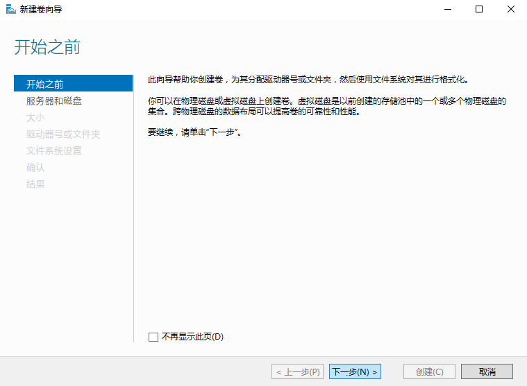

8.  根据界面提示，单击“下一步”。

    进入“选择服务器和磁盘”页面，如[图9](#zh-cn_topic_0115255433_fig132145111385)所示。

    **图 9**  选择服务器和磁盘  
    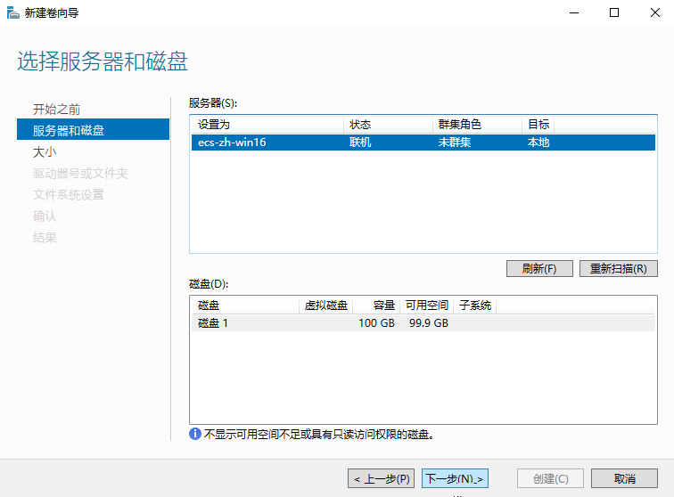

9.  选择服务器和磁盘，系统默认选择磁盘所挂载的服务器，您还可以根据实际需求指定服务器，此处以保持系统默认配置为例，单击“下一步”。

    进入“指定卷大小”页面，如[图10](#zh-cn_topic_0115255433_fig15177143215422)所示。

    **图 10**  指定卷大小（Windows 2016）  
    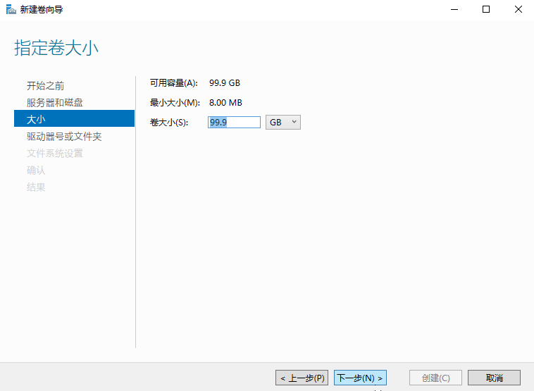

10. 指定卷大小，系统默认卷大小为最大值，您还可以根据实际需求指定卷大小，此处以保持系统默认配置为例，单击“下一步”。

    进入“分配到驱动器号或文件夹”页面，如[图11](#zh-cn_topic_0115255433_fig1412013015443)所示。

    **图 11**  分配到驱动器号或文件夹  
    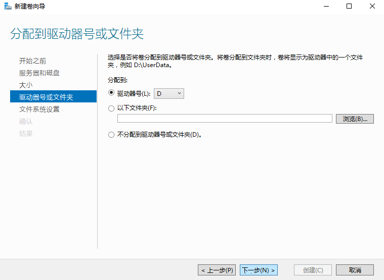

11. 分配到驱动器号或文件夹，系统默认为磁盘分配驱动器号，驱动器号默认为“D”，此处以保持系统默认配置为例，单击“下一步”。

    进入“选择文件系统设置”页面，如[图12](#zh-cn_topic_0115255433_fig15826918154919)所示。

    **图 12**  选择文件系统设置  
    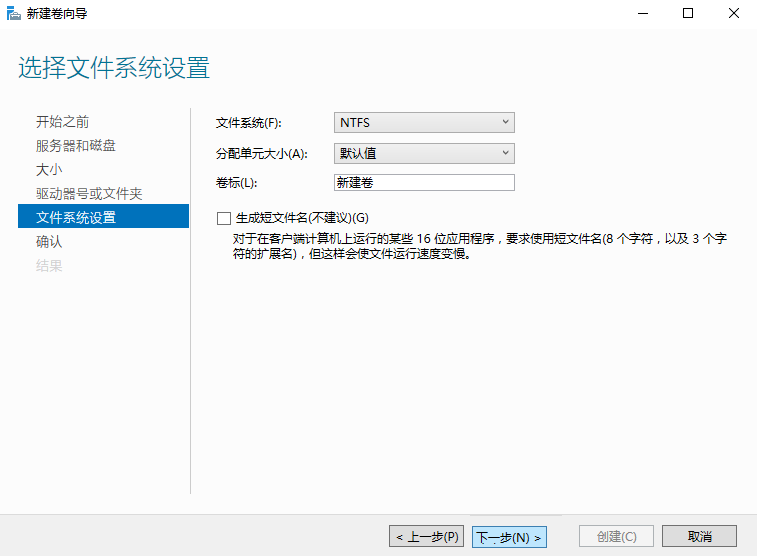

12. 选择文件系统设置，系统默认的文件系统为NTFS，并根据实际情况设置参数，此处以保持系统默认设置为例，单击“下一步”。

    > **须知：**   
    >不同文件系统支持的分区大小不同，请根据您的业务需求选择合适的文件系统。  

    进入“确认选择”页面，如[图13](#zh-cn_topic_0115255433_fig16843547165519)所示。

    **图 13**  确认选择  
    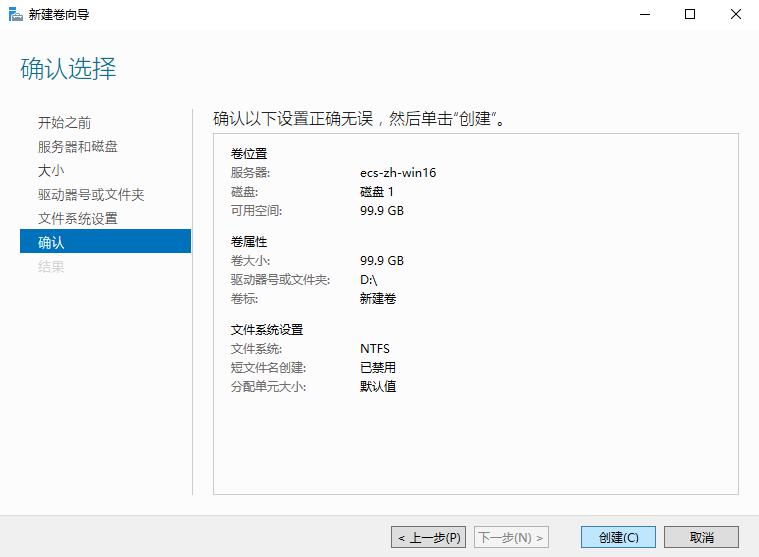

13. 根据界面提示，确认卷位置、卷属性以及文件系统设置的相关参数，确认无误后，单击“创建”，开始新建卷。

    当出现如[图14](#zh-cn_topic_0115255433_fig9863192213574)所示界面，表示新建卷完成。

    **图 14**  新建卷完成  
    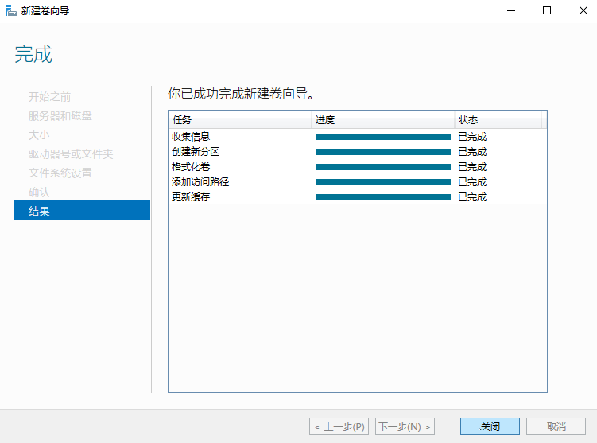

14. 新建卷完成后，单击，在文件资源管理器中查看是否有新建卷，此处以“新建卷（D:）”为例。
    -   若如[图15](#zh-cn_topic_0115255433_fig1066713712311)所示，可以看到“新建卷（D:）”，表示磁盘初始化成功，任务结束。

        **图 15**  文件资源管理器  
        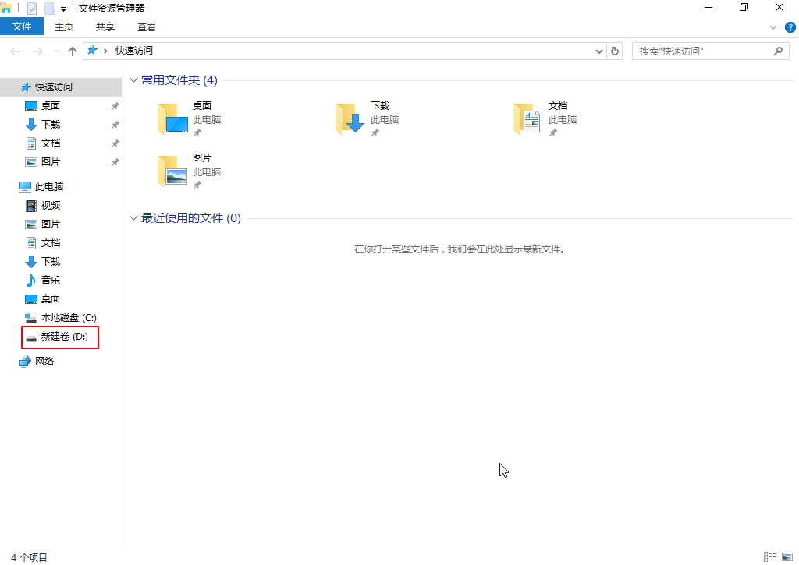

    -   若无法看到“新建卷（D:）”，请执行以下操作，为新建卷重新添加驱动器号或文件夹。
        1.  单击，输入cmd，单击“Enter”

            弹出管理员窗口。

        2.  在管理员窗口，执行**diskmgmt**命令。

            弹出“磁盘管理”窗口，如[图16](#zh-cn_topic_0115255433_fig1542015221127)所示。

            **图 16**  磁盘管理（Windows 2016）  
            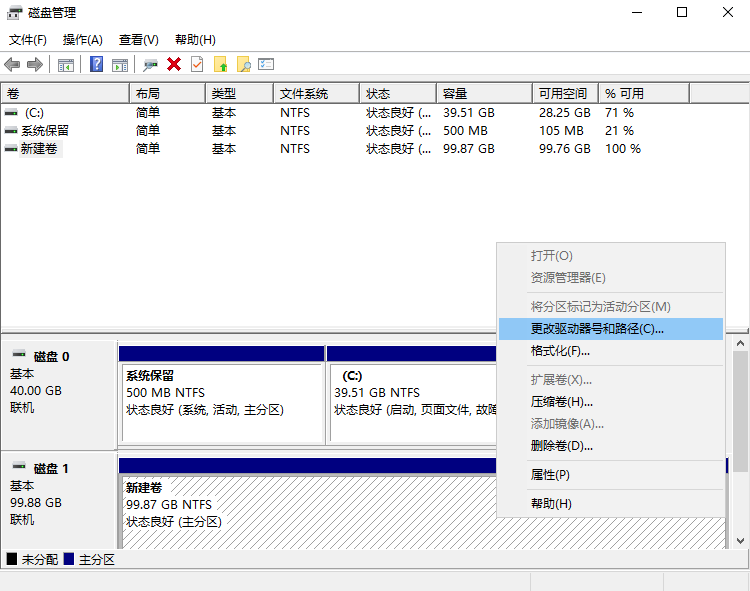

        3.  在磁盘1右侧“新建卷”区域，右键单击菜单列表中“更改驱动器号和路径”。

            弹出“更改新建卷的驱动器号和路径”对话框，如[图17](#zh-cn_topic_0115255433_fig106315111717)所示。

            **图 17**  更改新建卷的驱动器号和路径  
            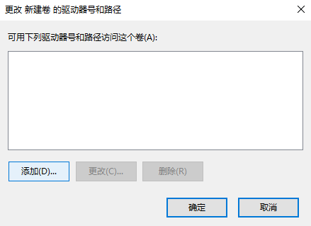

        4.  单击“添加”。

            弹出“添加驱动器号和路径”对话框，如[图18](#zh-cn_topic_0115255433_fig10260947280)所示。

            **图 18**  添加驱动器号和路径  
            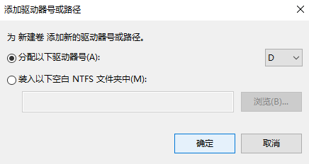

        5.  选择“分配以下驱动器号（A）”，重新为磁盘分配驱动器号，此处以分配驱动号D为例，并单击“确定”。

            分配完成后，即可在文件资源管理器中看到“新建卷（D:）”。

            > **说明：**   
            >此处选择请与[11](#zh-cn_topic_0115255433_li02801421135916)中的配置保持一致。  

