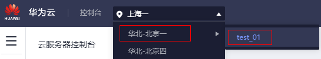

# 在管理控制台找不到我的裸金属服务器资源怎么办？

## 问题背景

已经购买成功的裸金属服务器资源，管理控制台上却没有显示。

## 可能原因

资源不在当前所选区域或项目。

## 处理方法

1.  登录裸金属服务器管理控制台。
2.  确认自己购买的裸金属服务器所属区域，然后在控制台左上角切换区域后，即可查看已购买的资源。

    **图 1**  切换区域  
    

    如果您的裸金属服务器是在某个区域的子项目下购买的，请切换至该子项目下查看资源。

    **图 2**  切换项目  
    

