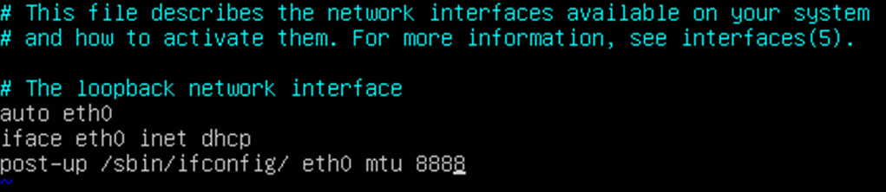

# 如何修改Linux裸金属服务器网卡的MTU值？

最大传输单元（Maximum Transmission Unit，MTU）是指一种通信协议的某一层上所能通过的最大数据包大小，取值范围1280～8888，以字节为单位。数据包在两台主机间传输时，如果MTU值不一样，可能导致传输中断或丢包等问题。本节针对SUSE、CentOS和Ubuntu操作系统，介绍Linux裸金属服务器网卡的MTU值的修改方法。

## SUSE操作系统

以操作系统SUSE Enterprise Linux Server 11 SP4 64bit为例，具体操作如下：

1.  使用root帐号登录裸金属服务器。
2.  执行命令**ifconfig**，查看IP地址绑定的网卡，如eth0。
3.  执行以下命令，打开文件**ifcfg-**_XXX_。

    **vi /etc/sysconfig/network/ifcfg-**_XXX_

    > **说明：** 
    >XXX表示[2](#li6275220918653)中查询到的IP地址绑定的网卡，如eth0。

4.  按“i”进入编辑模式，添加如下语句，设置网卡MTU值。

    **MTU=8888**

5.  按“ESC”，输入**:wq!**，按“Enter”保存并关闭文件。
6.  执行以下命令，重启网络。

    **service network restart**

7.  执行命令**ifconfig**，验证MTU值的设置是否正确。

## CentOS操作系统

以操作系统 CentOS 7.5 64bit为例，具体操作如下：

1.  使用root帐号登录裸金属服务器。
2.  执行命令**ifconfig**，查看IP地址绑定的网卡，如eth0。
3.  执行以下命令，打开文件**ifcfg-**_XXX_。

    **vi /etc/sysconfig/network-scripts/ifcfg-**_XXX_

    > **说明：** 
    >XXX表示[2](#zh-cn_topic_0038983525_li6275220918653)中查询到的IP地址绑定的网卡，如eth0。

4.  按“i”进入编辑模式，添加如下语句，设置网卡MTU值。

    **MTU=8888**

5.  按“ESC”，输入**:wq!**，按“Enter”保存并关闭文件。
6.  执行以下命令，重启网络。

    **service network restart**

7.  执行命令**ifconfig**，验证MTU值的设置是否正确。

## Ubuntu操作系统

1.  使用root帐号登录裸金属服务器。
2.  执行以下命令，打开文件interfaces。

    **vi /etc/network/interfaces**

3.  按“i”进入编辑模式，添加如下语句，设置网卡MTU值。

    **post-up /sbin/ifconfig/ eth0 mtu 8888**

    

4.  按“ESC”，输入**:wq!**，按“Enter”保存并关闭文件。
5.  执行以下命令，重启网络。

    **/etc/init.d/networking restart**

6.  执行命令**ifconfig**，验证MTU值的设置是否正确。

