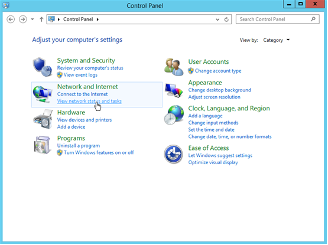
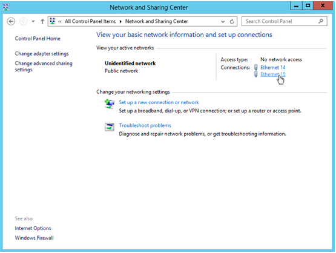
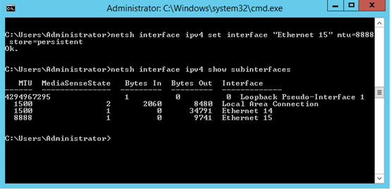

# 如何修改Windows裸金属服务器网卡的MTU值？

最大传输单元（Maximum Transmission Unit，MTU）是指一种通信协议的某一层上所能通过的最大数据包大小，取值范围1280～8888，以字节为单位。数据包在两台主机间传输时，如果MTU值不一样，可能导致传输中断或丢包等问题。本节以Windows Server 2012 R2操作系统为例，介绍Windows裸金属服务器网卡的MTU值的修改方法。

1.  开启网卡的Jumbo Packet。
    1.  单击左下角的图标，打开“控制面板”。

        **图 1**  控制面板  
        

    2.  在“网络和Internet”栏，单击“查看网络状态和任务”。

        **图 2**  网络和共享中心  
        

    3.  在“查看活动网络 \> 连接”栏，选择需要更改配置的网卡，以[图2](#fig63157301152055)的网卡“Ethernet 15”为例，单击“Ethernet 15”。

        系统进入“Ethernet 15状态”页面。

    4.  单击“属性”。

        系统进入“Ethernet 15属性”页面。

    5.  单击“配置”，并在新页面中选择“高级”页签，如[图3](#fig30967209153324)所示。

        **图 3**  Inter\(R\) 82599 Virtual Function \#13属性  
        -82599-Virtual-Function-13属性.png "Inter(R)-82599-Virtual-Function-13属性")

    6.  在“设置”栏，选择“Jumbo Packet”，在“值”栏选择“9014 Bytes”。
    7.  单击“确定”。

2.  修改MTU值。
    1.  单击左下角的图标，选择“Windows PowerShell”，执行以下命令，查询当前网卡的MTU值。

        **netsh interface ipv4 show subinterfaces**

    2.  根据查询结果可以看出，开启“Jumbo Packet”的网卡的MTU值为9000，如[图4](#fig16079803154544)所示。

        **图 4**  查看当前网卡的MTU值  
        

    3.  执行以下命令，修改网卡的MTU值。

        **netsh interface ipv4 set interface "**_网卡名称_**" mtu=**_修改后的MTU值_** store=persistent**

        假设将网卡“Ethernet 15”的MTU值修改为8888，则命令行如下：

        **netsh interface ipv4 set interface "Ethernet 15" mtu=8888 store=persistent**

    4.  执行以下命令，查询修改后的MTU值。

        **netsh interface ipv4 show subinterfaces**

        **图 5**  查看修改后网卡的MTU值  
        

