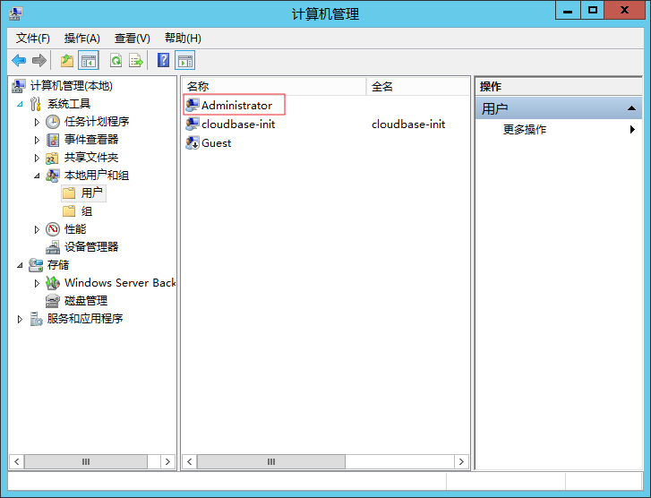
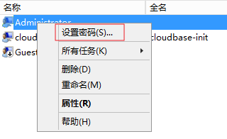
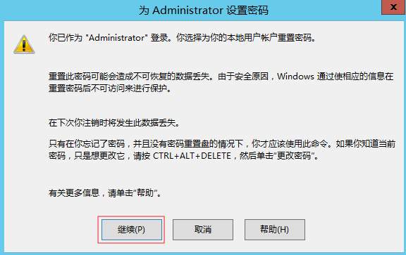
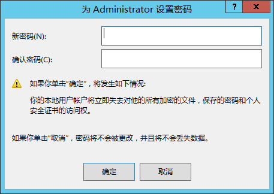

# 如何在裸金属服务器操作系统内部修改登录密码？

本文介绍如何在裸金属服务器操作系统内部修改登录密码。

建议优先[在控制台上重置密码](https://support.huaweicloud.com/usermanual-bms/bms_01_0028.html)，如果不可以，再尝试在操作系统内部修改登录密码。

## 修改Linux裸金属服务器的登录密码

此处以CentOS 7.5版本为例。

1.  [远程登录裸金属服务器](https://support.huaweicloud.com/usermanual-bms/bms_01_0018.html)。
2.  执行**passwd root**命令，输入新密码，并重复输入，以确认密码。

    

3.  执行**exit**退出当前登录状态，然后使用新密码重新登录，验证密码是否修改成功。

## 修改Windows裸金属服务器的登录密码

此处以Windows Server 2012 R2版本为例。

1.  [远程桌面连接裸金属服务器](https://support.huaweicloud.com/usermanual-bms/zh-cn_topic_0079188786.html)。
2.  单击左下角的图标，选择“Windows PowerShell”，输入“compmgmt.msc”打开计算机管理界面。
3.  选择“系统工具 \> 本地用户和组 \> 用户”，右键单击您需要修改的用户名，如示例中的“Administrator”。

    

4.  选择“设置密码”。

    

5.  单击“继续”。

    

6.  输入新密码，并重复输入，以确认密码。单击“确定”完成修改。

    

7.  按“Ctrl + Alt + Delete”锁定再解锁，然后使用新密码重新登录。

