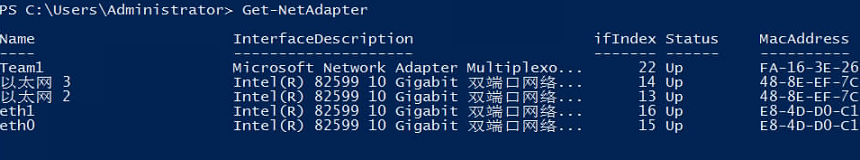

# 如何增加系统Swap交换分区的大小？

## 问题背景

Linux操作系统安装Oracle数据库时会校验Swap分区大小，如果操作系统自带的Swap分区不能满足要求，可以参考本章节进行设置。

> **说明：** 
>Swap：交换分区，类似于Windows操作系统的虚拟内存，就是当内存容量不足时，把一部分硬盘空间虚拟成内存使用，提升系统运行效率。

## 操作步骤

1.  登录裸金属服务器操作系统内部。
2.  执行**lsblk**查看Swap分区扩展前大小。

    

    可以看到，Swap分区扩展前大小为3G。

3.  以新增5G Swap分区大小为例（具体大小请按照实际情况设置），执行以下命令扩展分区：

    **dd if=/dev/zero of=/swapfile bs=1M count=5000**

    **chmod 600 /swapfile**

    **mkswap /swapfile swapon /swapfile echo "/swapfile swap swap defaults 0 0" \>\>/etc/fstab**

4.  执行**free**查看Swap分区扩展后大小。

    

    可以看到，Swap分区扩展后大小为8G。

