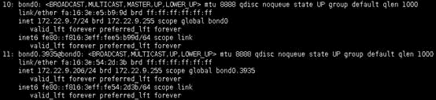

# 如何处理裸金属服务器主网卡和扩展网卡共平面通信异常问题？<a name="bms_faq_0056"></a>

## 问题原因<a name="section1418611694917"></a>

裸金属服务器如果添加两块同网段网卡，由于裸金属服务器网关严格的源MAC校验，会导致主网卡或者扩展网卡通信异常。以[图1](#fig9146815125112)为例，主网卡与扩展网卡均设置成172.22.9.X网段，此时需要配置策略路由来实现网络通信正常。

**图 1**  查看网卡所属网段<a name="fig9146815125112"></a>  


## 解决方案<a name="section14418919529"></a>

1.  执行以下命令，在“/etc/iproute2/rt\_tables”文件中增加两个路由表名称（net1和net2）和优先级（252和251）。

    **vi /etc/iproute2/rt\_tables**

    ```
    252     net1
    251     net2
    ```

2.  执行以下命令，在“/etc/rc.local”文件中增加网卡的路由信息。

    **vi /etc/rc.local**

    以主网卡IP为172.22.9.7，扩展网卡IP为172.22.9.206，裸金属服务器网关为172.22.9.1为例，添加策略路由如下：

    ```
    ip route add 172.22.9.0/24 dev bond0 src 172.22.9.7 table net1
    ip route add default via 172.22.9.1 dev bond0 table net1
    ip route add 172.22.9.0/24 dev bond0.3935 src 172.22.9.206 table net2
    ip route add default via 172.22.9.1 dev bond0.3935 table net2
    ip rule add from 172.22.9.7/32 table net1
    ip rule add from 172.22.9.206/32 table net2
    ```


