# 如何扩展快速发放裸金属服务器的根分区大小？

## 问题背景

如果快速发放裸金属服务器的根分区大小无法满足业务需求，可以参考本章节进行根分区容量扩充。

## 操作步骤

以系统卷盘符为“/dev/sdf”为例（具体请以实际情况为准，谨慎操作），假设裸金属服务器初始发放大小为40G，需要扩容至140G，初始分区详情如下：

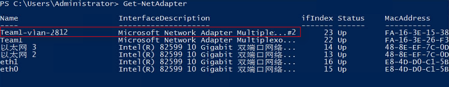

1.  首先在云硬盘控制台页面对卷大小进行扩容，扩容大小为100G。

    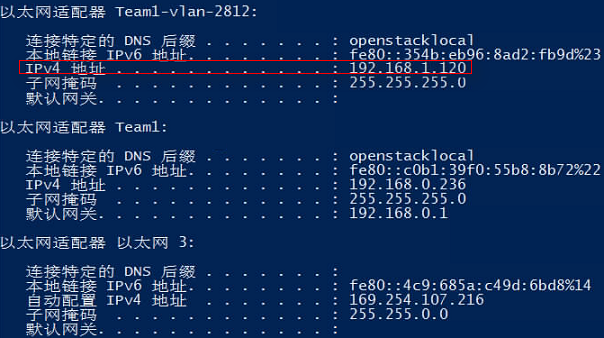

    扩容后在裸金属服务器内部查看系统卷大小，假设系统卷盘符为“/dev/sdf”，如下图所示，系统卷大小已经从40G扩展至140G。其中64M大小的sdf4分区为存储裸金属服务器配置信息的configdriver分区。

    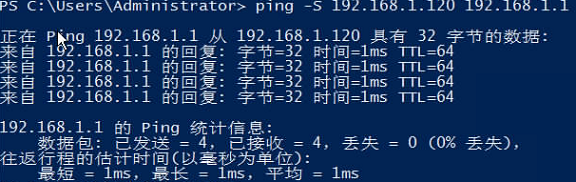

2.  运行以下命令对configdriver分区内容进行备份。

    **dd if=/dev/sdf4 of=/root/configdriver.img**

    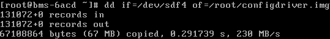

3.  运行**fdisk /dev/sdf**命令并参考以下步骤，删除configdriver分区。

    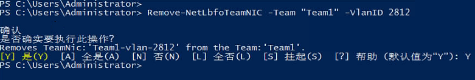

    运行**partprobe**刷新分区，删除configdriver分区后的系统卷详情如下：

    

4.  在系统卷末尾再次新建configdriver分区，大小为100M。

    假设可用扇区范围为：83755008-293601279，则新建分区的初始值为可用扇区最大值减去200000，本例即为293401279，新建分区的最大值保持默认值293601279。

    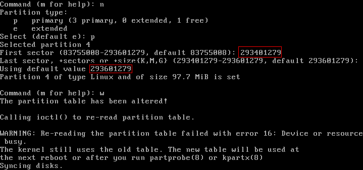

    运行**partprobe**刷新分区详情：

    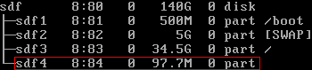

5.  运行以下命令扩展根分区：

    **growpart /dev/sdf 3**

    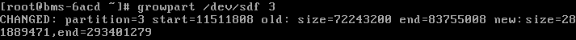

    扩展后根分区大小如下：

    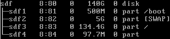

    运行**resize2fs /dev/sdf3**扩展根分区文件系统：

    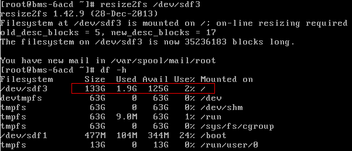

6.  通过以下命令恢复configdriver分区内容。

    **dd if=/root/configdriver.img of=/dev/sdf4**

    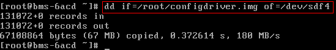

    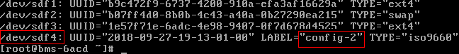

    至此，快速发放裸金属服务器的根分区扩容完成。

