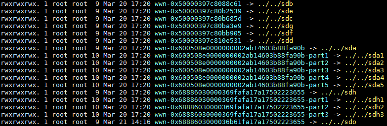

# 如何查看云硬盘盘符？

裸金属服务器重启后，挂载至该裸金属服务器上的云硬盘盘符可能发生变化，您可以参考本指导快速找到云硬盘和盘符间的对应关系。

1.  在裸金属服务器详情页面，记录云硬盘的“设备标识”信息。
2.  登录裸金属服务器操作系统，进入“/dev/disk/by-id”目录，执行**ll**查看wwn号和盘符的对应关系。其中wwn号在Linux操作系统中是由“wwn-0x + 设备标识”组成，例如：wwn-0x50000397c80b685d -\> ../../sdc

    **图 1**  查看wwn号和盘符对应关系  
    

> **说明：** 
>建议租户在应用中使用wwn号进行磁盘操作，例如挂载磁盘：**mount** _wwn-0x50000397c80b685d 文件夹名称_。不建议直接使用盘符，因为会有盘符漂移而引起的无法找到磁盘的风险。
>通过wwn号查找磁盘盘符，只支持Linux操作系统。

