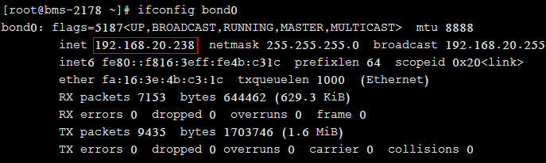
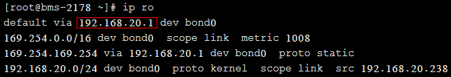
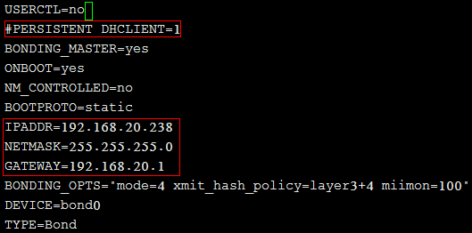

# 如何设置裸金属服务器的静态IP？

## 问题背景

如果要自定义裸金属服务器的DNS服务器信息，需要将裸金属服务器网络设置为静态IP。若将动态DHCP改为静态IP设置，IP和网关等网络信息必须和裸金属服务器下发时保持一致，否则可能会引起网络不通。以CentOS 7系列为例，具体配置步骤可参考本节。

## 操作步骤

1.  查看裸金属服务器的IP、网关等信息。

    查看IP地址：

    **ifconfig bond0**

    

    查看网关地址：

    **ip ro**

    

2.  修改网络配置文件。

    执行**vi /etc/sysconfig/network-scripts/ifcfg-bond0**命令打开“/etc/sysconfig/network-scripts/ifcfg-bond0”文件，将网络信息由动态改为静态注释，或者删除“PERSISTENT\_DHCLIENT=1”，增加“IPADDR”、“NETMASK”、“GATEWAY”三个配置项（分别对应IP、掩码和网关信息）：

    **图 1**  修改网络配置文件  
    

    > **说明：** 
    >IP、掩码和网关等网络信息必须和裸金属服务器下发时保持一致，否则可能会引起网络不通。

3.  执行**systemctl disable bms-network-config.service**命令禁用bms-network-config网络脚本。
4.  重启裸金属服务器使网络配置生效，或者**kill dhclient**进程再重启网络服务使静态配置生效。

