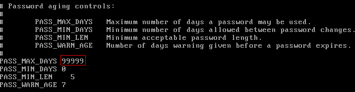

# 如何设置裸金属服务器镜像密码的有效期？

如果裸金属服务器镜像密码已过期导致无法登录，请联系运营管理员处理。

如果裸金属服务器还可正常登录，用户可以参考以下操作设置密码有效期，避免密码过期造成的不便。

1.  登录裸金属服务器操作系统，执行以下命令查看密码有效期。

    **vi /etc/login.defs**

    找到配置项“PASS\_MAX\_DAYS”，该参数表示密码的有效时间。

2.  执行以下命令，修改[1](#li96511055152412)中“PASS\_MAX\_DAYS”参数的取值。

    **chage -M** _99999 user\_name_

    其中，_99999_为密码有效期限，_user\_name_为系统用户。

    建议用户根据实际情况及业务需求进行配置，定期使用该命令更新密码有效期。

3.  再次执行**vi /etc/login.defs**，验证配置是否生效。

    **图 1**  验证配置  
    

