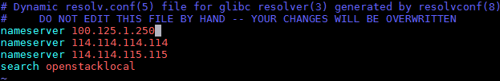
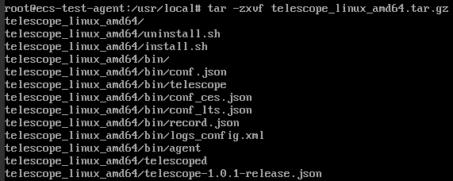
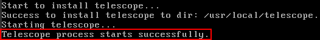

# 安装Agent

本章节主要介绍如何在已有裸金属服务器实例中手动安装Agent，实现主机监控。您需要完成以下步骤：

1.  [添加域名解析地址](#zh-cn_topic_0104704865_section20336159191311)：在裸金属服务器“/etc/resolv.conf”文件中添加各区域域名解析地址。
2.  [修改子网DNS地址](#zh-cn_topic_0104704865_section24544395145)：按裸金属服务器所在区域修改子网的DNS服务器地址。
3.  [配置安全组](#zh-cn_topic_0104704865_section49331415141516)：用于下载Telescope包、发送指标数据、采集日志等。
4.  [安装Agent](#zh-cn_topic_0104704865_section2500354141513)：手动为裸金属服务器安装Agent，实现主机监控。

## 添加域名解析地址

1.  使用root帐号，登录裸金属服务器。
2.  输入**vi /etc/resolv.conf**，打开“/etc/resolv.conf”文件。
3.  在文件中添加“nameserver 100.125.1.250”，如[图1](#zh-cn_topic_0104704865_fig185163506199)所示。

    **图 1**  添加域名解析地址  
    

    > **说明：**   
    >不同区域nameserver不同，如下所示：  
    >华北-北京一：100.125.1.250,100.125.21.250  
    >华东-上海二：100.125.17.29,100.125.135.29  
    >华南-广州：100.125.1.250,100.125.136.29  
    >亚太-香港：100.125.1.250,100.125.3.250  

4.  按“Esc”，输入**:wq**保存设置。

## 修改子网DNS地址

参考[修改子网DNS地址](自动安装配置Agent（新创建裸金属服务器）.md#zh-cn_topic_0104704446_section99035364202)进行操作。

## 配置安全组

参考[配置安全组](自动安装配置Agent（新创建裸金属服务器）.md#zh-cn_topic_0104704446_section199181037202414)进行操作。

## 安装Agent

1.  选择Agent安装包下载路径，切换至该目录下，以“/usr/local”为例，执行以下命令。

    **cd /usr/local**

2.  执行以下命令，下载Agent，以Linux 64位安装包为例：

    **wget** _http://obs.myhwclouds.com/telescope/agent/telescope\_linux\_amd64.tar.gz_

    各区域安装包下载地址请参见[表3](自动安装配置Agent（新创建裸金属服务器）.md#zh-cn_topic_0104704446_table8441794366)。

3.  执行以下命令，解压安装包。

    **tar -zxvf** _telescope\_linux\_amd64.tar.gz_

    系统返回如下内容，即表示解压成功。

    **图 2**  解压成功  
    

4.  执行以下命令，切换至Agent安装包解压目录下。

    **cd telescope\_linux\_amd64**

5.  执行以下命令，开始安装Agent。

    **chmod 755 install.sh; ./install.sh**

    系统返回如下内容，表示Agent安装成功。

    **图 3**  Agent安装成功  
    

    > **说明：**   
    >-   Agent的默认安装路径在“/usr/local/telescope”，当成功执行**./install.sh**命令后，Agent会自动安装在该路径下。  
    >-   如果执行安装后无任何回显，请手动启动Telescope，操作步骤请参见[启动Agent](管理Agent.md#zh-cn_topic_0104704867_section18605194154420)。  
    >-   CentOS系统，Agent插件支持开机自启动。其他系统下，用户成功安装Agent插件后，需要手动开启Agent，操作步骤请参见[启动Agent](管理Agent.md#zh-cn_topic_0104704867_section18605194154420)。  

