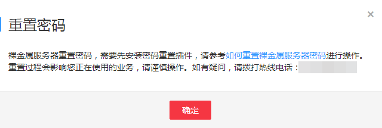
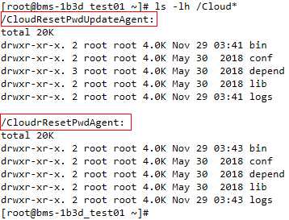
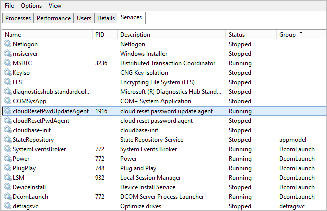

# 安装一键式重置密码插件（可选）

## 操作场景

裸金属服务器的密码丢失或过期时，如果您的裸金属服务器提前安装了一键式重置密码插件“CloudResetPwdAgent”，则可以使用一键式重置密码功能，为裸金属服务器设置新密码。

该方法方便、有效，建议您成功创建、登录裸金属服务器后，安装密码重置插件，具体操作请参见本节内容。

> **说明：**   
>一般情况下，使用公共镜像创建的裸金属服务器默认已安装重置密码插件。检查是否已安装该插件，请参见“Linux裸金属服务器安装方法”中的[1](#li44330716114226)或“Windows裸金属服务器安装方法”中的[1](#li26270423125717)。  

## 安装须知

1.  请不要使用除该插件以外的其他密码重置插件。
2.  用户自行决定是否安装“CloudResetPwdAgent”插件，使裸金属服务器具备一键式重置密码功能。
3.  安装完成后，请勿自行卸载插件，因为可能导致管理控制台判断失误，从而无法完成密码重置。
4.  重装/切换裸金属服务器操作系统后，一键式重置密码功能失效。如需继续使用该功能，请重新安装“CloudResetPwdAgent”插件。
5.  裸金属服务器需绑定弹性公网IP，才能自动更新CloudResetPwdAgent，或者需要您手动下载升级包，完成安装或升级。
6.  一键重置密码插件“CloudResetPwdAgent”已按照GNU General Public License v2.0协议开源至Github平台，开放、透明、安全，请您放心使用。

## 前提条件

-   裸金属服务器的状态为“运行中”。
-   对于Windows裸金属服务器，需保证C盘可写入，且剩余空间大于600MB。

    对于Linux裸金属服务器，需保证根目录可写入，且剩余空间大于600MB。

-   裸金属服务器使用的VPC网络DHCP不能禁用。
-   裸金属服务器网络正常通行。
-   裸金属服务器安全组出方向规则满足如下要求：

    -   协议：TCP
    -   端口范围：80
    -   远端地址：169.254.0.0/16

    如果您使用的是默认安全组出方向规则，则已经包括了如上要求，可以正常初始化。默认安全组出方向规则为：

    -   协议：ANY
    -   端口范围：ANY
    -   远端地址：0.0.0.0/16

## Linux裸金属服务器安装方法

1.  提供如下两种方法，供您检查裸金属服务器是否已安装密码重置插件。

    **方法一：登录控制台查询**

    1.  登录管理控制台。
    2.  选择“计算 \> 裸金属服务器”。
    3.  选择待检查的裸金属服务器，单击“操作”列下的“更多 \> 重置密码”。
        -   如果界面弹窗类似[图1](#fig083717228564)，表示已安装一键式重置密码插件，任务结束。

            **图 1**  已安装重置密码插件  
            

        -   如果界面弹窗类似[图2](#fig926223110384)，表示未安装一键式重置密码插件，请继续执行后续操作进行安装。

            **图 2**  未安装重置密码插件  
            

    **方法二：登录操作系统查询**

    1.  以root用户登录裸金属服务器。
    2.  执行以下命令，查询是否已安装CloudResetPwdAgent和CloudResetPwdUpdateAgent。

        **ls** **-lh** **/Cloud\***

        **图 3**  检查是否已安装重置密码插件  
        

        检查结果是否如[图3](#fig203737591091)所示。

        -   是，表示已安装一键式重置密码插件，任务结束。
        -   否，表示未安装一键式重置密码插件，请继续执行后续操作进行安装。

2.  下载一键式重置密码插件CloudResetPwdAgent.zip。

    安装一键式重置密码插件对插件的具体放置目录无特殊要求，请您自定义。

    **wget** **http://cn-south-1-cloud-reset-pwd.obs.myhwclouds.com/linux/64/reset\_pwd\_agent/CloudResetPwdAgent.zip**

3.  执行以下命令，解压软件包CloudResetPwdAgent.zip。

    安装一键式重置密码插件对插件的解压目录无特殊要求，请您自定义。

    **unzip** **-o** **-d** _插件解压目录_ **CloudResetPwdAgent.zip**

    示例：

    假设插件解压的目录为/home/linux/test，则命令如下：

    **unzip** **-o** **-d** _/home/linux/test_ **CloudResetPwdAgent.zip**

4.  安装一键式重置密码插件CloudResetPwdAgent和CloudResetPwdUpdateAgent。
    1.  执行以下命令，进入文件CloudResetPwdUpdateAgent.Linux。

        **cd** _/home/linux/test_**/CloudResetPwdAgent/CloudResetPwdAgent/CloudResetPwdUpdateAgent.Linux**

    2.  执行以下命令，添加文件setup.sh的运行权限。

        **chmod** **+x** **setup.sh**

    3.  执行以下命令，安装插件。

        **sudo** **sh** **setup.sh**

    4.  执行以下命令，检查密码重置插件是否安装成功。

        **service** **cloudResetPwdUpdateAgent** **status**

        如果CoudResetPwdUpdateAgent服务的状态为“running”，表示插件安装成功，否则安装失败。

        > **说明：**   
        >您也可以根据[1](#li44330716114226)检查插件是否安装成功。  
        >如果密码重置插件安装失败，请检查安装环境是否符合要求，并重试安装操作。  

## Windows裸金属服务器安装方法

1.  检查裸金属服务器是否已安装密码重置插件CloudResetPwdAgent和CloudResetPwdUpdateAgent。检查方法如下：

    查看任务管理器，如果找到cloudResetPwdAgent服务和CloudResetPwdUpdateAgent服务，如[图4](#fig3657184919278)所示，表示裸金属服务器已安装密码重置插件。

    **图 4**  安装插件成功  
    

    -   是，任务结束。
    -   否，执行下一步。

2.  下载一键式重置密码插件CloudResetPwdAgent.zip。

    安装一键式重置密码插件对插件的具体放置目录无特殊要求，请您自定义。

    下载地址：[https://cn-south-1-cloud-reset-pwd.obs.myhwclouds.com/windows/reset\_pwd\_agent/CloudResetPwdAgent.zip](https://cn-south-1-cloud-reset-pwd.obs.myhwclouds.com/windows/reset_pwd_agent/CloudResetPwdAgent.zip)

3.  解压软件包CloudResetPwdAgent.zip。

    安装一键式重置密码插件对插件的解压目录无特殊要求，请您自定义。

4.  安装一键式重置密码插件CloudResetPwdAgent和CloudResetPwdUpdateAgent。
    1.  依次双击CloudResetPwdAgent.Windows和CloudResetPwdUpdateAgent.Windows文件夹下的“setup.bat“文件，安装密码重置插件。
    2.  查看任务管理器，检查密码重置插件是否安装成功。

        如果在任务管理器中查找到了cloudResetPwdAgent服务和cloudResetPwdUpdateAgent服务，表示安装成功，否则安装失败。

        > **说明：**   
        >如果密码重置插件安装失败，请检查安装环境是否符合要求，并重试安装操作。  

## 关于插件卸载

如果不再继续使用一键重置密码功能，您可以根据如下指导卸载插件：

-   **Linux裸金属服务器**

    以root用户登录裸金属服务器，依次执行以下命令：

    1.  **sudo** **bash** **/CloudrResetPwdAgent/bin/cloudResetPwdAgent.script** **remove**
    2.  **sudo** **bash** **/CloudResetPwdUpdateAgent/bin/cloudResetPwdUpdateAgent.script** **remove**
    3.  **sudo** **rm** **-rf** **/CloudrResetPwdAgent**
    4.  **sudo** **rm** **-rf** **/CloudResetPwdUpdateAgent**

-   **Windows裸金属服务器**
    1.  登录裸金属服务器，进入“C:\\CloudResetPwdUpdateAgent\\bin”目录。
    2.  双击“UninstallApp-NT.bat”。
    3.  删除“C:\\CloudResetPwdUpdateAgent”。
    4.  进入“C:\\CloudResetPwdAgent\\bin”目录。
    5.  双击“UninstallApp-NT.bat”。
    6.  删除“C:\\CloudResetPwdAgent”。

