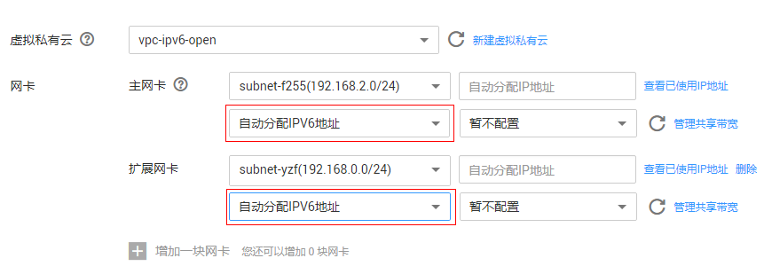
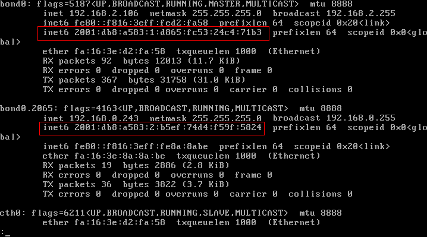

# 开启IPv6双栈

## 操作场景

IPv4/IPv6双栈可以为您的裸金属服务器提供两个不同版本的IP地址：IPv4地址和IPv6地址，这两个IP地址都可以进行内网/公网访问。如果需要开启IPv6双栈，请参考本指导进行操作。

## 使用须知

-   IPv6双栈功能，当前仅在“华北-北京四”区域公测，其他区域的用户暂不支持使用该功能，敬请期待。
-   当前仅支持在创建裸金属服务器时开启IPv6，不支持添加网卡时开启IPv6。开启IPv6功能成功后，不能关闭。
-   启用IPv6双栈时，裸金属服务器将同时获取IPv4和IPv6两个IP地址，不支持单独使用IPv6。

## 操作步骤

1.  开启VPC子网的IPv6功能。
    1.  登录管理控制台，选择“网络 \> 虚拟私有云”，单击待配置的VPC名称，进入VPC详情页面。
    2.  选择“子网”页签，在待配置的子网所在行，单击“操作”列的“开启IPv6”。

        > **说明：**   
        >子网的IPv6功能开启后，不能关闭。  

2.  创建裸金属服务器，开启IPv6双栈。
    -   镜像

        选择支持IPv6的镜像。如果是公共镜像，支持IPv6的镜像会在操作系统版本后标识；如果是私有镜像或共享镜像，需要用户自行确认是否支持IPv6。

    -   虚拟私有云

        选择已开启IPv6功能的VPC。

        **图 1**  网络配置  
        

    -   网卡

        选择已开启IPv6功能的子网后，页面将显示IPv6功能配置项，选择“自动分配IPv6地址”。

        > **说明：**   
        >-   若镜像选择私有镜像或共享镜像，且不支持IPv6，即使此处的IPv6功能配置项选择“自动分配IPv6地址”，也会配置不成功，即裸金属服务器操作系统中查询不到IPv6地址。因此，如果需要使用IPv6功能，建议选择公共镜像中支持IPv6的镜像。  
        >-   公共镜像中CentOS 7.3操作系统不支持扩展网卡获取IPv6地址，请优先使用其他镜像。  

3.  裸金属服务器创建成功后，登录操作系统内部，可以看到分配的IPv6地址。

    以Linux操作系统为例，执行**ip** **addr**命令查看。

    **图 2**  命令示例  
    

