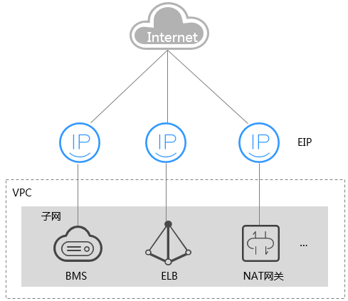

# 弹性公网IP概述

## 弹性公网IP

弹性公网IP（Elastic IP，EIP）提供独立的公网IP资源，包括公网IP地址与公网出口带宽服务。与传统静态IP地址不同，弹性公网IP支持与裸金属服务器、云服务器、NAT网关等资源动态绑定和解绑，可以实现绑定资源的灵活切换。当绑定的服务器出现故障时，可以快速解绑并绑定至新的健康服务器上，实现业务的快速恢复。

**图 1**  通过EIP访问公网  

## 相关链接

-   [裸金属服务器可以绑定多个弹性公网IP吗？](https://support.huaweicloud.com/bms_faq/bms_faq_0022.html)
-   [已释放的弹性公网IP，再次申请会分配相同的EIP地址吗？](https://support.huaweicloud.com/bms_faq/bms_01_0082.html)
-   [弹性公网IP、私有IP、虚拟IP之间有什么区别？](https://support.huaweicloud.com/bms_faq/bms_faq_0071.html)

