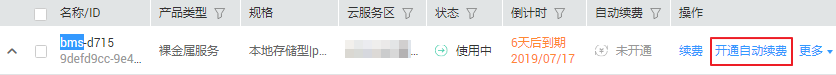
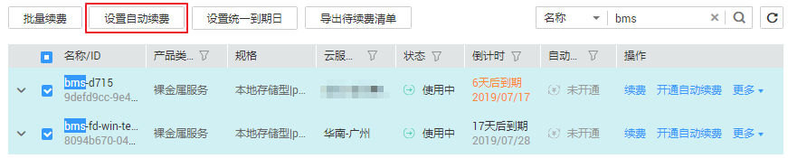

# 怎么设置“包年/包月”资源的自动续费？

为防止资源到期被删除，用户可为长期使用的“包年/包月”产品开通自动续费。

## 操作步骤

1.  登录管理控制台，选择“费用 \> 续费管理”。
2.  按照名称、订单号或者ID查询需要续费的裸金属服务器。
3.  单个自动续费与批量自动续费可以使用不同的操作方式：
    -   单个自动续费：找到待续费的裸金属服务器，单击操作列的“开通自动续费”，然后设置“自动续费周期”，单击“开通”。

        

    -   批量自动续费：勾选需要续费的裸金属服务器，单击列表左上方的“设置自动续费”，然后设置“自动续费周期”，单击“确认”。

        

