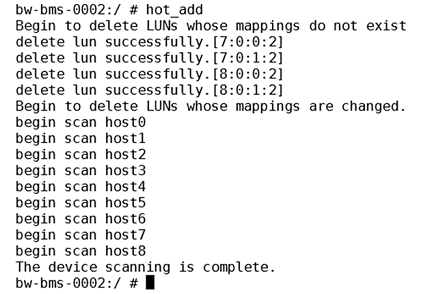

# 挂载磁盘

裸金属服务器创建成功后，如果发现磁盘不够用或当前磁盘不满足要求，可以将已有磁盘挂载给裸金属服务器，或在“存储”页面创建新的磁盘，然后再挂载至裸金属服务器。

## 前提条件

已创建可用的磁盘。

创建云硬盘的操作，请参见《云硬盘用户指南》的“购买云硬盘”章节。

> **说明：**   
>如果使用专属分布式存储，创建磁盘的操作请参见《专属分布式存储用户指南》。  
>如果使用专属企业存储，创建磁盘的操作请参见《专属企业存储用户指南》。  

## 操作步骤

1.  登录管理控制台。
2.  单击管理控制台左上角的，选择地域和项目。
3.  选择“计算 \> 裸金属服务器”。
4.  在裸金属服务器列表中的右上角，输入裸金属服务器名称、私有IP地址、ID或规格，并单击进行搜索。
5.  单击待挂载磁盘的裸金属服务器的名称。

    系统跳转至该裸金属服务器详情页面。

6.  选择“磁盘”页签，并单击“挂载磁盘”。

    系统跳转至“挂载磁盘”页面。

7.  根据界面提示选择磁盘类型，勾选目标磁盘，并设置挂载点。

    如果选择专属企业存储，还需要选择磁盘设备。

    > **说明：**   
    >如果无可用的云硬盘，请单击列表下方的“购买云硬盘”进行购买。  
    >挂载磁盘时的约束限制，请参见[裸金属服务器挂载磁盘时有什么限制？](http://support.huaweicloud.com/faq-bms/bms_faq_0044.html)。  

8.  单击“确定”。

    挂载成功后，在裸金属服务器详情页的“磁盘”页签，即可看到新挂载的磁盘信息。

## 后续处理

1.  如果挂载的云硬盘是新创建的，则云硬盘挂载至裸金属服务器后，需要登录裸金属服务器初始化云硬盘（即格式化云硬盘），之后云硬盘才可以正常使用。初始化数据盘的具体操作请参见[初始化数据盘](https://support.huaweicloud.com/qs-bms/bms_01_0019.html)。
2.  如果待挂载磁盘的裸金属服务器规格名称以“hba”为后缀，并且[7](#li265213223205)中选择专属企业存储，挂载成功后，需要登录裸金属服务器运行**hot\_add**命令，扫描新挂载的磁盘。

    **图 1**  扫描新映射的LUN  
    

> **说明：**   
>裸金属服务器重启后，云硬盘盘符可能发生变化，请参考[如何查看云硬盘盘符？](http://support.huaweicloud.com/faq-bms/bms_faq_0045.html)获取云硬盘设备和盘符的对应关系。  

