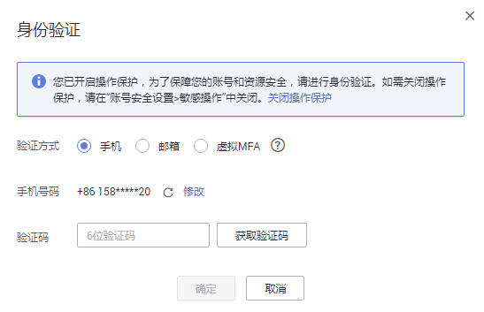

# 敏感操作保护

## 操作场景

裸金属服务器支持敏感操作保护，在控制台进行敏感操作时，需要输入一种能证明身份的凭证，身份验证通过后方可进行相关操作。为了账号安全，建议开启操作保护功能，该功能对账号以及账号下的用户都生效。

目前支持：关机、重启、重置密码、卸载磁盘、解绑弹性公网IP。

## 开启操作保护

操作保护默认关闭，租户管理员可以在“用户名 \> 安全设置 \> 敏感操作 \> 操作保护”中开启。

目前华为云提供了三种认证方式，您可以在“用户名 \> 安全设置 \> 账号设置”页面进行设置：

-   邮箱验证码
-   手机验证码
-   虚拟MFA认证

如果用户未绑定以上任意一种认证方式，那么操作保护将无法生效，默认直接认证通过。

## 操作保护验证

当您已经开启操作保护，在进行敏感操作时，系统会先进行操作保护验证：

-   若您绑定了邮箱，需输入邮箱验证码。
-   若您绑定了手机，需输入手机验证码。
-   若您绑定了虚拟MFA，需输入MFA设备上的6位动态验证码。

如[图1](#fig10571518135913)所示，尝试关机裸金属服务器时，弹出以下验证框，选择一种验证方式：

**图 1**  操作保护身份验证  

## 相关链接

-   [如何绑定虚拟MFA设备？](https://support.huaweicloud.com/iam_faq/iam_01_0003.html)
-   [如何获取MFA验证码？](https://support.huaweicloud.com/iam_faq/iam_01_0001.html)

