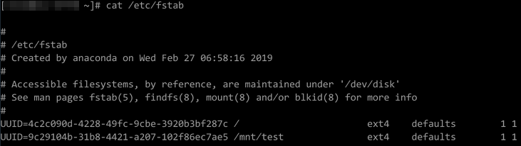
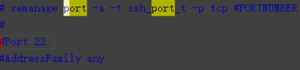

# 无法登录到Linux裸金属服务器怎么办？

当您的裸金属服务器无法SSH登录时，我们首先建议您通过控制台远程登录。

## 是否可以通过控制台远程登录

SSH登录失败时，请首先尝试能否通过管理控制台远程登录裸金属服务器。

1.  登录管理控制台。
2.  选择“计算 \> 裸金属服务器”。
3.  选择待登录的裸金属服务器，单击“操作”列的“远程登录”。

    开始建立连接，大约1分钟后进入登录界面，按“Enter”后输入用户名“root”和密码。

    > **说明：** 
    >单击[这里](裸金属服务器登录前的准备工作有哪些.md)了解裸金属服务器登录前的准备工作。

如果上述指导无法帮助您远程登录裸金属服务器，请记录资源信息和问题时间，然后[新建工单](https://console.huaweicloud.com/ticket/?locale=zh-cn#/ticketindex/createIndex)，联系华为云技术支持。

## 排查思路

远程登录裸金属服务器正常，但无法通过SSH连接方式登录裸金属服务器时，我们推荐您按照以下思路排查问题。

1.  [检查网络是否正常](#section289137105711)
2.  [安全组配置是否正确](#section830193612460)
3.  [“/etc/fstab”文件中未注释非系统盘信息](#section141851727193412)
4.  [远程访问端口配置异常](#section21752310487)
5.  [CPU负载过高](#section264733934910)

## 检查网络是否正常

检查弹性公网IP是否能ping通。如果ping不通，检查安全组是否已添加如下规则：

|协议|方向|端口范围|源地址|
|--|--|--|--|
|ICMP|入方向|All|0.0.0.0/0|

完成上述操作后，再次尝试远程连接裸金属服务器。

## 安全组配置是否正确

检查安全组22端口是否放通。

-   [查看默认的安全组规则](https://support.huaweicloud.com/usermanual-vpc/SecurityGroup_0003.html)
-   [如何添加安全组规则](https://support.huaweicloud.com/usermanual-bms/zh-cn_topic_0028313245.html)

完成上述操作后，再次尝试远程连接裸金属服务器。

## “/etc/fstab”文件中未注释非系统盘信息

1.  登录裸金属服务器，执行以下命令编辑“/etc/fstab”文件。

    **vi /etc/fstab**

2.  注释数据盘在“/etc/fstab”文件中的配置信息。

    “/etc/fstab”文件中记录了系统启动时自动挂载的文件系统和存储设备的信息，需要注释掉，如[图1](#zh-cn_topic_0029124569_fig2831914985830)中最后一行是数据盘在“/etc/fstab”中的配置信息。

    **图 1**  数据盘在fstab文件中的配置信息  
    

完成上述操作后，重启裸金属服务器，再次尝试远程连接。

## 远程访问端口配置异常

检查裸金属服务器内部设置。

1.  检查裸金属服务器sshd进程是否已运行。
2.  检查裸金属服务器是否将本地PC限制了。
    1.  登录裸金属服务器，执行以下命令。

        **vi /etc/hosts.deny**

    2.  如果文件中存在本地PC的IP，说明此IP被限制了，请将此IP在文件中删除。

3.  进入本地PC的“/etc/ssh/ssh\_config”文件中，查看默认登录端口，同时查看裸金属服务器的“/etc/ssh/sshd\_config”文件中的port字段，检查ssh服务开启端口是否被修改，默认端口为22。

    

完成上述操作后，再次尝试远程连接裸金属服务器。

## CPU负载过高

排查是否是因为CPU占用过高导致的无法登录。如果是，请参考以下操作降低CPU使用率：

-   可以把一些暂时不使用的进程关掉后再尝试。
-   或者可以尝试[重启裸金属服务器](https://support.huaweicloud.com/usermanual-bms/bms_umn_0013.html)。

    重启操作会使服务器停止工作，从而中断业务，请谨慎执行。

-   尝试[重装系统](https://support.huaweicloud.com/usermanual-bms/bms_01_0029.html)。

    重装操作系统属于高风险操作，在重装之前，请先做好数据备份。

完成上述操作后，再次尝试远程连接裸金属服务器。

**如果通过上述排查，仍然无法登录裸金属服务器，请记录资源信息和问题时间，然后[新建工单](https://console.huaweicloud.com/ticket/?locale=zh-cn#/ticketindex/createIndex)，联系华为云技术支持。**

