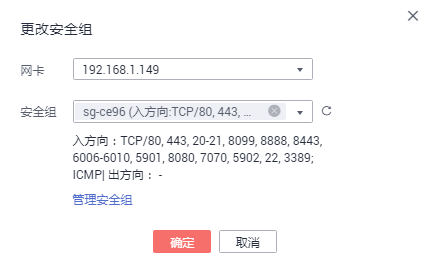

# 更改安全组

当裸金属服务器的网卡需要变更所属安全组时，可以参考下面步骤。

1.  登录管理控制台。
2.  单击管理控制台左上角的，选择地域和项目。
3.  选择“计算 \> 裸金属服务器”。

    进入裸金属服务器页面。

4.  单击待设置安全组的裸金属服务器的名称。

    系统跳转至该裸金属服务器的详情页面。

5.  选择“安全组”页签，并单击“更改安全组”。
6.  在弹出的“更改安全组”对话框中，选择指定的安全组。

    **图 1**  更改安全组  
    

7.  单击“确定”。

