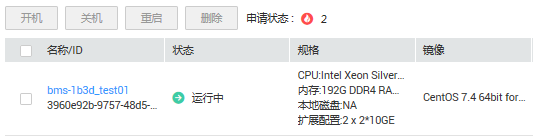

# 查看创建状态

## 操作场景

用户创建裸金属服务器后，可以通过“申请状态”栏查看任务的创建状态。创建裸金属服务器的任务可以包括创建裸金属服务器资源、绑定弹性公网IP、挂载云硬盘等子任务。

申请状态栏的任务状态包括如下两类：

-   处理中：指系统正在处理的请求。
-   处理失败：指未能成功处理的请求。对于处理失败的任务，系统会自动回退，同时在界面上直观的展示错误码，例如“（BMS.3033）创建系统卷失败。”

本节介绍如何查看裸金属服务器的申请状态以及申请状态栏的提示信息说明。

## 操作步骤

1.  登录管理控制台。
2.  选择“计算 \> 裸金属服务器”。

    进入裸金属服务器页面。

3.  常用操作“开机、关机、重启、删除”的右侧即为“申请状态”，用户执行购买裸金属服务器操作后，申请状态栏将显示该任务的创建状态。

    **图 1**  申请状态  
    

4.  单击“申请状态”栏对应的数字，即可查看“处理中”的任务和“处理失败”任务的详情，查看裸金属服务器的创建状态。

    > **说明：**   
    >如果用户发现申请状态栏显示创建裸金属服务器的任务失败，而裸金属服务器列表中显示该服务器已创建成功，关于此问题请参见[为什么创建裸金属服务器的任务失败，但是在服务器列表中显示创建成功？](https://support.huaweicloud.com/bms_faq/bms_faq_0019.html)。  

