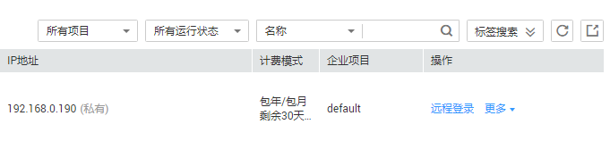

# 查看详细信息

## 操作场景

在您创建了裸金属服务器后，可以通过管理控制台查看和管理您的裸金属服务器。本节介绍如何查看裸金属服务器的详细信息，包括裸金属服务器名称/ID、磁盘、网卡、弹性公网IP等信息。

## 操作步骤

1.  登录管理控制台。
2.  选择“计算 \> 裸金属服务器”。

    进入裸金属服务器列表页面，您可以在本页面查看您已购买的裸金属服务器，以及裸金属服务器的规格、镜像、私有IP地址等基本信息。

3.  在裸金属服务器列表中的右上方，按照项目、运行状态、名称、裸金属服务器ID、规格和私有IP地址筛选需要的裸金属服务器。您也可以通过单击裸金属服务器列表右上角的“标签搜索”，根据标签的键和值进行搜索。

    **图 1**  搜索裸金属服务器  
    

4.  单击裸金属服务器的名称。

    进入裸金属服务器详情界面。

5.  查看裸金属服务器的详细信息，如：名称、状态、规格、虚拟私有云等信息。还可以单击“磁盘/网卡/安全组/弹性公网IP/监控/标签”页签，为裸金属服务器挂载、卸载云硬盘，更改安全组，绑定、解绑定弹性公网IP，添加委托等。

