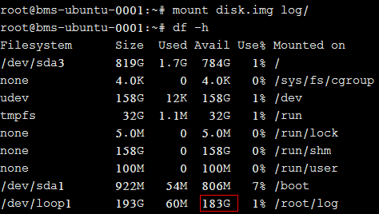
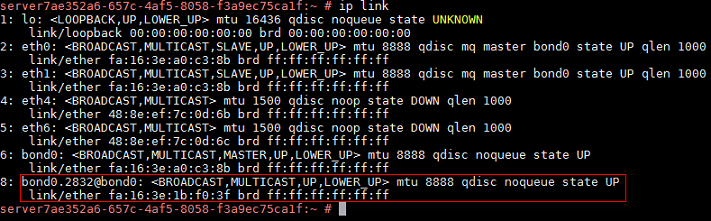
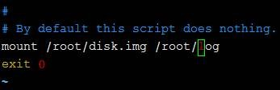

# 根分区自动扩盘的场景下，如何隔离日志空间大小？

## 问题背景

根分区自动扩盘场景下，会出现初始根分区占满系统盘的情况。如果您有隔离日志空间大小的诉求，可以参考本章节进行配置。

## 操作步骤

1.  执行**lsblk**命令，回显内容表明初始根分区已占满系统盘。

    

2.  新建存放日志的目录。

    **mkdir log**

    

3.  新建大小为200G的镜像文件存放日志。

    **dd if=/dev/zero of=disk.img bs=1M count=200000**

    

4.  将生成的文件虚拟为块设备并格式化。

    **losetup /dev/loop0 disk.img**

    **mkfs.ext4 /dev/loop0**

    

5.  将镜像文件挂载到日志目录下。

    **mount disk.img log**

    

6.  在日志目录下新建文件。

    

7.  将挂载命令增加至“/etc/rc.local”中。

    **mount /root/disk.img /root/log**

    

8.  重新启动系统。

    **reboot**

    

9.  执行**lsblk**命令，回显内容表明已实现镜像文件挂载。

    

