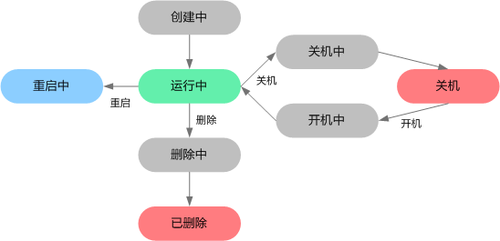

# 管理生命周期

裸金属服务器的生命周期管理包括对其进行启动、关闭、重启及删除 。

1.  登录管理控制台。
2.  单击管理控制台左上角的，选择地域和项目。
3.  选择“计算 \>  裸金属服务器”。

    进入裸金属服务器页面。

4.  在裸金属服务器列表中的右上角，输入裸金属服务器名称、私有IP地址、ID或规格，并单击。
5.  选择裸金属服务器，单击裸金属服务器列表左上角的“开机”、“关机”、“重启”或“删除”，修改裸金属服务器状态。

**图 1**  裸金属服务器状态  

**表 1**  裸金属服务器状态说明

<table><thead align="left"><tr id="row31891630195029"><th class="cellrowborder" valign="top" width="15.1%" id="mcps1.2.4.1.1">
<strong id="b36694051143340">状态</strong>

</th>
<th class="cellrowborder" valign="top" width="16.42%" id="mcps1.2.4.1.2">
<strong id="b19428150143340">状态属性</strong>

</th>
<th class="cellrowborder" valign="top" width="68.47999999999999%" id="mcps1.2.4.1.3">
<strong id="b30176326143340">说明</strong>

</th>
</tr>
</thead>
<tbody><tr id="row64204718195029"><td class="cellrowborder" valign="top" width="15.1%" headers="mcps1.2.4.1.1 ">
创建中

</td>
<td class="cellrowborder" valign="top" width="16.42%" headers="mcps1.2.4.1.2 ">
中间状态

</td>
<td class="cellrowborder" valign="top" width="68.47999999999999%" headers="mcps1.2.4.1.3 ">
创建裸金属服务器后，裸金属服务器状态进入运行中之前的状态。

如果长时间处于该状态，则说明出现异常，需要联系管理员处理。

</td>
</tr>
<tr id="row47440894105334"><td class="cellrowborder" valign="top" width="15.1%" headers="mcps1.2.4.1.1 ">
开机中

</td>
<td class="cellrowborder" valign="top" width="16.42%" headers="mcps1.2.4.1.2 ">
中间状态

</td>
<td class="cellrowborder" valign="top" width="68.47999999999999%" headers="mcps1.2.4.1.3 ">
裸金属服务器从关机到运行中的中间状态。

如果长时间处于该状态，则说明出现异常，需要联系管理员处理。

</td>
</tr>
<tr id="row32093542195029"><td class="cellrowborder" valign="top" width="15.1%" headers="mcps1.2.4.1.1 ">
运行中

</td>
<td class="cellrowborder" valign="top" width="16.42%" headers="mcps1.2.4.1.2 ">
稳定状态

</td>
<td class="cellrowborder" valign="top" width="68.47999999999999%" headers="mcps1.2.4.1.3 ">
裸金属服务器正常运行中的状态。

在这个状态的服务器可以运行您的业务。

</td>
</tr>
<tr id="row21015765105421"><td class="cellrowborder" valign="top" width="15.1%" headers="mcps1.2.4.1.1 ">
关机中

</td>
<td class="cellrowborder" valign="top" width="16.42%" headers="mcps1.2.4.1.2 ">
中间状态

</td>
<td class="cellrowborder" valign="top" width="68.47999999999999%" headers="mcps1.2.4.1.3 ">
裸金属服务器从运行中到关机的中间状态。

如果长时间处于该状态，则说明出现异常，需要联系管理员处理。

</td>
</tr>
<tr id="row20637738195029"><td class="cellrowborder" valign="top" width="15.1%" headers="mcps1.2.4.1.1 ">
关机

</td>
<td class="cellrowborder" valign="top" width="16.42%" headers="mcps1.2.4.1.2 ">
稳定状态

</td>
<td class="cellrowborder" valign="top" width="68.47999999999999%" headers="mcps1.2.4.1.3 ">
裸金属服务器被正常停止。

在这个状态下的服务器，不能对外提供业务。

</td>
</tr>
<tr id="row39612707195029"><td class="cellrowborder" valign="top" width="15.1%" headers="mcps1.2.4.1.1 ">
重启中

</td>
<td class="cellrowborder" valign="top" width="16.42%" headers="mcps1.2.4.1.2 ">
中间状态

</td>
<td class="cellrowborder" valign="top" width="68.47999999999999%" headers="mcps1.2.4.1.3 ">
裸金属服务器正在进行重启操作。

如果长时间处于该状态，则说明出现异常，需要联系管理员处理。

</td>
</tr>
<tr id="row39752192105447"><td class="cellrowborder" valign="top" width="15.1%" headers="mcps1.2.4.1.1 ">
删除中

</td>
<td class="cellrowborder" valign="top" width="16.42%" headers="mcps1.2.4.1.2 ">
中间状态

</td>
<td class="cellrowborder" valign="top" width="68.47999999999999%" headers="mcps1.2.4.1.3 ">
裸金属服务器处于正在被删除的状态。

如果长时间处于该状态，则说明出现异常，需要联系管理员处理。

</td>
</tr>
<tr id="row29232435195029"><td class="cellrowborder" valign="top" width="15.1%" headers="mcps1.2.4.1.1 ">
已删除

</td>
<td class="cellrowborder" valign="top" width="16.42%" headers="mcps1.2.4.1.2 ">
中间状态

</td>
<td class="cellrowborder" valign="top" width="68.47999999999999%" headers="mcps1.2.4.1.3 ">
裸金属服务器已被正常删除。在该状态下的服务器，不能对外提供业务，并在短时间内从系统中彻底清除。

</td>
</tr>
<tr id="row4093067195029"><td class="cellrowborder" valign="top" width="15.1%" headers="mcps1.2.4.1.1 ">
故障

</td>
<td class="cellrowborder" valign="top" width="16.42%" headers="mcps1.2.4.1.2 ">
稳定状态

</td>
<td class="cellrowborder" valign="top" width="68.47999999999999%" headers="mcps1.2.4.1.3 ">
裸金属服务器处于异常状态。

在这个状态下的服务器，不能对外提供业务，需要联系管理员进行处理。

</td>
</tr>
</tbody>
</table>

1.  根据提示信息，确认状态。

