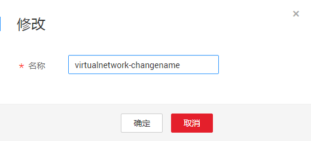
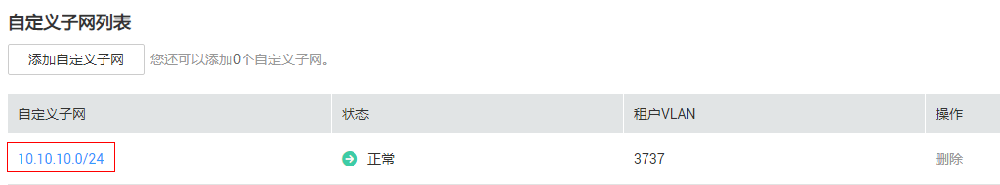
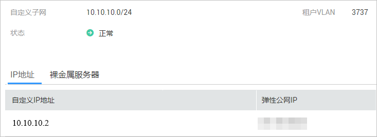
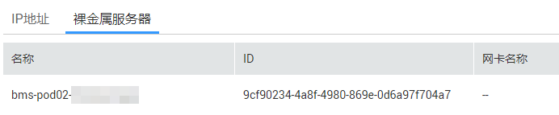

# 管理自定义网络

## 操作场景

裸金属服务器支持二次虚拟化，通过创建自定义网络，使裸金属服务器下发的虚拟机可以与同一VPC网络中的云服务互通，或者可以访问外网，及被外网访问。

关于自定义网络的使用，我们提供了一个最佳实践，请参考“[XenServer on BMS](https://support.huaweicloud.com/bestpractice-bms/zh-cn_topic_0130081152.html)”获取详细方案。

## 使用须知

-   若单个租户有多个VPC网络，只支持在1个VPC网络中创建自定义网络，并且只支持1个自定义子网。
-   租户网络内如果都是单网卡裸金属服务器，则不支持创建自定义网络。
-   必须先创建带自定义VLAN网络的裸金属服务器，然后再创建自定义网络。
-   不支持配置自定义子网的安全组。
-   一个自定义网络的自定义子网和VPC子网的CIDR不能冲突。
-   自定义子网中IP为x.x.x.1的地址为内部网关，请勿在裸金属服务器中使用。
-   自定义子网掩码限制在16~29位。

## 申请自定义网络

1.  登录管理控制台。
2.  单击管理控制台左上角的，选择地域和项目。
3.  选择“计算 \> 裸金属服务器”。

    进入裸金属服务器页面。

4.  在“自定义网络”页签中，单击“创建自定义网络”。
5.  根据实际需求选择虚拟私有云、可用分区，设置自定义子网、名称，如[图1](#fig2180112584617)所示。

    **图 1**  创建自定义网络  
    

    > **说明：**   
    >自定义子网掩码限制在16~29位，且自定义子网的网关IP不能被租户使用。  

6.  单击“确定”完成自定义网络的创建。

    创建成功后，可以在列表查看自定义网络相关信息。

    **图 2**  自定义网络列表  
    

    > **说明：**   
    >如果您还没有创建多网卡裸金属服务器，会弹出“多网卡裸金属服务器实例不足”提示，创建失败。  

## 修改自定义网络的名称

1.  在裸金属服务器页面，单击“自定义网络”页签，找到待修改名称的自定义网络，单击“操作”列的“修改”。
2.  输入新名称，单击“确定”。

    **图 3**  修改自定义网络名称  
    

## 查看自定义网络详情

1.  在裸金属服务器页面，单击“自定义网络”页签。
2.  在自定义网络列表中，单击待查看详情的自定义网络名称。

    可以在详情页面查看自定义网络的名称、可用分区、自定义子网个数、虚拟私有云信息。

    **图 4**  自定义网络详情页面  
    

    您也可以在该页面修改自定义网络名称，单击，输入新名称，单击。

## 管理自定义子网

-   添加自定义子网

    当前一个自定义网络中仅支持一个自定义子网，暂时无法在自定义网络详情页面添加新的自定义子网。

-   查看自定义子网详情

    在自定义子网列表，单击待查看详情的自定义子网名称，系统跳转至自定义子网详情页面。

    **图 5**  自定义子网列表  
    

    您可以在详情页面查看自定义子网的IP、状态、租户VLAN信息。

    **图 6**  自定义子网详情  
    

    在“IP地址”页签查看自定义子网的IP地址，以及绑定的弹性公网IP。

    在“裸金属服务器”页签查看所有多网卡裸金属服务器的信息。

    **图 7**  裸金属服务器信息  
    

-   修改自定义子网

    用户无法直接修改自定义子网，需通过删除自定义网络后重新创建自定义网络来创建新的自定义子网。

-   删除自定义子网

    在自定义子网列表，找到待删除的自定义子网，单击“操作”列的“删除”。

    如果自定义网络下只有一个子网，则不允许用户删除自定义子网。

## 删除自定义网络

1.  在裸金属服务器页面，单击“自定义网络”页签。
2.  找到待删除的自定义网络，单击“操作”列的“删除”，在弹出框中单击“确定”。

    最后一个多网卡裸金属服务器实例被删除后，自定义网络会自动删除。

