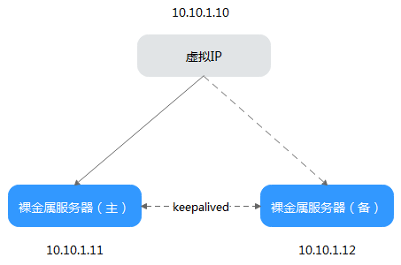

# 管理虚拟IP地址

## 虚拟IP相关知识

虚拟IP也称为“浮动IP”，主要用在服务器的主备切换，达到高可用性HA（High Availability）的目的。当主服务器发生故障无法对外提供服务时，动态将虚拟IP切换到备服务器，继续对外提供服务。

如果您想要提高服务的高可用性，避免单点故障，可以用“一主一备”或“一主多备”的方法组合使用裸金属服务器，这些裸金属服务器对外表现为一个虚拟IP。

**图 1**  高可用性模式组网图  

-   将2台同子网的裸金属服务器绑定同一个虚拟IP。
-   将这2台裸金属服务器配置Keepalived，实现一台为主服务器，一台为备份服务器。Keepalived可参考业内通用的配置方法，此处不做详细介绍。

> **说明：**   
>-   更多关于虚拟IP地址的信息，请参见《[虚拟私有云产品介绍](https://support.huaweicloud.com/productdesc-vpc/vpc_Concepts_0012.html)》。  
>-   关于虚拟IP的使用案例，可以参阅“[FusionCompute on BMS](https://support.huaweicloud.com/bestpractice-bms/bms_bp_0513.html)”最佳实践。  

## 如何为裸金属服务器绑定虚拟IP地址？

1.  登录管理控制台。
2.  选择“计算 \> 裸金属服务器”。

    进入裸金属服务器页面。

3.  单击待绑定虚拟IP地址的裸金属服务器的名称。

    系统跳转至该裸金属服务器的详情页面。

4.  选择“网卡”页签，并单击“管理虚拟IP地址”。

    系统跳转至虚拟私有云页面。

5.  在“虚拟IP”页签，您可以在列表中选择合适的虚拟IP，或者单击“申请虚拟IP地址”创建新的虚拟IP地址。
6.  单击“操作”列下的“绑定服务器”，选择目标裸金属服务器与对应的网卡，绑定虚拟IP地址。

