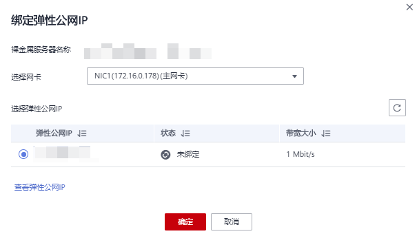

# 绑定弹性公网IP至服务器

## 操作场景

当您需要为裸金属服务器绑定弹性公网IP，使其可以与Internet通信时，请执行本节操作。

## 前提条件

已申请弹性公网IP，详细操作请参见“[申请弹性公网IP](https://support.huaweicloud.com/usermanual-vpc/zh-cn_topic_0013748738.html#section1)”。

## 操作步骤

1.  登录管理控制台。
2.  选择“计算 \> 裸金属服务器”。

    进入裸金属服务器页面。

3.  单击创建的裸金属服务器名称。

    进入详情页面。

4.  单击“弹性公网IP”页签，然后单击“绑定弹性公网IP”。

    弹出“绑定弹性公网IP”对话框。

5.  选择要绑定的弹性公网IP，单击“确定”，完成绑定。

    **图 1**  绑定弹性公网IP  
    

    > **说明：** 
    >一个网卡只能绑定一个弹性公网IP。

## 相关操作

-   [Windows服务器访问公网不通怎么办？](https://support.huaweicloud.com/ecs_faq/zh-cn_topic_0167429327.html)
-   [Linux服务器访问公网不通怎么办？](https://support.huaweicloud.com/ecs_faq/ecs_faq_1329.html)
-   [弹性公网IP Ping不通？](https://support.huaweicloud.com/ecs_faq/zh-cn_topic_0105130172.html)

