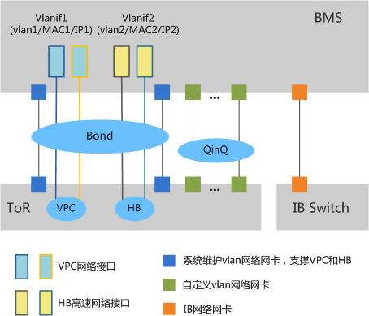

# 网络架构

裸金属服务有四种网络类型，分别是VPC网络、高速网络、自定义vlan网络和IB网络，四种网络之间相互隔离不互通。其中，VPC网络接口和高速网络接口是基于系统维护vlan网卡组建bond后创建的vlan子接口。自定义vlan网络网卡和IB网络网卡由用户进行管理配置。

**图 1**  裸金属服务网络  

> **说明：**   
>-   图中的ToR表示服务器机柜的布线方式，接入交换机放在机架顶部，服务器放在下方。HB表示高速网络。QinQ表示802.1Q隧道。  
>-   VPC网络接口和HB高速网络接口由系统生成，租户不可修改。这两个网络接口属于同一个网卡Bond。  
>-   弹性云服务器和裸金属服务器之间可以通过VPC网络通信，也可以通过IB网络通信（如果存在）。  
>-   只有VPC网络支持安全组、弹性公网IP和弹性负载均衡能力。  
>-   对于高速网络和自定义vlan网络，同一网络中的裸金属服务器实例之间仅提供L2连接。  

