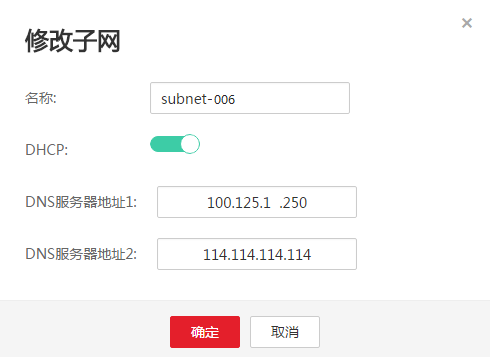
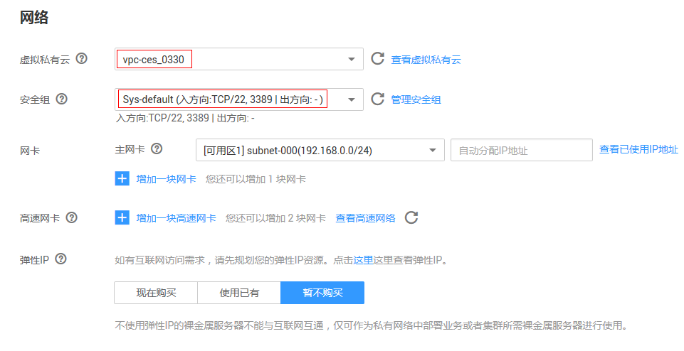

# 自动安装配置Agent（新创建裸金属服务器）<a name="ZH-CN_TOPIC_0160938551"></a>

本章节主要介绍如何在新建裸金属服务器时利用CloudInit自动安装Agent，实现主机监控。您需要完成以下步骤：

1.  [下载cloud-config配置文件](#zh-cn_topic_0104704446_section15711832152011)：提前准备cloud-config配置文件，在购买裸金属服务器时，注入该文件。
2.  [修改子网DNS地址](#zh-cn_topic_0104704446_section99035364202)：按裸金属服务器所在区域修改子网的DNS服务器地址。
3.  [配置安全组](#zh-cn_topic_0104704446_section199181037202414)：用于下载Telescope包、发送指标数据、采集日志等。
4.  [购买并配置裸金属服务器](#zh-cn_topic_0104704446_section1329874211247)：在已配置好DNS的VPC下创建裸金属服务器，并配置用户数据注入，选择委托。创建成功后，将自动完成Agent安装，实现主机监控。

## 下载cloud-config配置文件<a name="zh-cn_topic_0104704446_section15711832152011"></a>

下载路径：

[https://obs.myhwclouds.com/telescope/agent/cloudinit\_conf\_template.txt](https://obs.myhwclouds.com/telescope/agent/cloudinit_conf_template.txt)

## 修改子网DNS地址<a name="zh-cn_topic_0104704446_section99035364202"></a>

在管理控制台修改子网DNS服务器地址。

1.  进入管理控制台首页，在左上角单击图标，选择区域和项目。
2.  选择“服务列表 \> 网络 \> 虚拟私有云”。

    进入网络控制台界面。

3.  在左侧导航中选择“虚拟私有云”。
    -   如果已有可用虚拟私有云，单击该VPC名称（假设为_vpc-ces\_0330_），进入详情页。
    -   如果当前还未创建任何虚拟私有云，请参考[创建虚拟私有云和子网](https://support.huaweicloud.com/usermanual-vpc/zh-cn_topic_0013935842.html)进行创建。创建完成后，单击该VPC名称（假设为_vpc-ces\_0330_），进入详情页。

4.  在“子网”列表中，单击“_subnet-006_”所在行“修改”。

    弹出“修改子网”对话框，修改“DNS服务器地址1”为“_100.125.1.250_”。

    > **说明：**   
    >_subnet-006_为待创建裸金属服务器的子网。  
    >不同区域的DNS服务器地址不同，如下所示：  
    >华北-北京一：100.125.1.250,100.125.21.250  
    >华东-上海二：100.125.17.29,100.125.135.29  
    >华南-广州：100.125.1.250,100.125.136.29  
    >亚太-香港：100.125.1.250,100.125.3.250  
    >亚太-曼谷：100.125.1.250,100.125.3.250  

    **图 1**  修改DNS服务器地址<a name="zh-cn_topic_0104704446_fig4674209323"></a>  
    

5.  单击“确定”，保存设置。

## 配置安全组<a name="zh-cn_topic_0104704446_section199181037202414"></a>

在“虚拟私有云 \> 安全组”页面，单击Sys-default右侧的“添加规则”，按[表1](#zh-cn_topic_0104704446_table236145594014)添加规则。

> **说明：**   
>Sys-default为待创建裸金属服务器的安全组。  

**表 1**  安全组规则

<a name="zh-cn_topic_0104704446_table236145594014"></a>
<table><thead align="left"><tr id="zh-cn_topic_0104704446_row123745524019"><th class="cellrowborder" valign="top" width="20%" id="mcps1.2.5.1.1"><p id="zh-cn_topic_0104704446_p109311613411"><a name="zh-cn_topic_0104704446_p109311613411"></a><a name="zh-cn_topic_0104704446_p109311613411"></a>方向</p>
</th>
<th class="cellrowborder" valign="top" width="22%" id="mcps1.2.5.1.2"><p id="zh-cn_topic_0104704446_p189311268415"><a name="zh-cn_topic_0104704446_p189311268415"></a><a name="zh-cn_topic_0104704446_p189311268415"></a>协议</p>
</th>
<th class="cellrowborder" valign="top" width="21%" id="mcps1.2.5.1.3"><p id="zh-cn_topic_0104704446_p18931176104118"><a name="zh-cn_topic_0104704446_p18931176104118"></a><a name="zh-cn_topic_0104704446_p18931176104118"></a>端口</p>
</th>
<th class="cellrowborder" valign="top" width="37%" id="mcps1.2.5.1.4"><p id="zh-cn_topic_0104704446_p17931156124112"><a name="zh-cn_topic_0104704446_p17931156124112"></a><a name="zh-cn_topic_0104704446_p17931156124112"></a>说明</p>
</th>
</tr>
</thead>
<tbody><tr id="zh-cn_topic_0104704446_row1137165534015"><td class="cellrowborder" valign="top" width="20%" headers="mcps1.2.5.1.1 "><p id="zh-cn_topic_0104704446_p10337142384115"><a name="zh-cn_topic_0104704446_p10337142384115"></a><a name="zh-cn_topic_0104704446_p10337142384115"></a>入方向</p>
</td>
<td class="cellrowborder" valign="top" width="22%" headers="mcps1.2.5.1.2 "><p id="zh-cn_topic_0104704446_p4337142315417"><a name="zh-cn_topic_0104704446_p4337142315417"></a><a name="zh-cn_topic_0104704446_p4337142315417"></a>TCP</p>
</td>
<td class="cellrowborder" valign="top" width="21%" headers="mcps1.2.5.1.3 "><p id="zh-cn_topic_0104704446_p93371523164115"><a name="zh-cn_topic_0104704446_p93371523164115"></a><a name="zh-cn_topic_0104704446_p93371523164115"></a>80</p>
</td>
<td class="cellrowborder" rowspan="2" valign="top" width="37%" headers="mcps1.2.5.1.4 "><p id="zh-cn_topic_0104704446_p123715550408"><a name="zh-cn_topic_0104704446_p123715550408"></a><a name="zh-cn_topic_0104704446_p123715550408"></a>用于wget从OBS桶下载Telescope包。</p>
</td>
</tr>
<tr id="zh-cn_topic_0104704446_row73765519400"><td class="cellrowborder" valign="top" headers="mcps1.2.5.1.1 "><p id="zh-cn_topic_0104704446_p233716236414"><a name="zh-cn_topic_0104704446_p233716236414"></a><a name="zh-cn_topic_0104704446_p233716236414"></a>出方向</p>
</td>
<td class="cellrowborder" valign="top" headers="mcps1.2.5.1.2 "><p id="zh-cn_topic_0104704446_p14337132310412"><a name="zh-cn_topic_0104704446_p14337132310412"></a><a name="zh-cn_topic_0104704446_p14337132310412"></a>TCP</p>
</td>
<td class="cellrowborder" valign="top" headers="mcps1.2.5.1.3 "><p id="zh-cn_topic_0104704446_p17337102384114"><a name="zh-cn_topic_0104704446_p17337102384114"></a><a name="zh-cn_topic_0104704446_p17337102384114"></a>80</p>
</td>
</tr>
<tr id="zh-cn_topic_0104704446_row113725594012"><td class="cellrowborder" valign="top" width="20%" headers="mcps1.2.5.1.1 "><p id="zh-cn_topic_0104704446_p14337112314118"><a name="zh-cn_topic_0104704446_p14337112314118"></a><a name="zh-cn_topic_0104704446_p14337112314118"></a>入方向</p>
</td>
<td class="cellrowborder" valign="top" width="22%" headers="mcps1.2.5.1.2 "><p id="zh-cn_topic_0104704446_p1337152364111"><a name="zh-cn_topic_0104704446_p1337152364111"></a><a name="zh-cn_topic_0104704446_p1337152364111"></a>UDP</p>
</td>
<td class="cellrowborder" valign="top" width="21%" headers="mcps1.2.5.1.3 "><p id="zh-cn_topic_0104704446_p153379238417"><a name="zh-cn_topic_0104704446_p153379238417"></a><a name="zh-cn_topic_0104704446_p153379238417"></a>53</p>
</td>
<td class="cellrowborder" rowspan="2" valign="top" width="37%" headers="mcps1.2.5.1.4 "><p id="zh-cn_topic_0104704446_p19371155184017"><a name="zh-cn_topic_0104704446_p19371155184017"></a><a name="zh-cn_topic_0104704446_p19371155184017"></a>用于DNS解析域名，需要解析OBS地址、Cloud Eye开放接口地址、LTS开放接口地址。</p>
</td>
</tr>
<tr id="zh-cn_topic_0104704446_row437195512405"><td class="cellrowborder" valign="top" headers="mcps1.2.5.1.1 "><p id="zh-cn_topic_0104704446_p153371423144113"><a name="zh-cn_topic_0104704446_p153371423144113"></a><a name="zh-cn_topic_0104704446_p153371423144113"></a>出方向</p>
</td>
<td class="cellrowborder" valign="top" headers="mcps1.2.5.1.2 "><p id="zh-cn_topic_0104704446_p12337192317410"><a name="zh-cn_topic_0104704446_p12337192317410"></a><a name="zh-cn_topic_0104704446_p12337192317410"></a>UDP</p>
</td>
<td class="cellrowborder" valign="top" headers="mcps1.2.5.1.3 "><p id="zh-cn_topic_0104704446_p733752314117"><a name="zh-cn_topic_0104704446_p733752314117"></a><a name="zh-cn_topic_0104704446_p733752314117"></a>53</p>
</td>
</tr>
<tr id="zh-cn_topic_0104704446_row138145564014"><td class="cellrowborder" valign="top" width="20%" headers="mcps1.2.5.1.1 "><p id="zh-cn_topic_0104704446_p8337162304120"><a name="zh-cn_topic_0104704446_p8337162304120"></a><a name="zh-cn_topic_0104704446_p8337162304120"></a>入方向</p>
</td>
<td class="cellrowborder" valign="top" width="22%" headers="mcps1.2.5.1.2 "><p id="zh-cn_topic_0104704446_p1933752319412"><a name="zh-cn_topic_0104704446_p1933752319412"></a><a name="zh-cn_topic_0104704446_p1933752319412"></a>TCP</p>
</td>
<td class="cellrowborder" valign="top" width="21%" headers="mcps1.2.5.1.3 "><p id="zh-cn_topic_0104704446_p3338323144115"><a name="zh-cn_topic_0104704446_p3338323144115"></a><a name="zh-cn_topic_0104704446_p3338323144115"></a>443</p>
</td>
<td class="cellrowborder" rowspan="2" valign="top" width="37%" headers="mcps1.2.5.1.4 "><p id="zh-cn_topic_0104704446_p83810552401"><a name="zh-cn_topic_0104704446_p83810552401"></a><a name="zh-cn_topic_0104704446_p83810552401"></a>用于发送指标数据、采集日志。云监控和云日志服务的开放接口是HTTPS请求。</p>
</td>
</tr>
<tr id="zh-cn_topic_0104704446_row15381055184016"><td class="cellrowborder" valign="top" headers="mcps1.2.5.1.1 "><p id="zh-cn_topic_0104704446_p16338192312412"><a name="zh-cn_topic_0104704446_p16338192312412"></a><a name="zh-cn_topic_0104704446_p16338192312412"></a>出方向</p>
</td>
<td class="cellrowborder" valign="top" headers="mcps1.2.5.1.2 "><p id="zh-cn_topic_0104704446_p13338182315414"><a name="zh-cn_topic_0104704446_p13338182315414"></a><a name="zh-cn_topic_0104704446_p13338182315414"></a>TCP</p>
</td>
<td class="cellrowborder" valign="top" headers="mcps1.2.5.1.3 "><p id="zh-cn_topic_0104704446_p9338823154118"><a name="zh-cn_topic_0104704446_p9338823154118"></a><a name="zh-cn_topic_0104704446_p9338823154118"></a>443</p>
</td>
</tr>
</tbody>
</table>

## 购买并配置裸金属服务器<a name="zh-cn_topic_0104704446_section1329874211247"></a>

1.  在裸金属服务器界面，单击“购买裸金属服务器”。
2.  配置裸金属服务器的规格参数。

    -   “镜像”请按照支持的镜像列表选择。
    -   “网络 \> 虚拟私有云”选择已配置好DNS的VPC。

    **图 2**  购买裸金属服务器<a name="zh-cn_topic_0104704446_fig66049139221"></a>  
    

3.  登录方式选择“密钥对”。
4.  展开“高级配置”，配置用户数据注入和委托。

    在“用户数据注入”中填入[下载cloud-config配置文件](#zh-cn_topic_0104704446_section15711832152011)下载的cloud-config配置文件，目的是在创建裸金属服务器后利用Cloudinit功能将安装配置Agent的步骤全部自动化。

    cloud-config配置文件如下：

    ```
    #cloud-config
    write_files:
      - path: /home/linux/userInfo.txt
        content: |
          {
            "ProjectId":"xxxxxxxxxxxxxxxxxxxxxxxxxxx", 
            "AccessKey":"xxxxxxxxxxxxxxxxxxxx",
            "SecretKey":"xxxxxxxxxxxxxxxxxxxxxxxxxxxxxxxxxxxxxx",
            "RegionId":"cn-north-1"
          }
    runcmd:
       - cd /usr/local/ && wget http://obs.myhwclouds.com/telescope/agent/telescope_linux_amd64.tar.gz && tar -zxvf telescope_linux_amd64.tar.gz
      - chmod 755/usr/local/telescope_linux_amd64/install.sh &&/usr/local/telescope_linux_amd64/install.sh
      -mv /home/linux/userInfo.txt /usr/local/telescope/bin/conf.json
      - cd /usr/local && wgethttp://169.254.169.254/openstack/latest/meta_data.json
      - cat meta_data.json | python -c'import json,sys;uuid=json.load(sys.stdin)["uuid"];print"\"InstanceId\"':' " + "\"" + uuid +"\""' > instanceId
      - sed -i "2i \  $(cat instanceId),"/usr/local/telescope/bin/conf.json
      - rm /usr/local/meta_data.json/usr/local/instanceId
    ```

    其中，ProjectId、AccessKey、SecretKey、RegionId参数说明请参见[表2](#zh-cn_topic_0104704446_table1083355454411)，Telescope下载地址请参见[表3](#zh-cn_topic_0104704446_table8441794366)。

    **表 2**  参数说明

    <a name="zh-cn_topic_0104704446_table1083355454411"></a>
    <table><thead align="left"><tr id="zh-cn_topic_0104704446_row783545410444"><th class="cellrowborder" valign="top" width="22%" id="mcps1.2.3.1.1"><p id="zh-cn_topic_0104704446_p04415173118"><a name="zh-cn_topic_0104704446_p04415173118"></a><a name="zh-cn_topic_0104704446_p04415173118"></a>参数</p>
    </th>
    <th class="cellrowborder" valign="top" width="78%" id="mcps1.2.3.1.2"><p id="zh-cn_topic_0104704446_p8441317311"><a name="zh-cn_topic_0104704446_p8441317311"></a><a name="zh-cn_topic_0104704446_p8441317311"></a>说明</p>
    </th>
    </tr>
    </thead>
    <tbody><tr id="zh-cn_topic_0104704446_row883511546447"><td class="cellrowborder" valign="top" width="22%" headers="mcps1.2.3.1.1 "><p id="zh-cn_topic_0104704446_p114587101422"><a name="zh-cn_topic_0104704446_p114587101422"></a><a name="zh-cn_topic_0104704446_p114587101422"></a>ProjectId</p>
    </td>
    <td class="cellrowborder" valign="top" width="78%" headers="mcps1.2.3.1.2 "><p id="zh-cn_topic_0104704446_p1145816102215"><a name="zh-cn_topic_0104704446_p1145816102215"></a><a name="zh-cn_topic_0104704446_p1145816102215"></a>项目ID，获取方式如下：</p>
    <a name="zh-cn_topic_0104704446_ol445851020213"></a><a name="zh-cn_topic_0104704446_ol445851020213"></a><ol id="zh-cn_topic_0104704446_ol445851020213"><li>登录管理控制台，单击右上角用户名，选择“我的凭证”。</li><li>在项目列表中，查看BMS实例对应的所属区域的项目ID。</li></ol>
    </td>
    </tr>
    <tr id="zh-cn_topic_0104704446_row178351254124417"><td class="cellrowborder" valign="top" width="22%" headers="mcps1.2.3.1.1 "><p id="zh-cn_topic_0104704446_p1145871015219"><a name="zh-cn_topic_0104704446_p1145871015219"></a><a name="zh-cn_topic_0104704446_p1145871015219"></a>AccessKey/SecretKey</p>
    </td>
    <td class="cellrowborder" valign="top" width="78%" headers="mcps1.2.3.1.2 "><p id="zh-cn_topic_0104704446_p245861014214"><a name="zh-cn_topic_0104704446_p245861014214"></a><a name="zh-cn_topic_0104704446_p245861014214"></a>访问密钥，获取方式如下：</p>
    <p id="zh-cn_topic_0104704446_p178061571734"><a name="zh-cn_topic_0104704446_p178061571734"></a><a name="zh-cn_topic_0104704446_p178061571734"></a>登录管理控制台，单击右上角用户名，选择“我的凭证 &gt; 管理访问密钥”。</p>
    <a name="zh-cn_topic_0104704446_ul76504144318"></a><a name="zh-cn_topic_0104704446_ul76504144318"></a><ul id="zh-cn_topic_0104704446_ul76504144318"><li>如已有访问密钥，查看创建时下载保存的credentials.csv文件中，获取文件中记录的Key值即可。</li><li>如未创建，则通过“新增访问密钥”可创建新的访问密钥，请妥善保存credentials.csv文件，并获取文件中记录的Key值。</li></ul>
    <div class="notice" id="zh-cn_topic_0104704446_note1137810101217"><a name="zh-cn_topic_0104704446_note1137810101217"></a><a name="zh-cn_topic_0104704446_note1137810101217"></a><span class="noticetitle"> 须知： </span><div class="noticebody"><a name="zh-cn_topic_0104704446_ul1796105351315"></a><a name="zh-cn_topic_0104704446_ul1796105351315"></a><ul id="zh-cn_topic_0104704446_ul1796105351315"><li>为了安全考虑，建议该用户为IAM用户，并且权限仅为CES Administratror和LTS Administrator。</li><li>配置的AccessKey必须在“我的凭证 &gt; 管理访问密钥”列表中，否则将鉴权失败，云监控界面看不到监控数据。</li></ul>
    </div></div>
    </td>
    </tr>
    <tr id="zh-cn_topic_0104704446_row1383517548447"><td class="cellrowborder" valign="top" width="22%" headers="mcps1.2.3.1.1 "><p id="zh-cn_topic_0104704446_p7459210726"><a name="zh-cn_topic_0104704446_p7459210726"></a><a name="zh-cn_topic_0104704446_p7459210726"></a>RegionId</p>
    </td>
    <td class="cellrowborder" valign="top" width="78%" headers="mcps1.2.3.1.2 "><p id="zh-cn_topic_0104704446_p54593103212"><a name="zh-cn_topic_0104704446_p54593103212"></a><a name="zh-cn_topic_0104704446_p54593103212"></a>区域ID。例如：BMS实例所属区域为“华北-北京一”，则RegionId为“cn-north-1”，其他区域的RegionId详见<a href="https://developer.huaweicloud.com/endpoint" target="_blank" rel="noopener noreferrer">https://developer.huaweicloud.com/endpoint</a>。</p>
    </td>
    </tr>
    </tbody>
    </table>

    **表 3**  获取安装包

    <a name="zh-cn_topic_0104704446_table8441794366"></a>
    <table><thead align="left"><tr id="zh-cn_topic_0104704446_row204412911365"><th class="cellrowborder" valign="top" width="23%" id="mcps1.2.4.1.1"><p id="zh-cn_topic_0104704446_p741592473620"><a name="zh-cn_topic_0104704446_p741592473620"></a><a name="zh-cn_topic_0104704446_p741592473620"></a>名称</p>
    </th>
    <th class="cellrowborder" valign="top" width="23%" id="mcps1.2.4.1.2"><p id="zh-cn_topic_0104704446_p13415224193612"><a name="zh-cn_topic_0104704446_p13415224193612"></a><a name="zh-cn_topic_0104704446_p13415224193612"></a>格式</p>
    </th>
    <th class="cellrowborder" valign="top" width="54%" id="mcps1.2.4.1.3"><p id="zh-cn_topic_0104704446_p8415182412369"><a name="zh-cn_topic_0104704446_p8415182412369"></a><a name="zh-cn_topic_0104704446_p8415182412369"></a>获取路径</p>
    </th>
    </tr>
    </thead>
    <tbody><tr id="zh-cn_topic_0104704446_row1745492360"><td class="cellrowborder" valign="top" width="23%" headers="mcps1.2.4.1.1 "><p id="zh-cn_topic_0104704446_p128362030153613"><a name="zh-cn_topic_0104704446_p128362030153613"></a><a name="zh-cn_topic_0104704446_p128362030153613"></a>Linux 64位Agent安装包</p>
    </td>
    <td class="cellrowborder" valign="top" width="23%" headers="mcps1.2.4.1.2 "><p id="zh-cn_topic_0104704446_p188361430173612"><a name="zh-cn_topic_0104704446_p188361430173612"></a><a name="zh-cn_topic_0104704446_p188361430173612"></a>tar.gz</p>
    </td>
    <td class="cellrowborder" valign="top" width="54%" headers="mcps1.2.4.1.3 "><p id="zh-cn_topic_0104704446_p68041442163617"><a name="zh-cn_topic_0104704446_p68041442163617"></a><a name="zh-cn_topic_0104704446_p68041442163617"></a>华北-北京一：<a href="https://obs.myhwclouds.com/telescope/agent/telescope_linux_amd64.tar.gz" target="_blank" rel="noopener noreferrer">https://obs.myhwclouds.com/telescope/agent/telescope_linux_amd64.tar.gz</a></p>
    <p id="zh-cn_topic_0104704446_p1843319113373"><a name="zh-cn_topic_0104704446_p1843319113373"></a><a name="zh-cn_topic_0104704446_p1843319113373"></a>华南-广州：</p>
    <p id="zh-cn_topic_0104704446_p14804642183611"><a name="zh-cn_topic_0104704446_p14804642183611"></a><a name="zh-cn_topic_0104704446_p14804642183611"></a><a href="https://telescope-cn-south-1.obs.myhwclouds.com/agent/telescope_linux_amd64.tar.gz" target="_blank" rel="noopener noreferrer">https://telescope-cn-south-1.obs.myhwclouds.com/agent/telescope_linux_amd64.tar.gz</a></p>
    <p id="zh-cn_topic_0104704446_p151437140373"><a name="zh-cn_topic_0104704446_p151437140373"></a><a name="zh-cn_topic_0104704446_p151437140373"></a>华东-上海二：</p>
    <p id="zh-cn_topic_0104704446_p7804144216369"><a name="zh-cn_topic_0104704446_p7804144216369"></a><a name="zh-cn_topic_0104704446_p7804144216369"></a><a href="https://telescope-cn-east-2.obs.myhwclouds.com/agent/telescope_linux_amd64.tar.gz" target="_blank" rel="noopener noreferrer">https://telescope-cn-east-2.obs.myhwclouds.com/agent/telescope_linux_amd64.tar.gz</a></p>
    <p id="zh-cn_topic_0104704446_p153733210506"><a name="zh-cn_topic_0104704446_p153733210506"></a><a name="zh-cn_topic_0104704446_p153733210506"></a>亚太-香港：</p>
    <p id="zh-cn_topic_0104704446_p379111116504"><a name="zh-cn_topic_0104704446_p379111116504"></a><a name="zh-cn_topic_0104704446_p379111116504"></a><a href="https://telescope-ap-southeast-1.obs.ap-southeast-1.myhwclouds.com/agent/telescope_linux_amd64.tar.gz" target="_blank" rel="noopener noreferrer">https://telescope-ap-southeast-1.obs.ap-southeast-1.myhwclouds.com/agent/telescope_linux_amd64.tar.gz</a></p>
    <p id="zh-cn_topic_0104704446_p1515791219507"><a name="zh-cn_topic_0104704446_p1515791219507"></a><a name="zh-cn_topic_0104704446_p1515791219507"></a>亚太-曼谷：</p>
    <p id="zh-cn_topic_0104704446_p139428172501"><a name="zh-cn_topic_0104704446_p139428172501"></a><a name="zh-cn_topic_0104704446_p139428172501"></a><a href="https://telescope-ap-southeast-2.obs.ap-southeast-2.myhwclouds.com/agent/telescope_linux_amd64.tar.gz" target="_blank" rel="noopener noreferrer">https://telescope-ap-southeast-2.obs.ap-southeast-2.myhwclouds.com/agent/telescope_linux_amd64.tar.gz</a></p>
    </td>
    </tr>
    </tbody>
    </table>

    同时，在代理名称下拉框中选择“[如何创建用于裸金属服务器主机监控的委托](https://support.huaweicloud.com/bms_faq/bms_faq_0064.html)”中创建的委托。

5.  单击“立即购买”创建裸金属服务器。
6.  裸金属服务器创建成功后，等待30分钟左右（裸金属服务器创建成功后还需要执行一些初始化配置），单击“云监控 \> 主机监控 \> 裸金属服务器”，查看对应裸金属服务器的监控数据。

