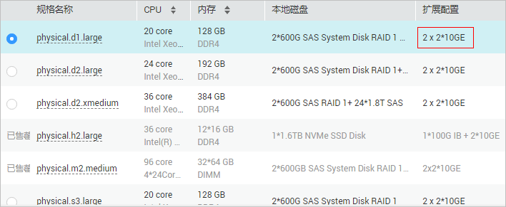

# 自定义VLAN网络概述

## 介绍

未被系统默认使用的以太网卡（10GE，在裸金属服务器规格中定义）可用于自定义VLAN网络，物理上采用QinQ技术实现用户的网络隔离，提供额外的物理平面和网络带宽。用户能够自由划分所需的VLAN子网来分隔流量，适用于SAP HANA、VMware等场景。自定义VLAN网络的网卡是成对出现的，用户可以通过配置bond实现高可用。自定义VLAN网络当前不支持跨AZ互通。

系统默认未使用的以太网卡没有默认配置文件，在系统启动时处于**down**状态，可以使用**ifconfig** **-a**命令查看网卡名，执行**ifconfig** _eth2_ **up**后进行配置，具体配置方法可能因操作系统而异。

例如，一台Linux操作系统的裸金属服务器，eth0/eth1自动组bond用于VPC网络；eth2、eth3用于自定义VLAN网络，用户可以通过这两个网口发送带有任意VLAN标签的报文。如果需要划分VLAN，可以参考系统为VPC网络创建bond设备及VLAN子接口的配置方法，将eth2和eth3组bond后，在bond设备上创建对应VLAN的网络接口。

> **说明：**   
>目前自定义VLAN网络支持组bond和不组bond两种方式，组bond方式只支持主备模式。  
>了解更多关于网卡组bond的信息，请参考[https://www.kernel.org/doc/Documentation/networking/bonding.txt](https://www.kernel.org/doc/Documentation/networking/bonding.txt)。  

各操作系统的自定义VLAN网络配置方法请参考[配置自定义VLAN网络（SUSE Linux Enterprise Server 12系列）](配置自定义VLAN网络（SUSE-Linux-Enterprise-Server-12系列）.md)\~[配置自定义VLAN网络（Windows Server系列）](配置自定义VLAN网络（Windows-Server系列）.md)。

## 查看方式

自定义VLAN网络是通过裸金属服务器的规格呈现给用户的，如[图1](#fig3014101191)所示。

**图 1**  裸金属服务器规格  

该规格的机型提供1块双网口的10GE网卡接入VPC网络，1块双网口的10GE扩展网卡支持裸金属服务器间的高速互联，租户可以根据业务需要在扩展网卡上自由配置VLAN网络。

