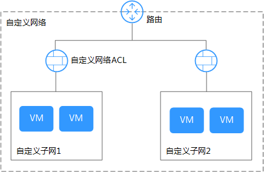
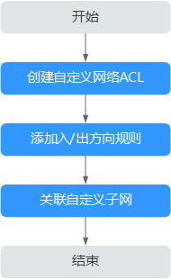

# 自定义网络ACL简介

## 自定义网络ACL

自定义网络ACL是一个子网级别的可选安全层，通过与自定义子网关联的出方向/入方向规则控制出入子网的数据流，如[图1](#fig09941104210)所示。

**图 1**  自定义网络ACL  

自定义网络ACL与安全组类似，都是安全防护策略，当您想增加额外的安全防护层时，就可以启用自定义网络ACL。安全组只有“允许”策略，但自定义网络ACL可以“拒绝”和“允许”，可以实现更精细、更复杂的安全访问控制。目前自定义网络中暂不支持安全组功能，使用自定义网络ACL可以满足您的网络配置需求。

## 使用须知

-   当前仅“华南-广州”区域支持创建自定义网络ACL，其他区域敬请期待。
-   自定义网络ACL和VPC服务中的网络ACL功能类似，如果您想了解更多信息，请参考“[网络ACL](https://support.huaweicloud.com/productdesc-vpc/zh-cn_topic_0051746676.html)”。
-   您的自定义网络中默认没有自定义网络ACL。当您需要时，可以创建自定义网络ACL并将其与子网关联。关联子网后，自定义网络ACL默认拒绝所有出入子网的流量，直至添加放通规则。
-   自定义网络ACL可以关联多个自定义子网，但一个自定义子网同一时间只能关联一个自定义网络ACL。

## 自定义网络ACL配置流程

**图 2**  自定义网络ACL配置流程  

具体配置请参考[创建并管理自定义网络ACL](创建并管理自定义网络ACL.md)。

