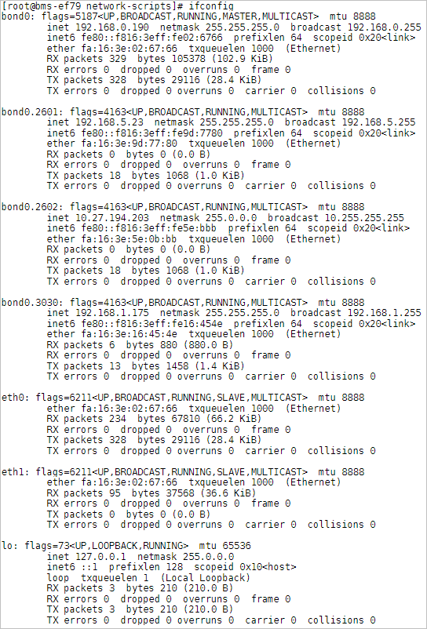
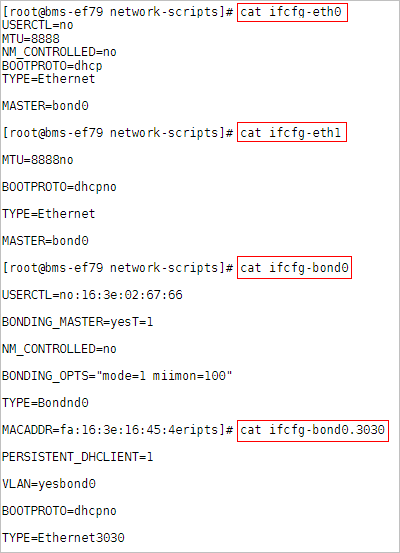

# 虚拟私有云概述

## 虚拟私有云

虚拟私有云（VPC）为裸金属服务器构建一个逻辑上完全隔离的专有区域，用户可以在VPC网络中配置弹性公网IP、安全组和VPN等网络特性，并且该网络可用于弹性云服务器和裸金属服务器之间通信。

## VPC网卡查看方式

VPC网络的网络接口可以在管理控制台查看（裸金属服务器详情页“网卡”页签下，如[图1](#fig1332104115514)所示）。对于Linux镜像，也可以根据分配的IP地址在操作系统中找到对应的vlan子接口或bond接口。

**图 1**  查看VPC网卡  

以CentOS 7.4 64 bit为例，登录到操作系统中，在“/etc/sysconfig/network-scripts”目录下可以看到以下网卡配置文件：ifcfg-eth0，ifcfg-eth1，ifcfg-bond0，ifcfg-bond0.3030，ifcfg-bond0.2601，ifcfg-bond0.2602，用户需要通过IP映射来匹配网络。

执行**ifconfig**命令，从控制台查看VPC网卡NIC1的私有IP地址分别为192.168.0.190，MAC地址为fa:16:3e:02:67:66；VPC网卡NIC2的私有IP地址为192.168.1.175，MAC地址为fa:16:3e:16:45:4e。eth0和eth1自动组成bond0，它们拥有相同的MAC地址。同时我们可以确定，ifcfg-eth0，ifcfg-eth1，ifcfg-bond0，ifcfg-bond0.3030为VPC网卡配置文件。

各网卡和bond配置文件的配置信息如下：

