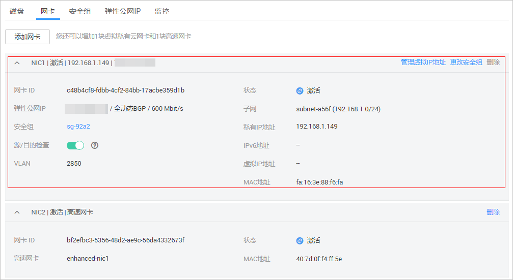

# 虚拟私有云概述

## 介绍

VPC网络为裸金属服务器构建一个逻辑上完全隔离的专有区域，用户可以在VPC网络中配置弹性公网IP、安全组和VPN等网络特性，并且该网络可用于弹性云服务器和裸金属服务器之间通信。

## 查看方式

VPC网络的网络接口可以在管理控制台中查看（裸金属服务器详情页“网卡”页签下，如[图1](#fig207291556034)所示），也可以根据分配的IP地址在Linux系统中找到对应的vlan子接口或bond接口。

**图 1**  查看VPC网卡  

以SUSE Linux  Enterprise Server 11 SP4为例，登录到操作系统中，在“/etc/sysconfig/network”目录下可以看到以下网卡配置文件：ifcfg-eth0，ifcfg-eth1，ifcfg-bond0，ifcfg-bond0.2976，ifcfg-bond0.3056，ifcfg-bond0.3057，用户需要通过IP映射来匹配网络。可以看出，ifcfg-eth0，ifcfg-eth1，ifcfg-bond0，ifcfg-bond0.2976为VPC网卡配置文件。

各网卡和bond配置文件的配置信息如下：

