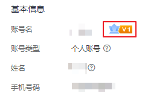

# 裸金属服务器到期了，多久会释放资源？

包年/包月方式购买的裸金属服务器到期后，如果没有按时续费，华为云会提供一定的保留期。

保留期的时长由客户等级而定，具体请参见“[保留期](https://support.huaweicloud.com/usermanual-period/zh-cn_topic_0086671074.html)”。

> **说明：** 
>客户等级查看方式：登录管理控制台，在右上角用户名下单击“基本信息”，查看账号名后的级别，如[图1](#fig135492489418)所示。

**图 1**  基本信息  

